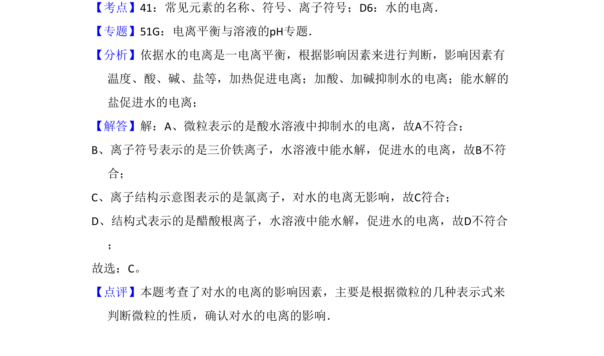

## 题面

## 摘要

考查水的电离平衡影响因素，辨析微粒符号与离子对水电离的作用。

## 关联考点

- [[324-水的电离|水的电离]]
- [[037-离子符号|离子符号]]
- [[电离平衡影响因素]]

## 答案与解析

> 📄 原 PDF 第 1 页：`素材/真题/北京/2008-2024·（北京）化学高考真题/2008年高考化学试卷（北京）（解析卷）.pdf`

<!-- 题干文本-start -->
## 题干文本
1．（6分）对H2O的电离平衡不产生影响的粒子是（　　）
A．B． 26M3+ C．D．
<!-- 题干文本-end -->

<!-- 解析文本-start -->
## 解析文本
【考点】41：常见元素的名称、符号、离子符号；D6：水的电离．菁优网版权所有
【专题】51G：电离平衡与溶液的pH专题．
【分析】依据水的电离是一电离平衡，根据影响因素来进行判断，影响因素有
温度、酸、碱、盐等，加热促进电离；加酸、加碱抑制水的电离；能水解的
盐促进水的电离；
【解答】解：A、微粒表示的是酸水溶液中抑制水的电离，故A不符合；
B、离子符号表示的是三价铁离子，水溶液中能水解，促进水的电离，故B不符
合；
C、离子结构示意图表示的是氯离子，对水的电离无影响，故C符合；
D、结构式表示的是醋酸根离子，水溶液中能水解，促进水的电离，故D不符合
；
故选：C。
【点评】本题考查了对水的电离的影响因素，主要是根据微粒的几种表示式来
判断微粒的性质，确认对水的电离的影响．
<!-- 解析文本-end -->
