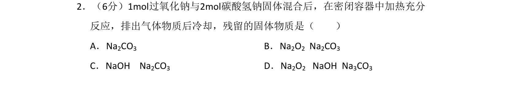
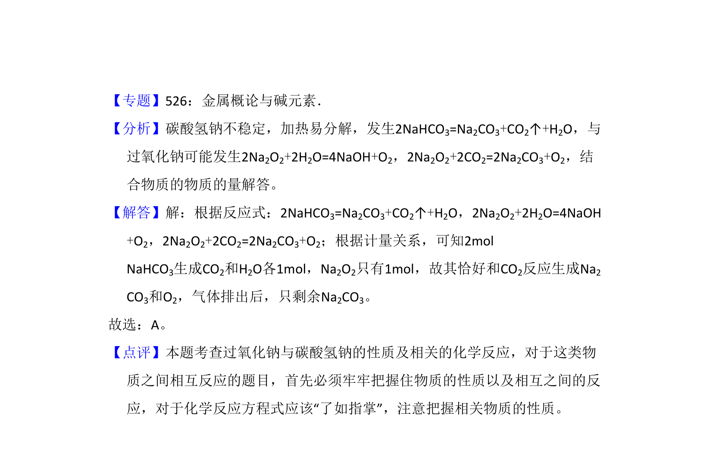

## 题面

## 摘要

过氧化钠与碳酸氢钠混合加热反应，需根据物质的量关系判断最终残留固体。

## 关联考点

- [[钠的重要化合物]]
- [[208-过氧化钠|过氧化钠]]
- [[115-碳酸氢钠|碳酸氢钠]]
- [[热分解反应]]

## 答案与解析

> 📄 原 PDF 第 1 页：`素材/真题/北京/2008-2024·（北京）化学高考真题/2008年高考化学试卷（北京）（解析卷）.pdf`
