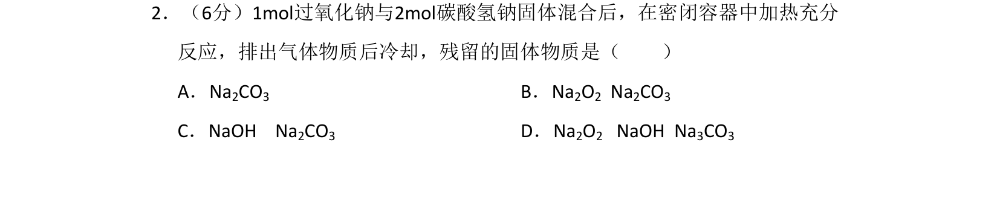
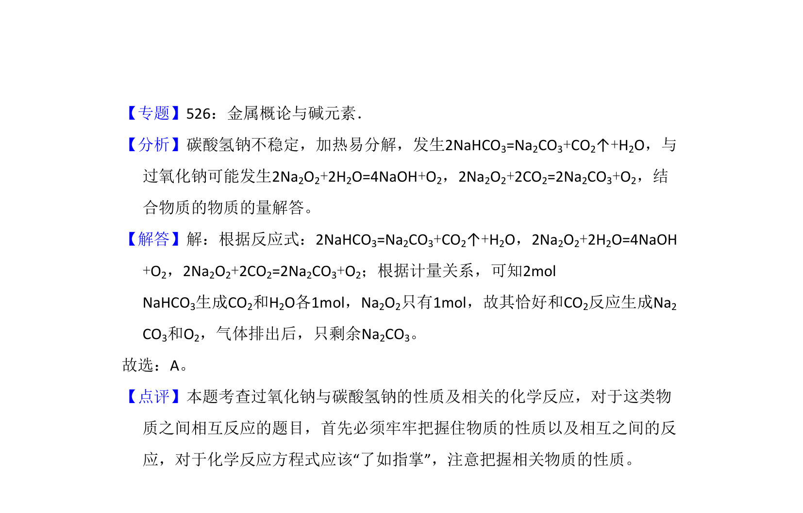

## 题面

## 摘要

过氧化钠与碳酸氢钠混合加热反应，需根据物质的量关系判断最终残留固体。

## 关联考点

- [[钠的重要化合物]]
- [[208-过氧化钠|过氧化钠]]
- [[115-碳酸氢钠|碳酸氢钠]]
- [[热分解反应]]

## 答案与解析

> 📄 原 PDF 第 1 页：`素材/真题/北京/2008-2024·（北京）化学高考真题/2008年高考化学试卷（北京）（解析卷）.pdf`

<!-- 题干文本-start -->
## 题干文本
2．（6分）1mol过氧化钠与2mol碳酸氢钠固体混合后，在密闭容器中加热充分
反应，排出气体物质后冷却，残留的固体物质是（　　）
A．Na2CO3 B．Na2O2  Na2CO3
C．NaOH    Na2CO3 D．Na2O2   NaOH  Na3CO3
<!-- 题干文本-end -->

<!-- 解析文本-start -->
## 解析文本
【考点】GF：钠的重要化合物．菁优网版权所有
<!-- 解析文本-end -->
