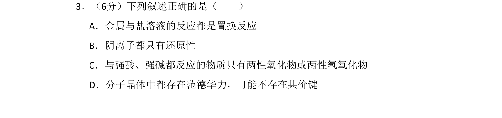
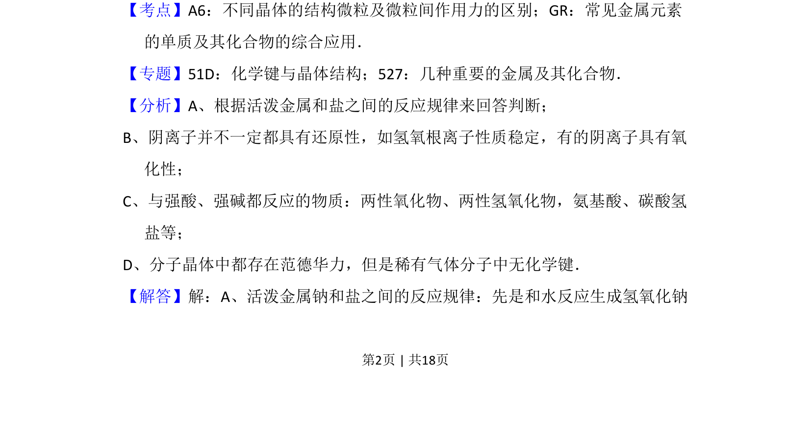
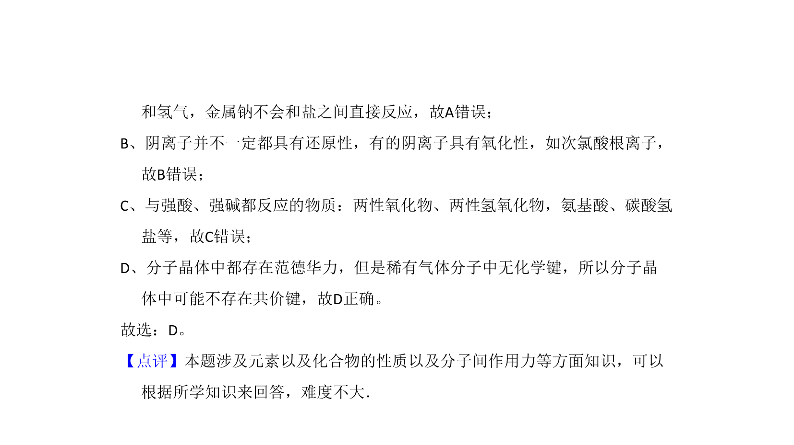

## 题面

## 摘要

该题考查金属与盐溶液反应类型、阴离子氧化还原性、两性物质判断及分子晶体微粒间作用力。

## 关联考点

- [[095-置换反应|置换反应]]
- [[阴离子还原性]]
- [[180-两性氧化物|两性氧化物]]
- [[437-范德华力|范德华力]]

## 答案与解析

> 📄 原 PDF 第 2 页：`素材/真题/北京/2008-2024·（北京）化学高考真题/2008年高考化学试卷（北京）（解析卷）.pdf`
