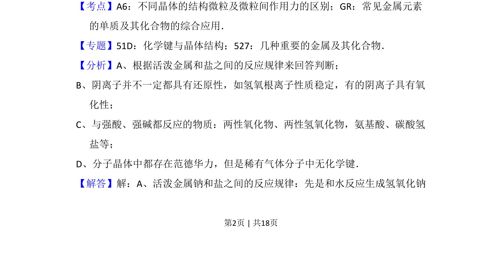
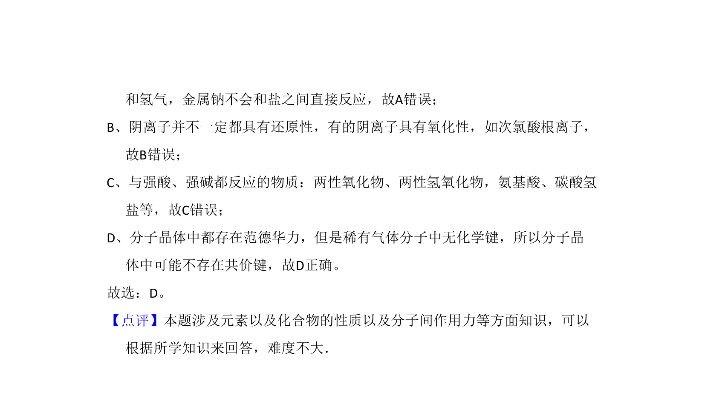

## 题面

## 摘要

该题考查金属与盐溶液反应类型、阴离子氧化还原性、两性物质判断及分子晶体微粒间作用力。

## 关联考点

- [[095-置换反应|置换反应]]
- [[968-阴离子还原性|阴离子还原性]]
- [[180-两性氧化物|两性氧化物]]
- [[437-范德华力|范德华力]]

## 答案与解析

> 📄 原 PDF 第 2 页：`素材/真题/北京/2008-2024·（北京）化学高考真题/2008年高考化学试卷（北京）（解析卷）.pdf`

<!-- 题干文本-start -->
## 题干文本
3．（6分）下列叙述正确的是（　　）
A．金属与盐溶液的反应都是置换反应
B．阴离子都只有还原性
C．与强酸、强碱都反应的物质只有两性氧化物或两性氢氧化物
D．分子晶体中都存在范德华力，可能不存在共价键
<!-- 题干文本-end -->

<!-- 解析文本-start -->
## 解析文本
【考点】A6：不同晶体的结构微粒及微粒间作用力的区别；GR：常见金属元素
的单质及其化合物的综合应用．菁优网版权所有
【专题】51D：化学键与晶体结构；527：几种重要的金属及其化合物．
【分析】A、根据活泼金属和盐之间的反应规律来回答判断；
B、阴离子并不一定都具有还原性，如氢氧根离子性质稳定，有的阴离子具有氧
化性；
C、与强酸、强碱都反应的物质：两性氧化物、两性氢氧化物，氨基酸、碳酸氢
盐等；
D、分子晶体中都存在范德华力，但是稀有气体分子中无化学键．
【解答】解：A、活泼金属钠和盐之间的反应规律：先是和水反应生成氢氧化钠
<!-- 解析文本-end -->
