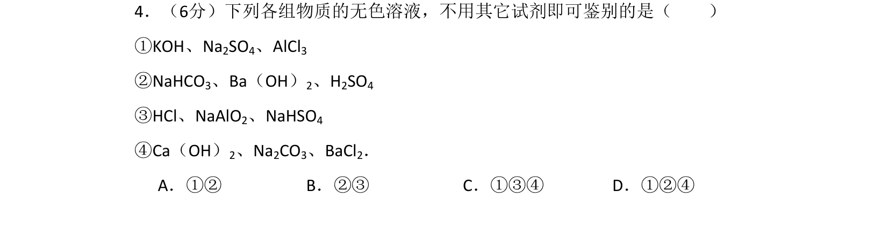
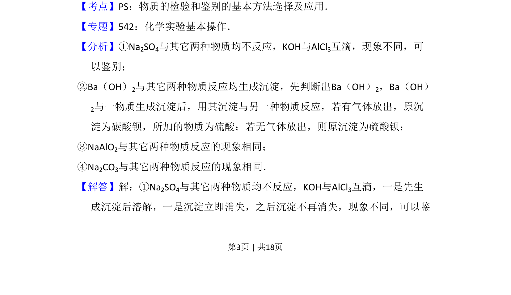
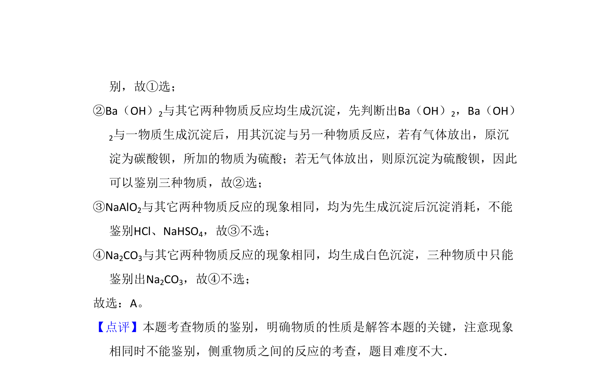

## 题面

## 摘要

考查不用其他试剂鉴别无色溶液，利用互滴现象差异和反应产物特征进行判断

## 关联考点

- [[物质的检验和鉴别]]
- [[互滴法]]
- [[沉淀生成与转化]]
- [[无机物性质]]

## 答案与解析

> 📄 原 PDF 第 3 页：`素材/真题/北京/2008-2024·（北京）化学高考真题/2008年高考化学试卷（北京）（解析卷）.pdf`

<!-- 题干文本-start -->
## 题干文本
4．（6分）下列各组物质的无色溶液，不用其它试剂即可鉴别的是（　　）
①KOH、Na2SO4、AlCl3     
②NaHCO3、Ba（OH）2、H2SO4
③HCl、NaAlO2、NaHSO4   
④Ca（OH）2、Na2CO3、BaCl2．
A．①②B．②③C．①③④D．①②④
<!-- 题干文本-end -->

<!-- 解析文本-start -->
## 解析文本
【考点】PS：物质的检验和鉴别的基本方法选择及应用．菁优网版权所有
【专题】542：化学实验基本操作．
【分析】①Na2SO4与其它两种物质均不反应，KOH与AlCl3互滴，现象不同，可
以鉴别；
②Ba（OH）2与其它两种物质反应均生成沉淀，先判断出Ba（OH）2，Ba（OH）
2与一物质生成沉淀后，用其沉淀与另一种物质反应，若有气体放出，原沉
淀为碳酸钡，所加的物质为硫酸；若无气体放出，则原沉淀为硫酸钡；
③NaAlO2与其它两种物质反应的现象相同；
④Na2CO3与其它两种物质反应的现象相同．
【解答】解：①Na2SO4与其它两种物质均不反应，KOH与AlCl3互滴，一是先生
成沉淀后溶解，一是沉淀立即消失，之后沉淀不再消失，现象不同，可以鉴
<!-- 解析文本-end -->
