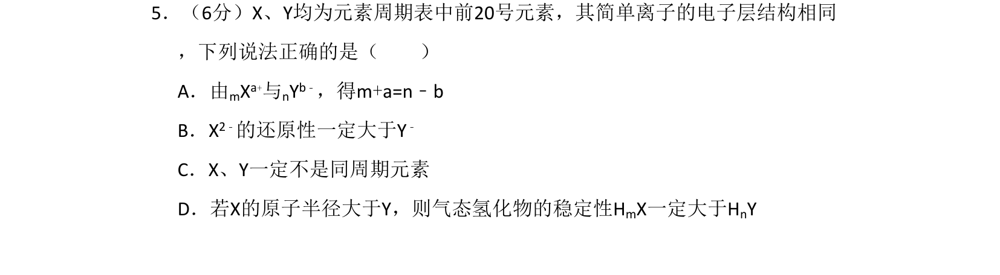
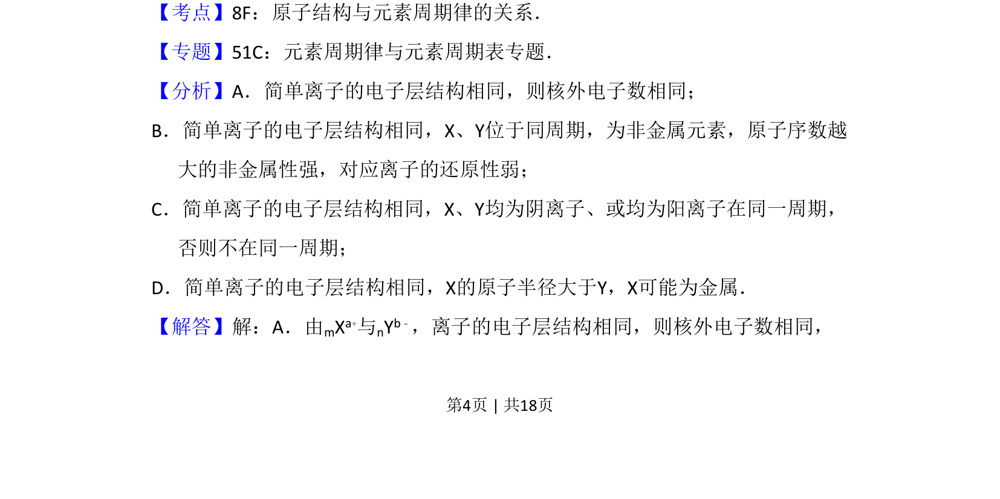
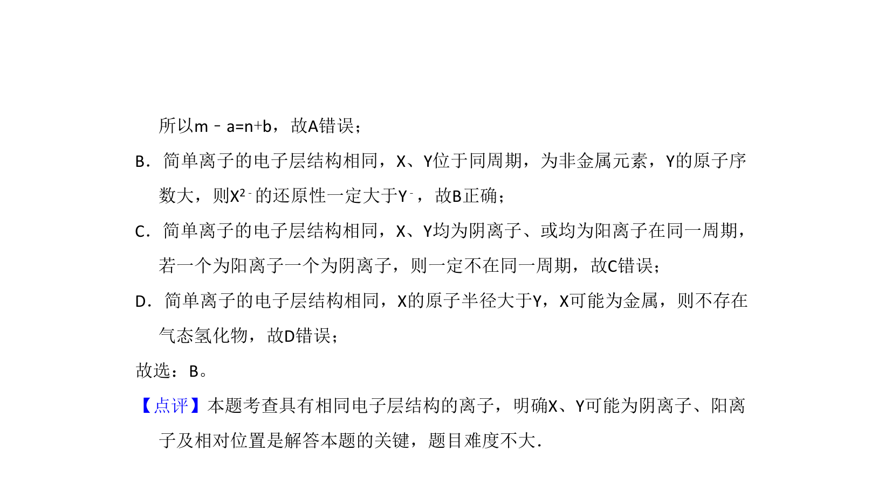

## 题面

## 摘要

本题考查前20号元素简单离子电子层结构相同时的离子电荷、还原性、周期位置及气态氢化物稳定性的判断。

## 关联考点

- [[530-原子结构与元素周期律|原子结构与元素周期律]]
- [[离子电子层结构]]
- [[还原性比较]]
- [[547-气态氢化物稳定性|气态氢化物稳定性]]

## 答案与解析

> 📄 原 PDF 第 4 页：`素材/真题/北京/2008-2024·（北京）化学高考真题/2008年高考化学试卷（北京）（解析卷）.pdf`
