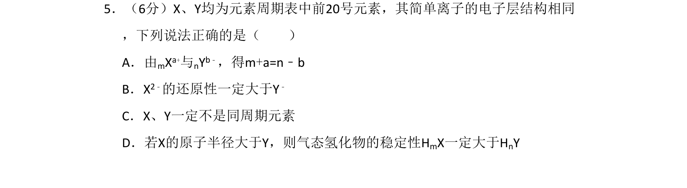
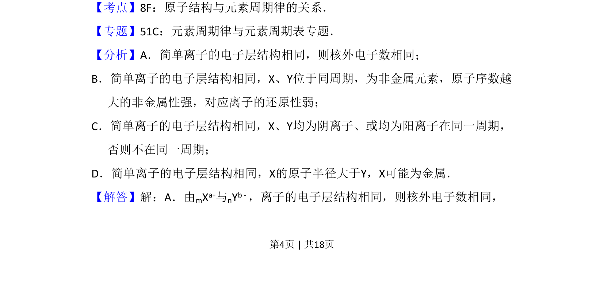
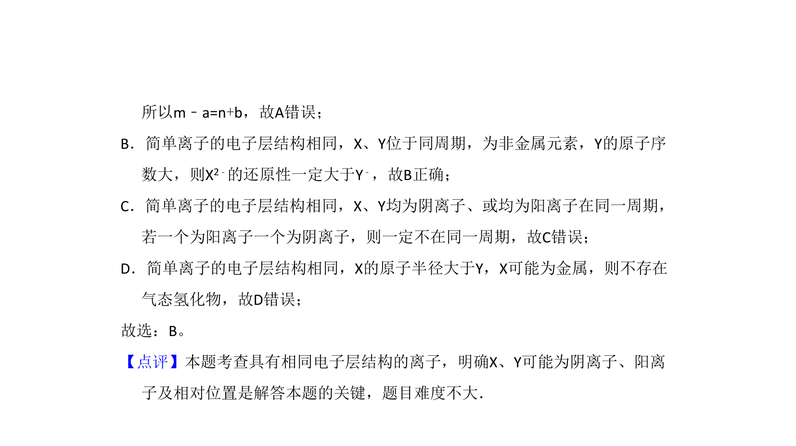

## 题面

## 摘要

本题考查前20号元素简单离子电子层结构相同时的离子电荷、还原性、周期位置及气态氢化物稳定性的判断。

## 关联考点

- [[530-原子结构与元素周期律|原子结构与元素周期律]]
- [[离子电子层结构]]
- [[还原性比较]]
- [[547-气态氢化物稳定性|气态氢化物稳定性]]

## 答案与解析

> 📄 原 PDF 第 4 页：`素材/真题/北京/2008-2024·（北京）化学高考真题/2008年高考化学试卷（北京）（解析卷）.pdf`

<!-- 题干文本-start -->
## 题干文本
5．（6分）X、Y均为元素周期表中前20号元素，其简单离子的电子层结构相同
，下列说法正确的是（　　）
A．由mXa+与nYb﹣，得m+a=n﹣b
B．X2﹣的还原性一定大于Y﹣
C．X、Y一定不是同周期元素
D．若X的原子半径大于Y，则气态氢化物的稳定性HmX一定大于HnY
<!-- 题干文本-end -->

<!-- 解析文本-start -->
## 解析文本
【考点】8F：原子结构与元素周期律的关系．菁优网版权所有
【专题】51C：元素周期律与元素周期表专题．
【分析】A．简单离子的电子层结构相同，则核外电子数相同；
B．简单离子的电子层结构相同，X、Y位于同周期，为非金属元素，原子序数越
大的非金属性强，对应离子的还原性弱；
C．简单离子的电子层结构相同，X、Y均为阴离子、或均为阳离子在同一周期，
否则不在同一周期；
D．简单离子的电子层结构相同，X的原子半径大于Y，X可能为金属．
【解答】解：A．由mXa+与nYb﹣，离子的电子层结构相同，则核外电子数相同，
<!-- 解析文本-end -->
