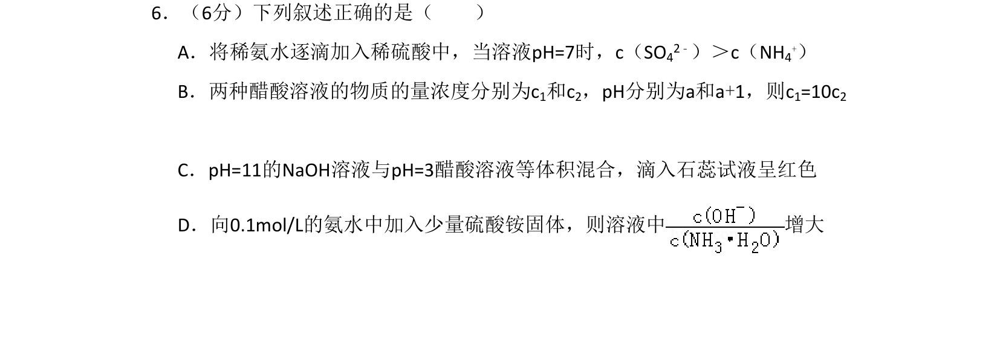
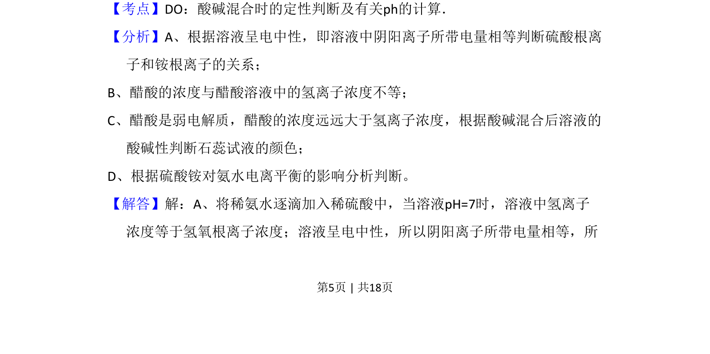
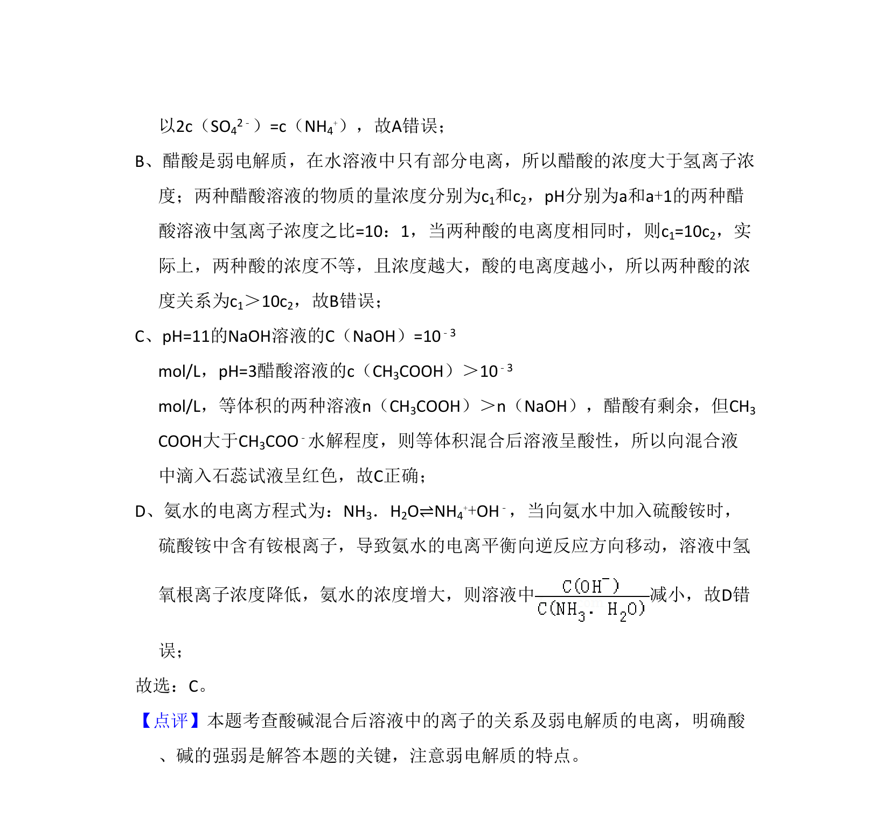

## 题面

## 摘要

考查酸碱混合时的pH判断、弱电解质电离及电荷守恒

## 关联考点

- [[853-酸碱混合定性判断|酸碱混合定性判断]]
- [[316-pH计算|pH计算]]
- [[322-弱电解质电离|弱电解质电离]]
- [[690-电荷数守恒|电荷守恒]]

## 答案与解析

> 📄 原 PDF 第 5 页：`素材/真题/北京/2008-2024·（北京）化学高考真题/2008年高考化学试卷（北京）（解析卷）.pdf`
