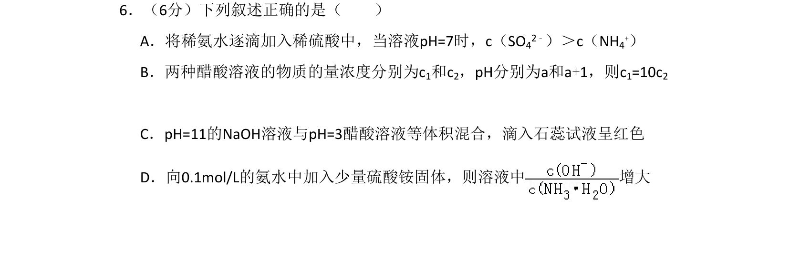
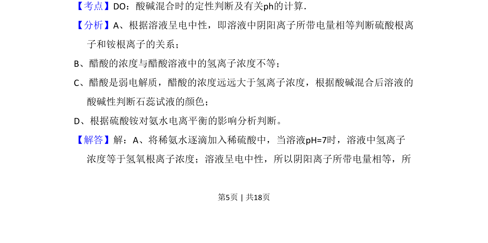
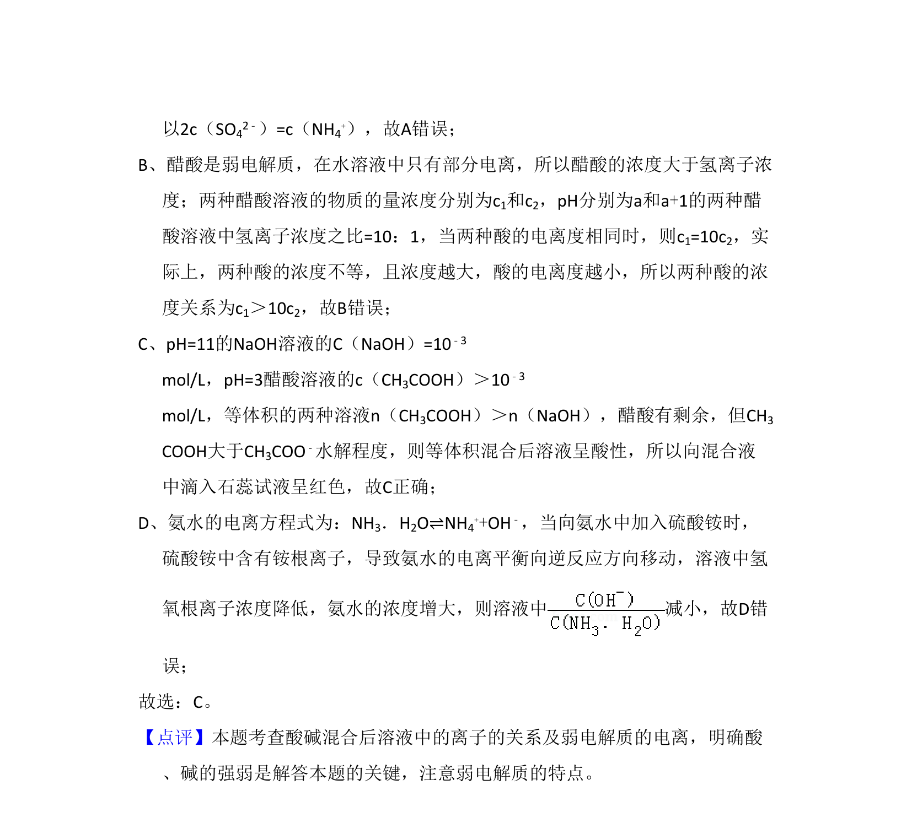

## 题面

## 摘要

考查酸碱混合时的pH判断、弱电解质电离及电荷守恒

## 关联考点

- [[853-酸碱混合定性判断|酸碱混合定性判断]]
- [[316-pH计算|pH计算]]
- [[322-弱电解质电离|弱电解质电离]]
- [[689-电荷数守恒|电荷守恒]]

## 答案与解析

> 📄 原 PDF 第 5 页：`素材/真题/北京/2008-2024·（北京）化学高考真题/2008年高考化学试卷（北京）（解析卷）.pdf`

<!-- 题干文本-start -->
## 题干文本
6．（6分）下列叙述正确的是（　　）
A．将稀氨水逐滴加入稀硫酸中，当溶液pH=7时，c（SO42﹣）＞c（NH4
+）
B．两种醋酸溶液的物质的量浓度分别为c1和c2，pH分别为a和a+1，则c1=10c2
C．pH=11的NaOH溶液与pH=3醋酸溶液等体积混合，滴入石蕊试液呈红色
D．向0.1mol/L的氨水中加入少量硫酸铵固体，则溶液中 增大
<!-- 题干文本-end -->

<!-- 解析文本-start -->
## 解析文本
【考点】DO：酸碱混合时的定性判断及有关ph的计算．菁优网版权所有
【分析】A、根据溶液呈电中性，即溶液中阴阳离子所带电量相等判断硫酸根离
子和铵根离子的关系；
B、醋酸的浓度与醋酸溶液中的氢离子浓度不等；
C、醋酸是弱电解质，醋酸的浓度远远大于氢离子浓度，根据酸碱混合后溶液的
酸碱性判断石蕊试液的颜色；
D、根据硫酸铵对氨水电离平衡的影响分析判断。
【解答】解：A、将稀氨水逐滴加入稀硫酸中，当溶液pH=7时，溶液中氢离子
浓度等于氢氧根离子浓度；溶液呈电中性，所以阴阳离子所带电量相等，所
<!-- 解析文本-end -->
