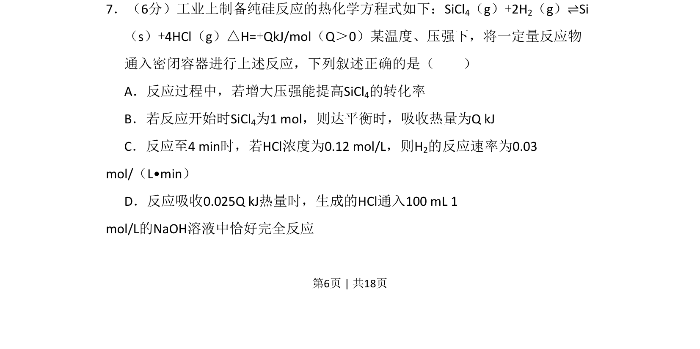
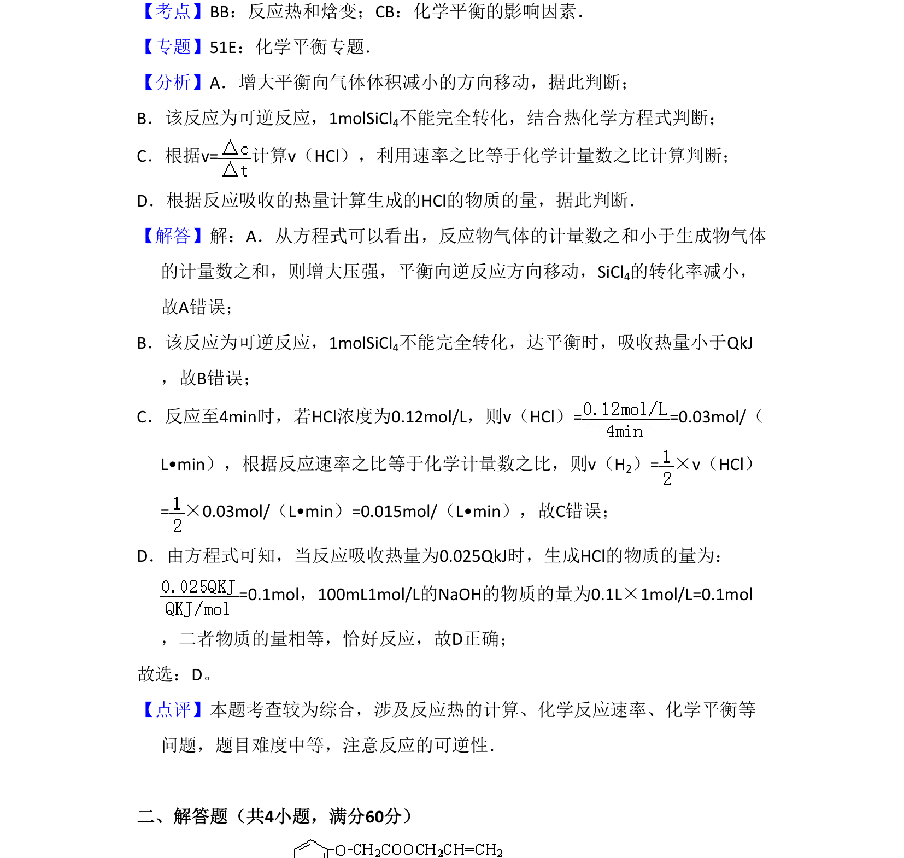

## 题面

## 摘要

本题结合热化学方程式考查化学平衡影响因素、反应热计算、反应速率计算及中和反应简单计算。

## 关联考点

- [[309-热化学方程式|热化学方程式]]
- [[284-化学平衡|化学平衡]]
- [[283-化学反应速率|反应速率]]
- [[137-中和反应|酸碱中和]]

## 答案与解析

> 📄 原 PDF 第 6 页：`素材/真题/北京/2008-2024·（北京）化学高考真题/2008年高考化学试卷（北京）（解析卷）.pdf`
