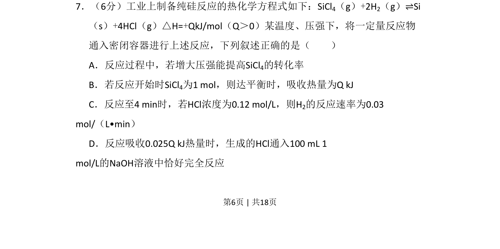
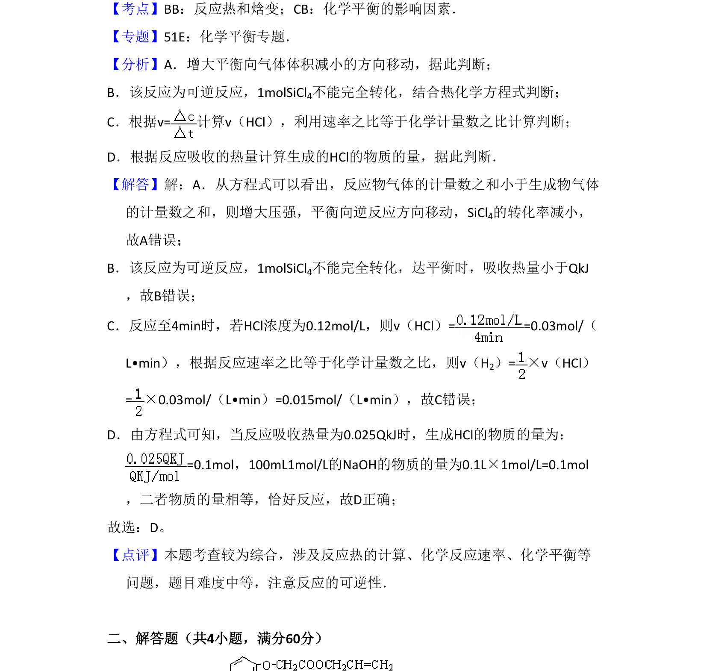

## 题面

## 摘要

本题结合热化学方程式考查化学平衡影响因素、反应热计算、反应速率计算及中和反应简单计算。

## 关联考点

- [[309-热化学方程式|热化学方程式]]
- [[284-化学平衡|化学平衡]]
- [[283-化学反应速率|反应速率]]
- [[137-中和反应|酸碱中和]]

## 答案与解析

> 📄 原 PDF 第 6 页：`素材/真题/北京/2008-2024·（北京）化学高考真题/2008年高考化学试卷（北京）（解析卷）.pdf`

<!-- 题干文本-start -->
## 题干文本
7．（6分）工业上制备纯硅反应的热化学方程式如下：SiCl4（g）+2H2（g）⇌Si
（s）+4HCl（g）△H=+QkJ/mol（Q＞0）某温度、压强下，将一定量反应物
通入密闭容器进行上述反应，下列叙述正确的是（　　）
A．反应过程中，若增大压强能提高SiCl4的转化率
B．若反应开始时SiCl4为1 mol，则达平衡时，吸收热量为Q kJ
C．反应至4 min时，若HCl浓度为0.12 mol/L，则H2的反应速率为0.03 
mol/（L•min）
D．反应吸收0.025Q kJ热量时，生成的HCl通入100 mL 1 
mol/L的NaOH溶液中恰好完全反应
<!-- 题干文本-end -->

<!-- 解析文本-start -->
## 解析文本

<!-- 解析文本-end -->
