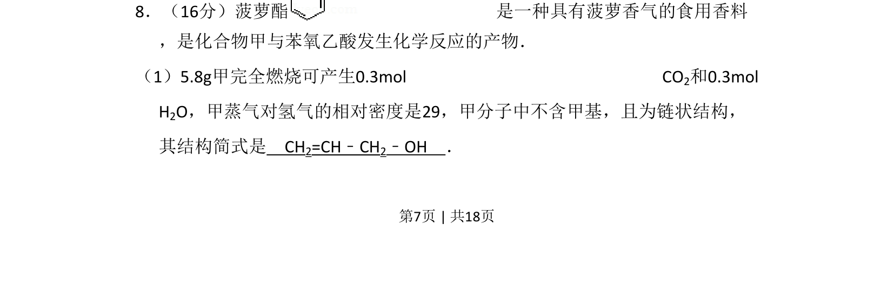
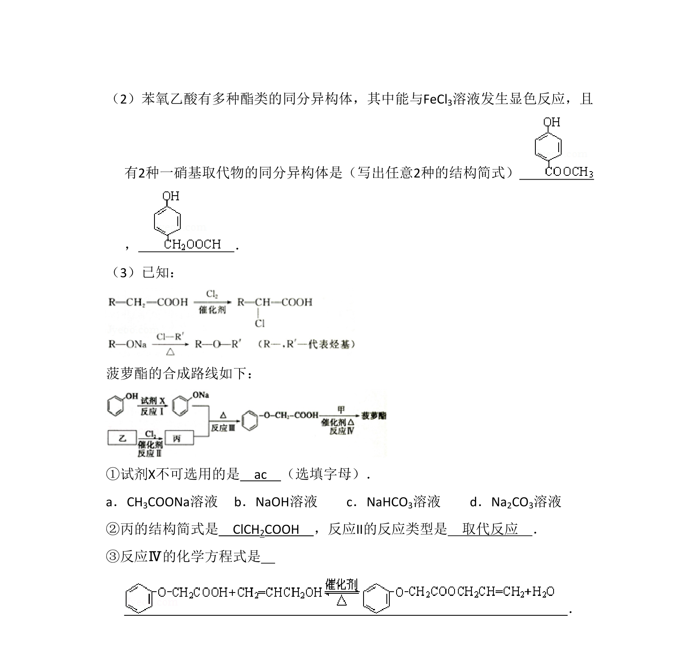
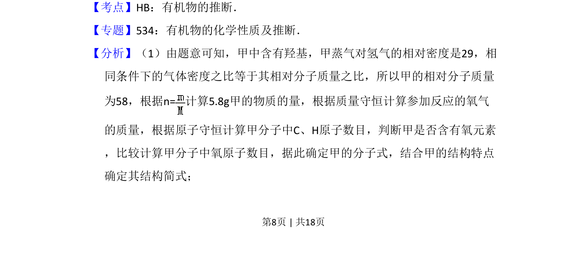
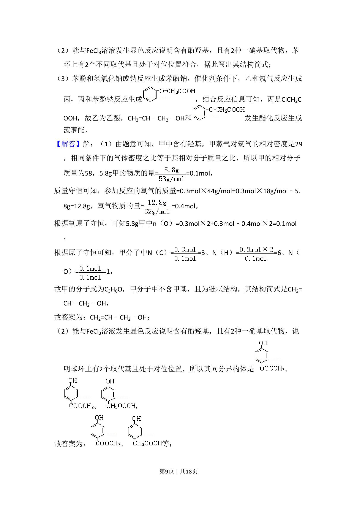
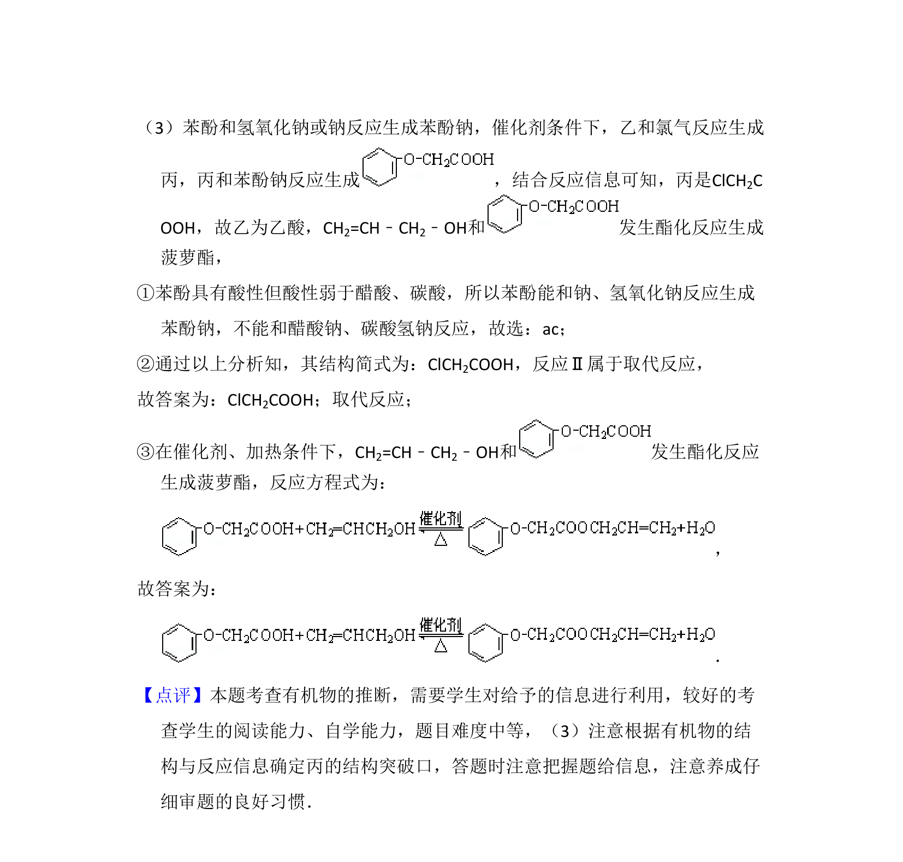

## 题面

## 摘要

推断有机物分子式和结构简式

## 关联考点

- [[有机物燃烧计算]]
- [[600-分子式确定|分子式确定]]
- [[结构简式推断]]
- [[官能团与性质]]

## 答案与解析

> 📄 原 PDF 第 7 页：`素材/真题/北京/2008-2024·（北京）化学高考真题/2008年高考化学试卷（北京）（解析卷）.pdf`

<!-- 题干文本-start -->
## 题干文本
8．（16分）菠萝酯 是一种具有菠萝香气的食用香料
，是化合物甲与苯氧乙酸发生化学反应的产物．
（1）5.8g甲完全燃烧可产生0.3mol CO 2和0.3mol 
H2O，甲蒸气对氢气的相对密度是29，甲分子中不含甲基，且为链状结构，
其结构简式是　CH2=CH﹣CH2﹣OH　．
<!-- 题干文本-end -->

<!-- 解析文本-start -->
## 解析文本

<!-- 解析文本-end -->
