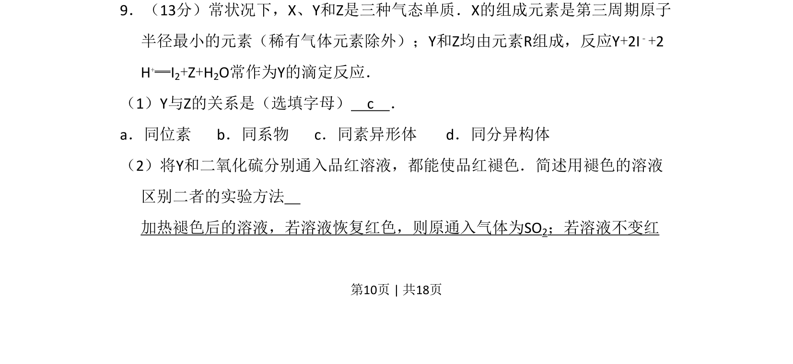
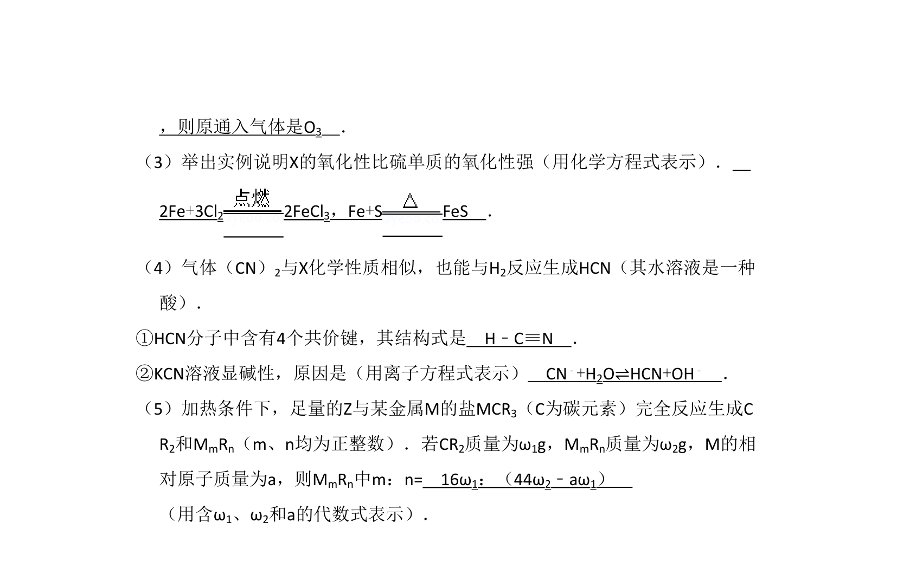
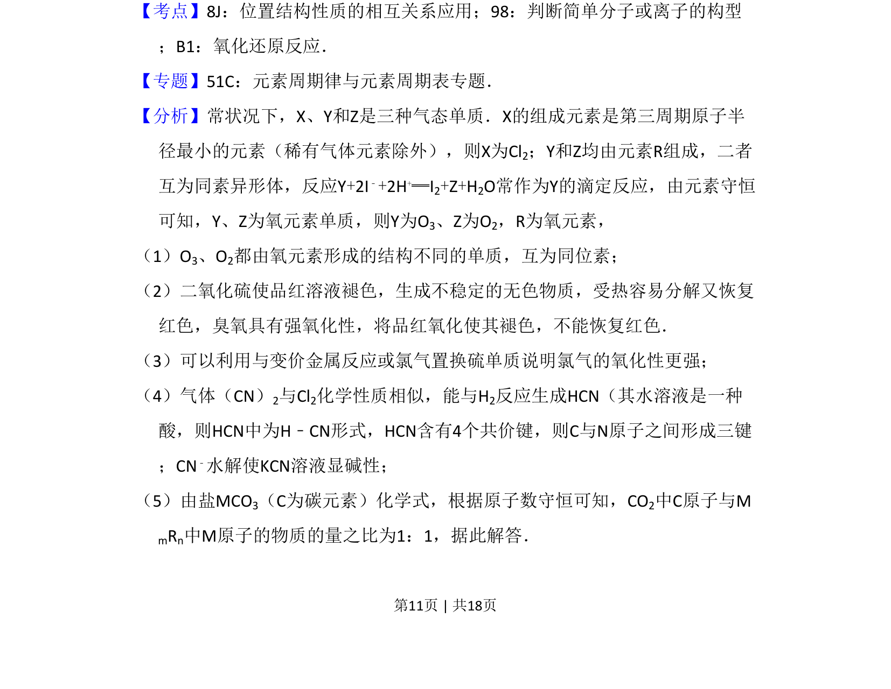
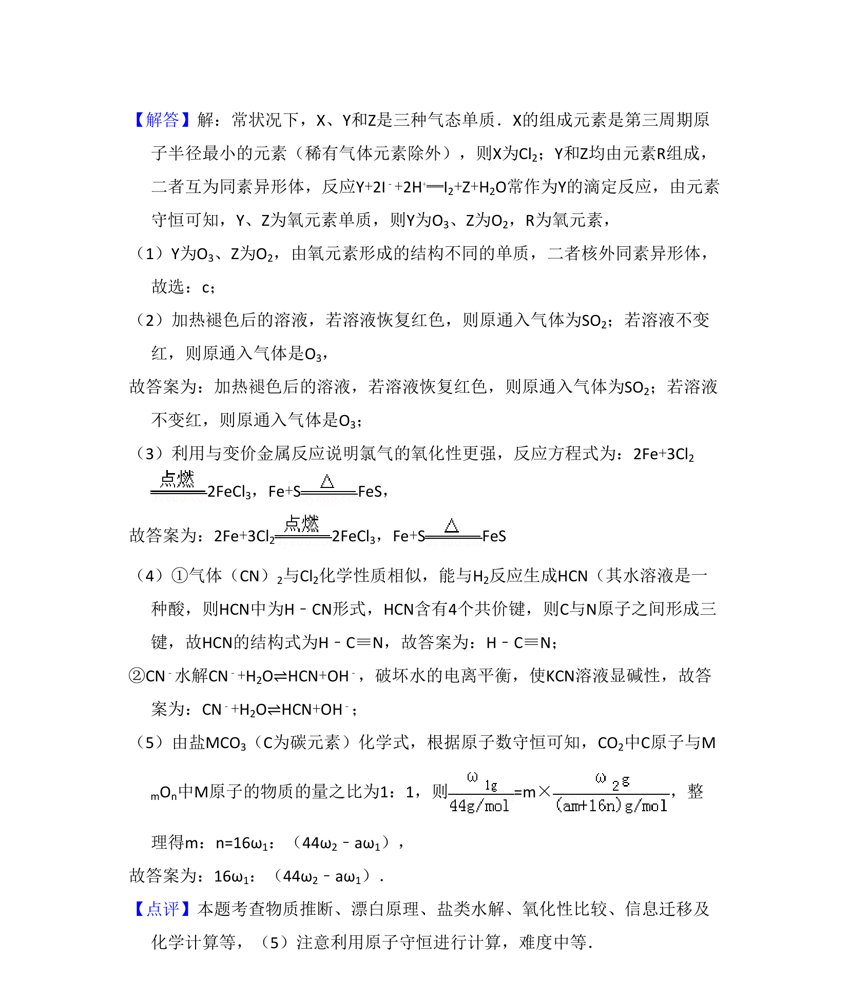

## 题面

## 摘要

该题考查同素异形体判断及利用二氧化硫与臭氧漂白原理差异进行鉴别。

## 关联考点

- [[066-同素异形体|同素异形体]]
- [[970-二氧化硫的漂白性|二氧化硫的漂白性]]
- [[785-物质鉴别|物质鉴别]]

## 答案与解析

> 📄 原 PDF 第 10 页：`素材/真题/北京/2008-2024·（北京）化学高考真题/2008年高考化学试卷（北京）（解析卷）.pdf`
