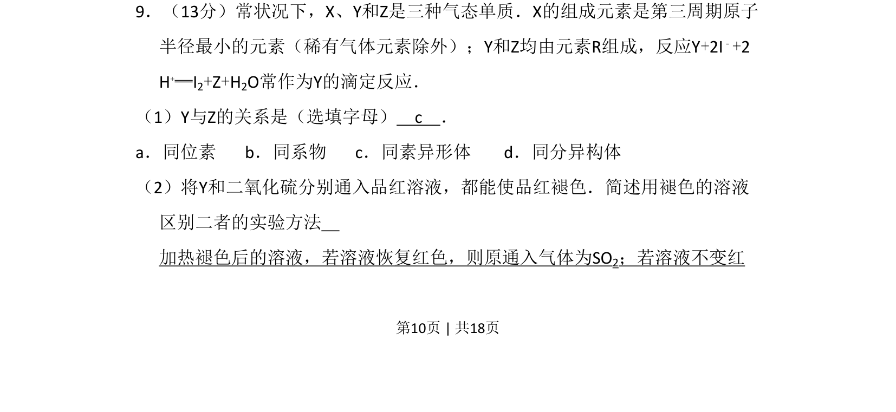
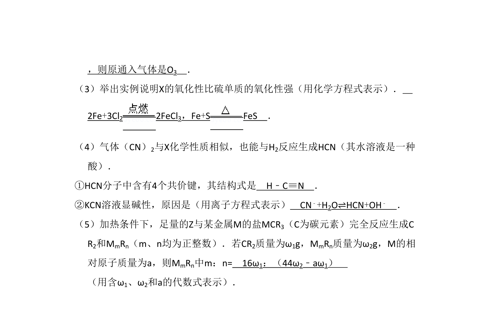
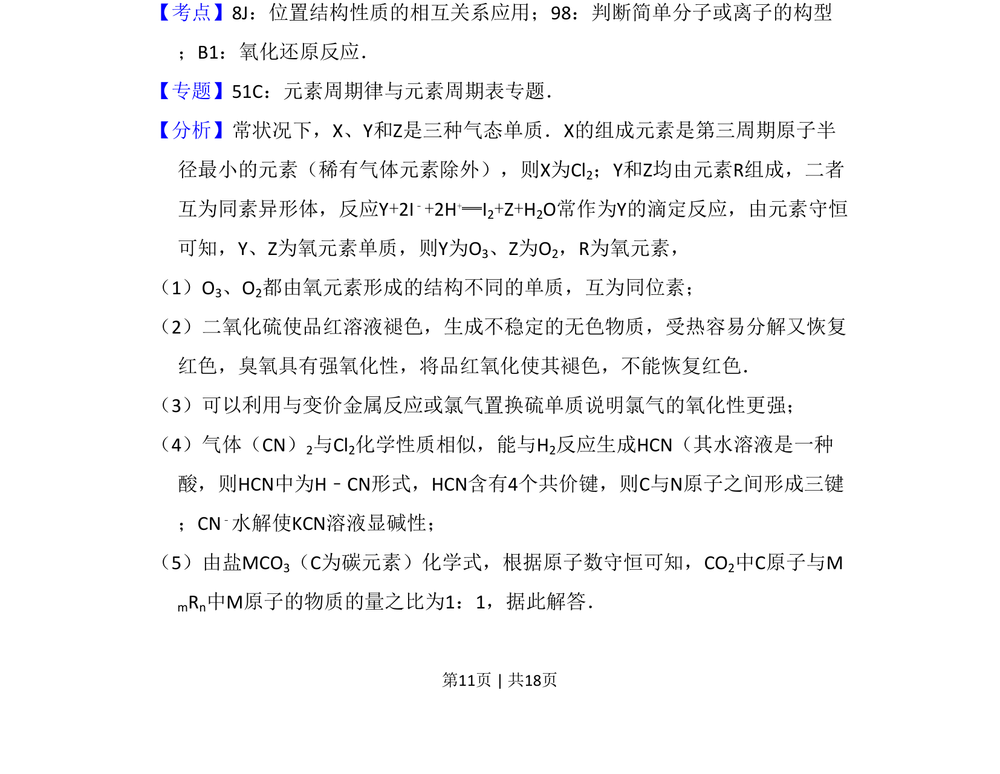
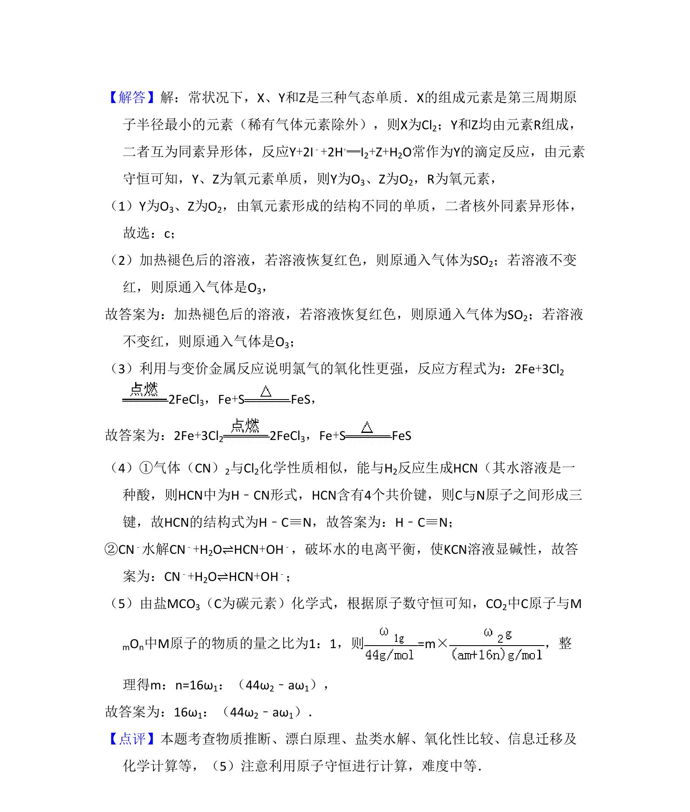

## 题面

## 摘要

该题考查同素异形体判断及利用二氧化硫与臭氧漂白原理差异进行鉴别。

## 关联考点

- [[066-同素异形体|同素异形体]]
- [[970-二氧化硫的漂白性|二氧化硫的漂白性]]
- [[785-物质鉴别|物质鉴别]]

## 答案与解析

> 📄 原 PDF 第 10 页：`素材/真题/北京/2008-2024·（北京）化学高考真题/2008年高考化学试卷（北京）（解析卷）.pdf`

<!-- 题干文本-start -->
## 题干文本
9．（13分）常状况下，X、Y和Z是三种气态单质．X的组成元素是第三周期原子
半径最小的元素（稀有气体元素除外）；Y和Z均由元素R组成，反应Y+2I﹣+2
H+═I2+Z+H2O常作为Y的滴定反应．
（1）Y与Z的关系是（选填字母）　c　．
a．同位素       b．同系物       c．同素异形体        d．同分异构体
（2）将Y和二氧化硫分别通入品红溶液，都能使品红褪色．简述用褪色的溶液
区别二者的实验方法　
加热褪色后的溶液，若溶液恢复红色，则原通入气体为SO2；若溶液不变红
<!-- 题干文本-end -->

<!-- 解析文本-start -->
## 解析文本

<!-- 解析文本-end -->
