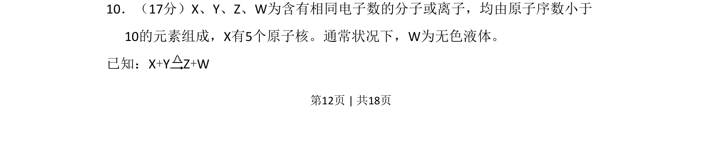
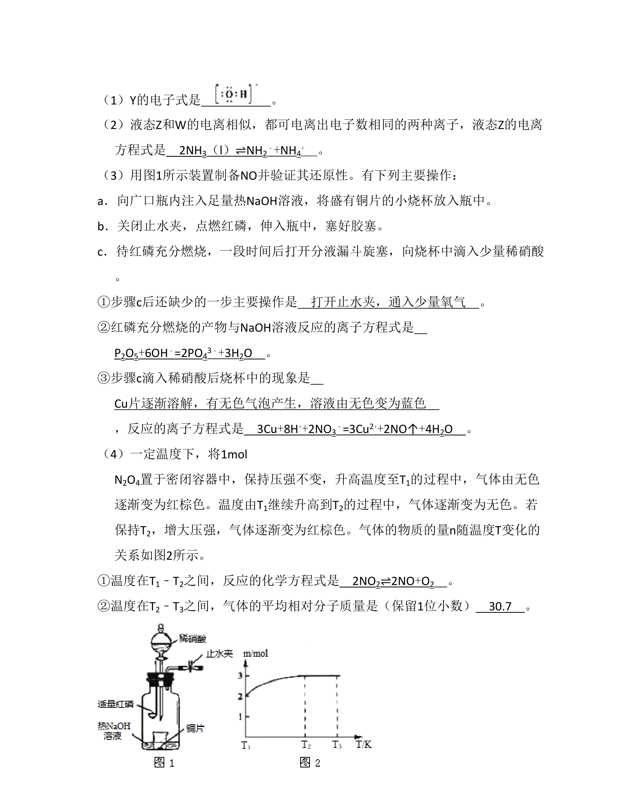
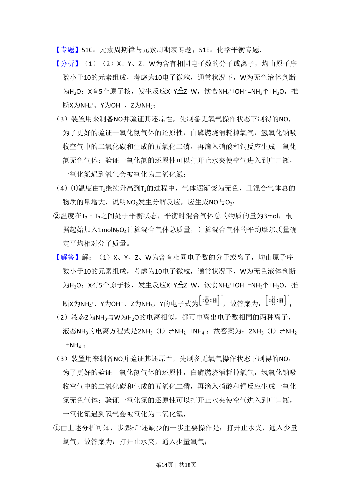
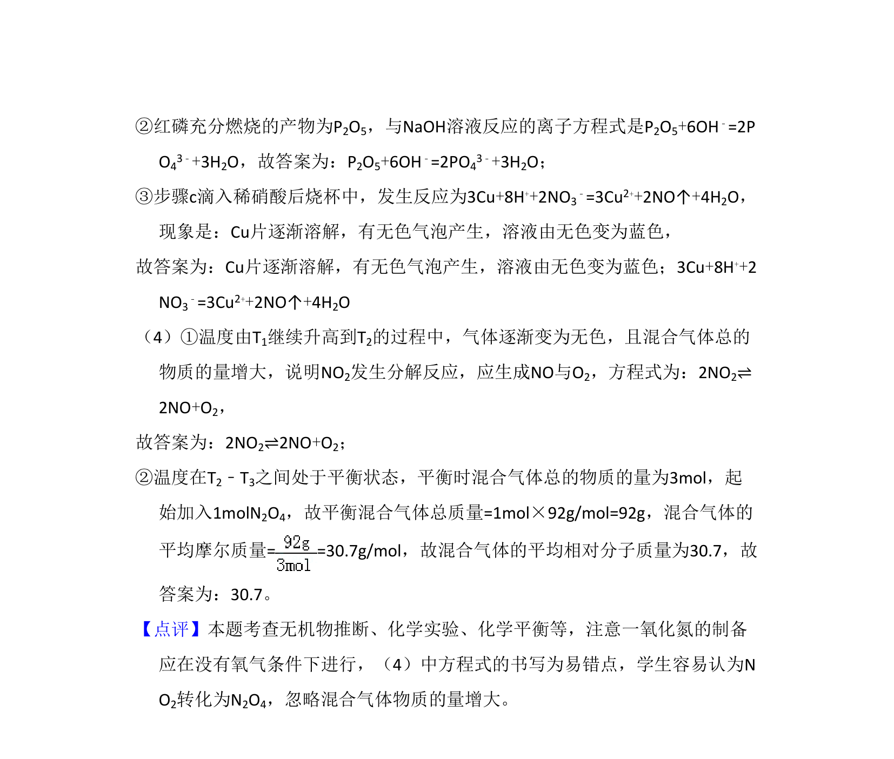

## 题面

## 摘要

推断10电子微粒并书写反应方程式，涉及等电子体与常见分子结构判断。

## 关联考点

- [[1002-等电子体|等电子体]]
- [[10电子微粒]]
- [[169-离子反应|离子反应]]
- [[027-分子|分子结构]]

## 答案与解析

> 📄 原 PDF 第 12 页：`素材/真题/北京/2008-2024·（北京）化学高考真题/2008年高考化学试卷（北京）（解析卷）.pdf`

<!-- 题干文本-start -->
## 题干文本
10．（17分）X、Y、Z、W为含有相同电子数的分子或离子，均由原子序数小于
10的元素组成，X有5个原子核。通常状况下，W为无色液体。
已知：X+Y Z+W
<!-- 题干文本-end -->

<!-- 解析文本-start -->
## 解析文本

<!-- 解析文本-end -->
