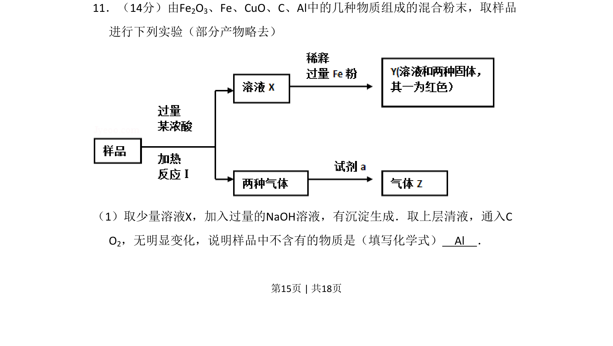
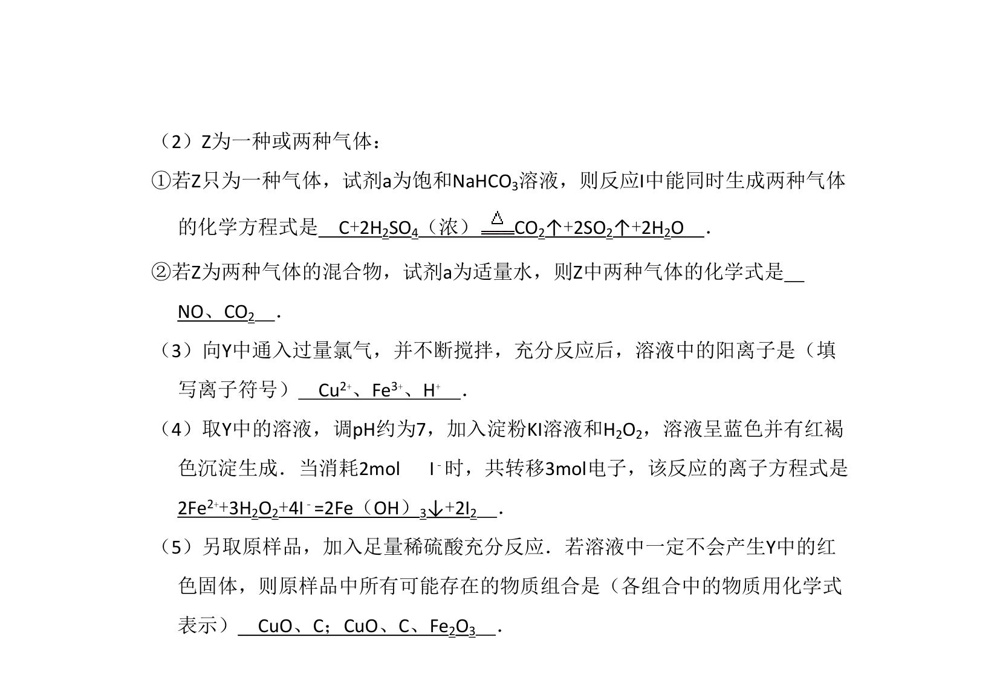
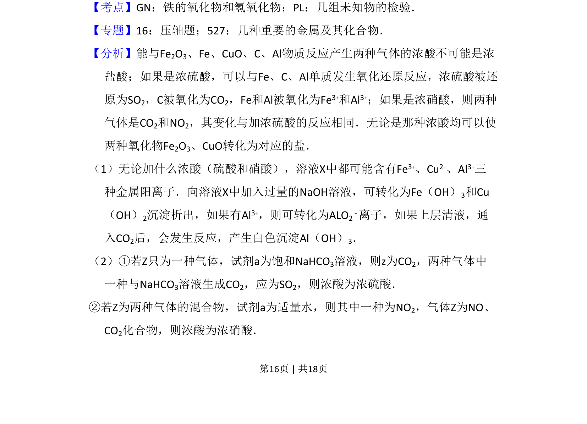
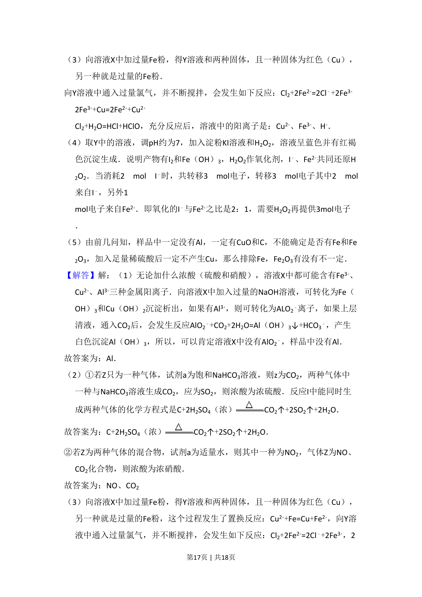
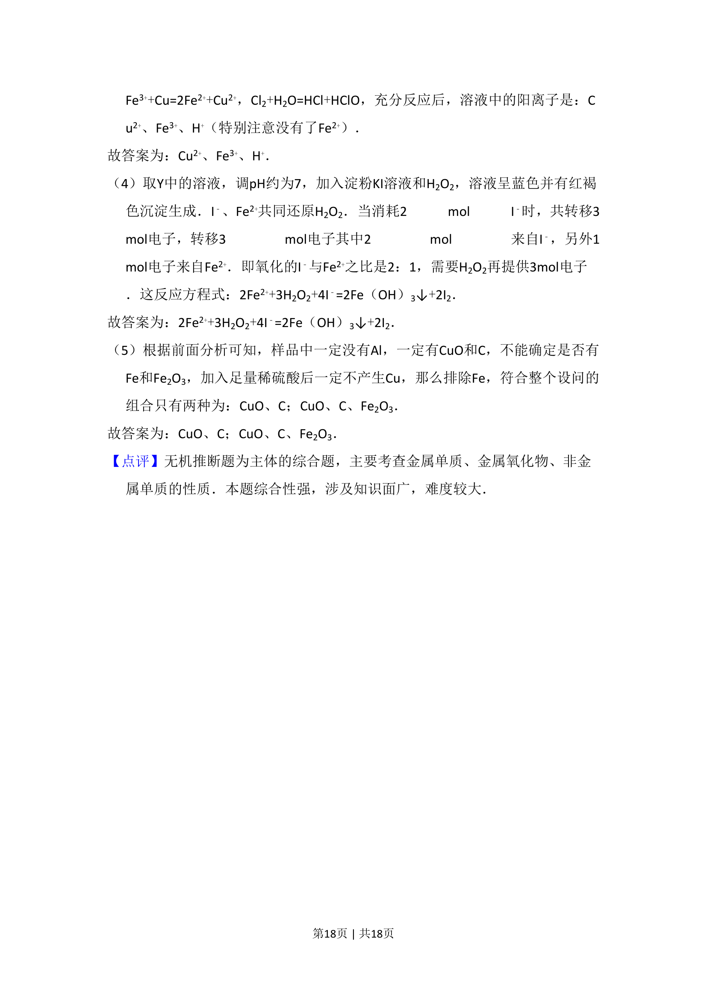

## 题面

## 摘要

根据实验现象推断混合粉末中不含铝，涉及铝及其化合物的反应特性。

## 关联考点

- [[987-铝的化学性质|铝的化学性质]]
- [[179-两性氢氧化物|两性氢氧化物]]
- [[物质的推断]]
- [[偏铝酸盐与二氧化碳反应]]

## 答案与解析

> 📄 原 PDF 第 15 页：`素材/真题/北京/2008-2024·（北京）化学高考真题/2008年高考化学试卷（北京）（解析卷）.pdf`
