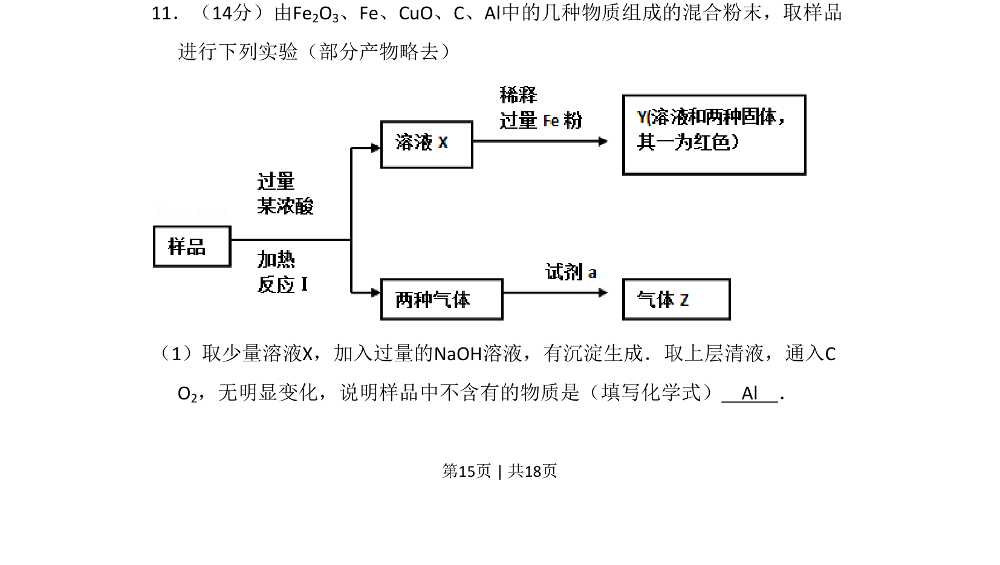
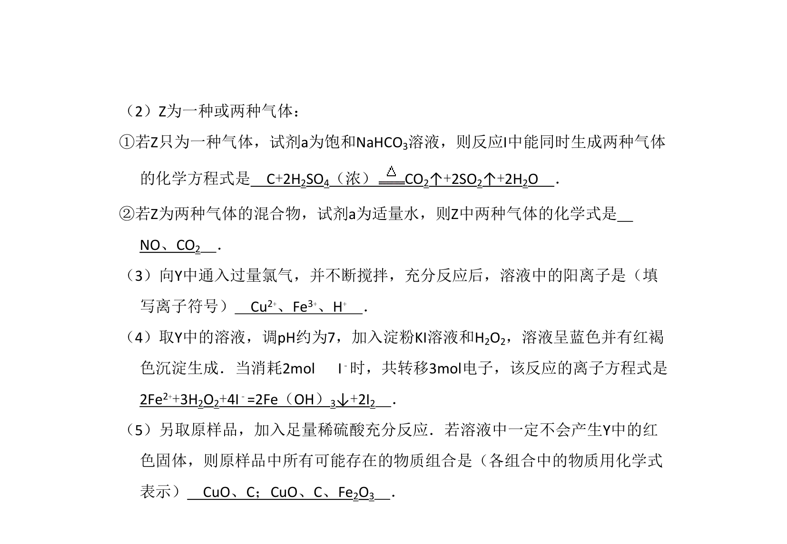
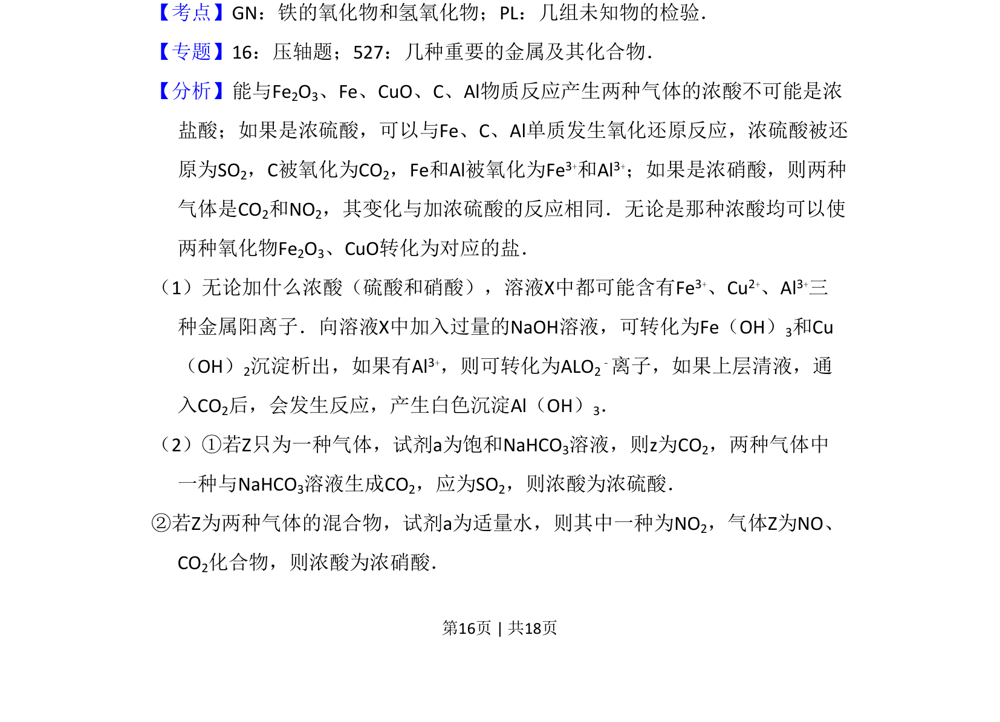
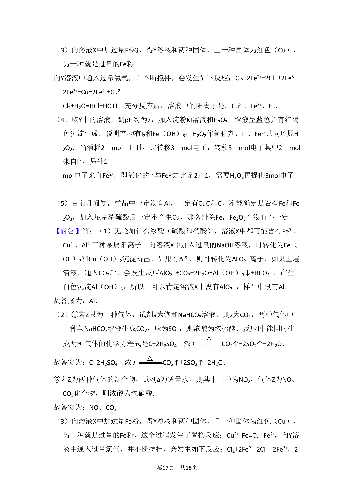
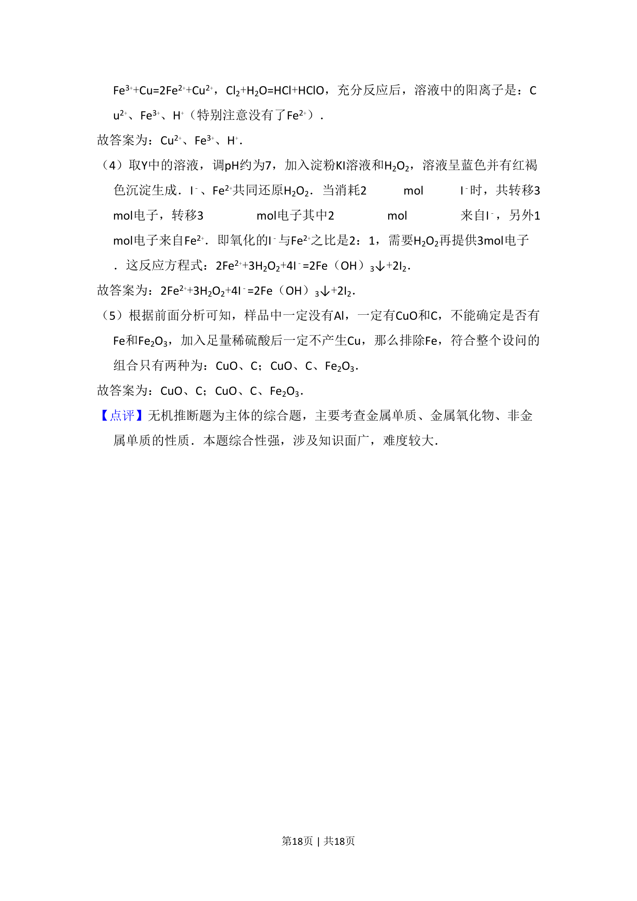

## 题面

## 摘要

根据实验现象推断混合粉末中不含铝，涉及铝及其化合物的反应特性。

## 关联考点

- [[987-铝的化学性质|铝的化学性质]]
- [[179-两性氢氧化物|两性氢氧化物]]
- [[物质的推断]]
- [[偏铝酸盐与二氧化碳反应]]

## 答案与解析

> 📄 原 PDF 第 15 页：`素材/真题/北京/2008-2024·（北京）化学高考真题/2008年高考化学试卷（北京）（解析卷）.pdf`

<!-- 题干文本-start -->
## 题干文本
11．（14分）由Fe2O3、Fe、CuO、C、Al中的几种物质组成的混合粉末，取样品
进行下列实验（部分产物略去）
（1）取少量溶液X，加入过量的NaOH溶液，有沉淀生成．取上层清液，通入C
O2，无明显变化，说明样品中不含有的物质是（填写化学式）　Al　．
<!-- 题干文本-end -->

<!-- 解析文本-start -->
## 解析文本

<!-- 解析文本-end -->
