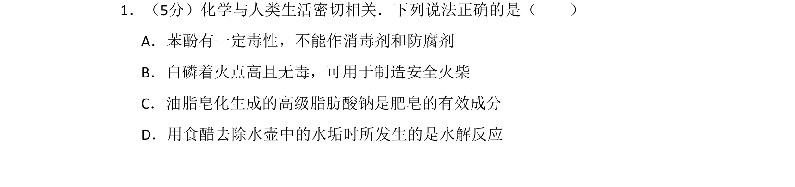
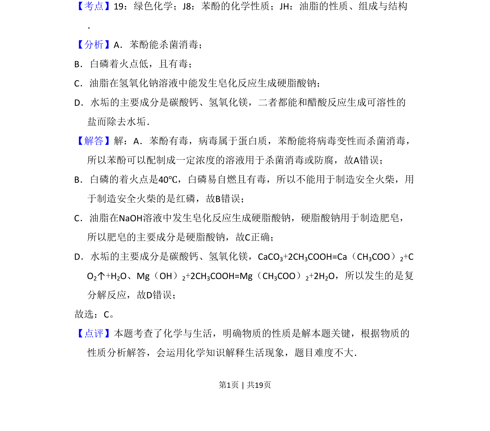

## 题面

## 摘要

化学与生活相关物质性质及反应判断，涉及消毒防腐、安全火柴、皂化反应和除水垢原理。

## 关联考点

- [[苯酚的化学性质]]
- [[油脂的性质组成与结构]]
- [[279-绿色化学|绿色化学]]
- [[109-复分解反应|复分解反应]]

## 答案与解析

> 📄 原 PDF 第 1 页：`素材/真题/北京/2008-2024·（北京）化学高考真题/2009年高考化学试卷（北京）（解析卷）.pdf`
