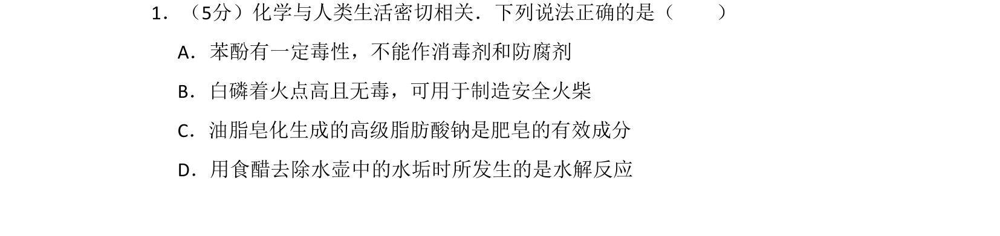
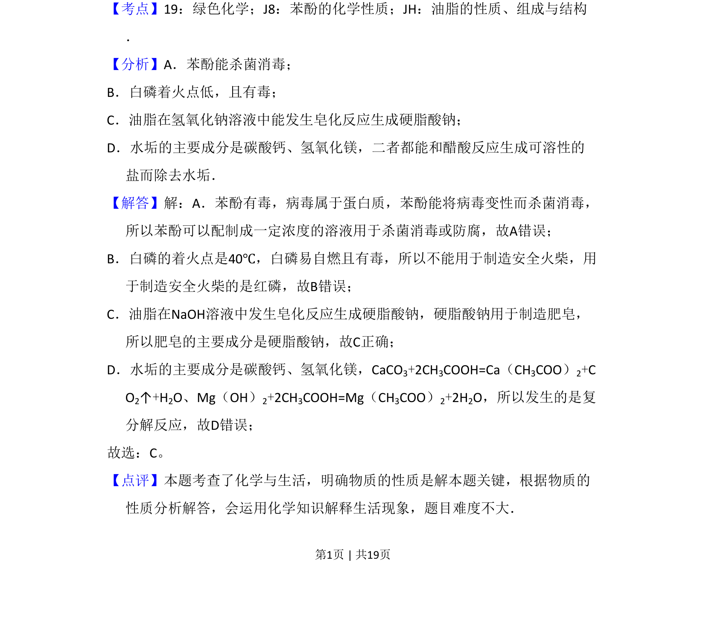

## 题面

## 摘要

化学与生活相关物质性质及反应判断，涉及消毒防腐、安全火柴、皂化反应和除水垢原理。

## 关联考点

- [[苯酚的化学性质]]
- [[油脂的性质组成与结构]]
- [[279-绿色化学|绿色化学]]
- [[109-复分解反应|复分解反应]]

## 答案与解析

> 📄 原 PDF 第 1 页：`素材/真题/北京/2008-2024·（北京）化学高考真题/2009年高考化学试卷（北京）（解析卷）.pdf`

<!-- 题干文本-start -->
## 题干文本
1．（5分）化学与人类生活密切相关．下列说法正确的是（　　）
A．苯酚有一定毒性，不能作消毒剂和防腐剂
B．白磷着火点高且无毒，可用于制造安全火柴
C．油脂皂化生成的高级脂肪酸钠是肥皂的有效成分
D．用食醋去除水壶中的水垢时所发生的是水解反应
<!-- 题干文本-end -->

<!-- 解析文本-start -->
## 解析文本
【考点】19：绿色化学；J8：苯酚的化学性质；JH：油脂的性质、组成与结构
．菁优网版权所有
【分析】A．苯酚能杀菌消毒；
B．白磷着火点低，且有毒；
C．油脂在氢氧化钠溶液中能发生皂化反应生成硬脂酸钠；
D．水垢的主要成分是碳酸钙、氢氧化镁，二者都能和醋酸反应生成可溶性的
盐而除去水垢．
【解答】解：A．苯酚有毒，病毒属于蛋白质，苯酚能将病毒变性而杀菌消毒，
所以苯酚可以配制成一定浓度的溶液用于杀菌消毒或防腐，故A错误；
B．白磷的着火点是40℃，白磷易自燃且有毒，所以不能用于制造安全火柴，用
于制造安全火柴的是红磷，故B错误；
C．油脂在NaOH溶液中发生皂化反应生成硬脂酸钠，硬脂酸钠用于制造肥皂，
所以肥皂的主要成分是硬脂酸钠，故C正确；
D．水垢的主要成分是碳酸钙、氢氧化镁，CaCO3+2CH3COOH=Ca（CH3COO）2+C
O2↑+H2O、Mg（OH）2+2CH3COOH=Mg（CH3COO）2+2H2O，所以发生的是复
分解反应，故D错误；
故选：C。
【点评】本题考查了化学与生活，明确物质的性质是解本题关键，根据物质的
性质分析解答，会运用化学知识解释生活现象，题目难度不大．
<!-- 解析文本-end -->
