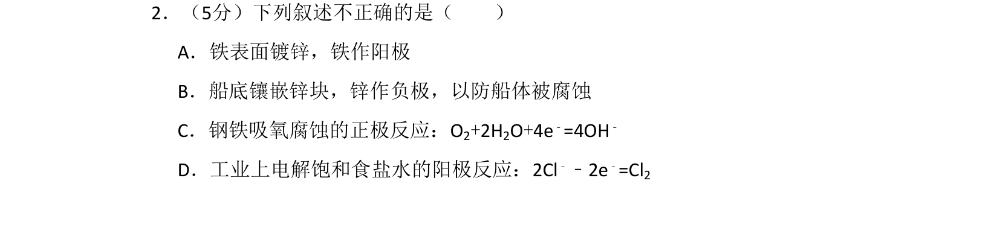
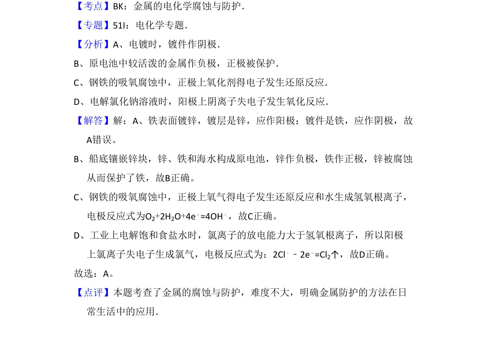

## 题面

## 摘要

本题通过判断电化学叙述的正误，考查电镀、牺牲阳极保护、吸氧腐蚀和电解食盐水等知识。

## 关联考点

- [[962-金属的电化学腐蚀与防护|金属的电化学腐蚀与防护]]
- [[371-电镀|电镀]]
- [[287-原电池|原电池]]
- [[368-电解池|电解池]]

## 答案与解析

> 📄 原 PDF 第 2 页：`素材/真题/北京/2008-2024·（北京）化学高考真题/2009年高考化学试卷（北京）（解析卷）.pdf`
