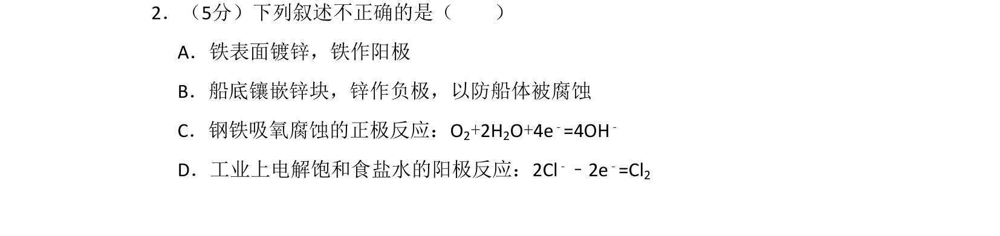
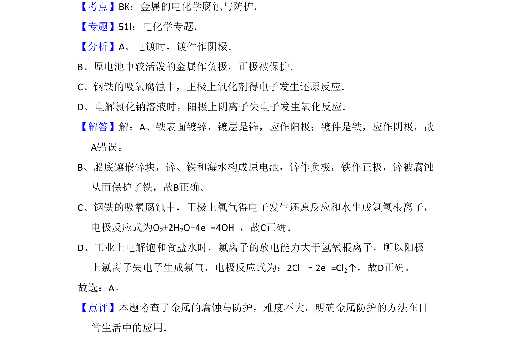

## 题面

## 摘要

本题通过判断电化学叙述的正误，考查电镀、牺牲阳极保护、吸氧腐蚀和电解食盐水等知识。

## 关联考点

- [[962-金属的电化学腐蚀与防护|金属的电化学腐蚀与防护]]
- [[371-电镀|电镀]]
- [[287-原电池|原电池]]
- [[368-电解池|电解池]]

## 答案与解析

> 📄 原 PDF 第 2 页：`素材/真题/北京/2008-2024·（北京）化学高考真题/2009年高考化学试卷（北京）（解析卷）.pdf`

<!-- 题干文本-start -->
## 题干文本
2．（5分）下列叙述不正确的是（　　）
A．铁表面镀锌，铁作阳极
B．船底镶嵌锌块，锌作负极，以防船体被腐蚀
C．钢铁吸氧腐蚀的正极反应：O2+2H2O+4e﹣=4OH﹣
D．工业上电解饱和食盐水的阳极反应：2Cl﹣﹣2e﹣=Cl2
<!-- 题干文本-end -->

<!-- 解析文本-start -->
## 解析文本
【考点】BK：金属的电化学腐蚀与防护．菁优网版权所有
【专题】51I：电化学专题．
【分析】A、电镀时，镀件作阴极．
B、原电池中较活泼的金属作负极，正极被保护．
C、钢铁的吸氧腐蚀中，正极上氧化剂得电子发生还原反应．
D、电解氯化钠溶液时，阳极上阴离子失电子发生氧化反应．
【解答】解：A、铁表面镀锌，镀层是锌，应作阳极；镀件是铁，应作阴极，故
A错误。
B、船底镶嵌锌块，锌、铁和海水构成原电池，锌作负极，铁作正极，锌被腐蚀
从而保护了铁，故B正确。
C、钢铁的吸氧腐蚀中，正极上氧气得电子发生还原反应和水生成氢氧根离子，
电极反应式为O2+2H2O+4e﹣=4OH﹣，故C正确。
D、工业上电解饱和食盐水时，氯离子的放电能力大于氢氧根离子，所以阳极
上氯离子失电子生成氯气，电极反应式为：2Cl﹣﹣2e﹣=Cl2↑，故D正确。
故选：A。
【点评】本题考查了金属的腐蚀与防护，难度不大，明确金属防护的方法在日
常生活中的应用．
<!-- 解析文本-end -->
