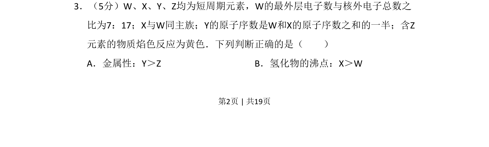
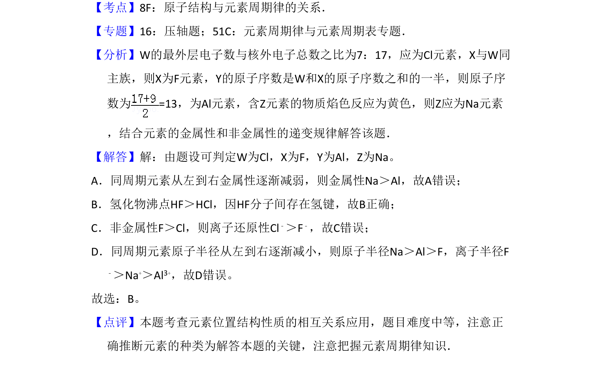

## 题面

## 摘要

通过原子结构比例及焰色反应推断短周期元素，并判断金属性与氢化物沸点正误。

## 关联考点

- [[597-元素推断|元素推断]]
- [[426-原子结构|原子结构]]
- [[252-元素周期律|元素周期律]]
- [[435-氢键|氢键]]

## 答案与解析

> 📄 原 PDF 第 2 页：`素材/真题/北京/2008-2024·（北京）化学高考真题/2009年高考化学试卷（北京）（解析卷）.pdf`
