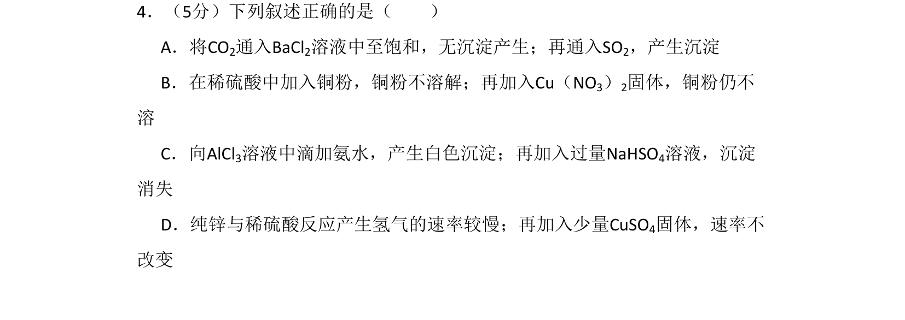
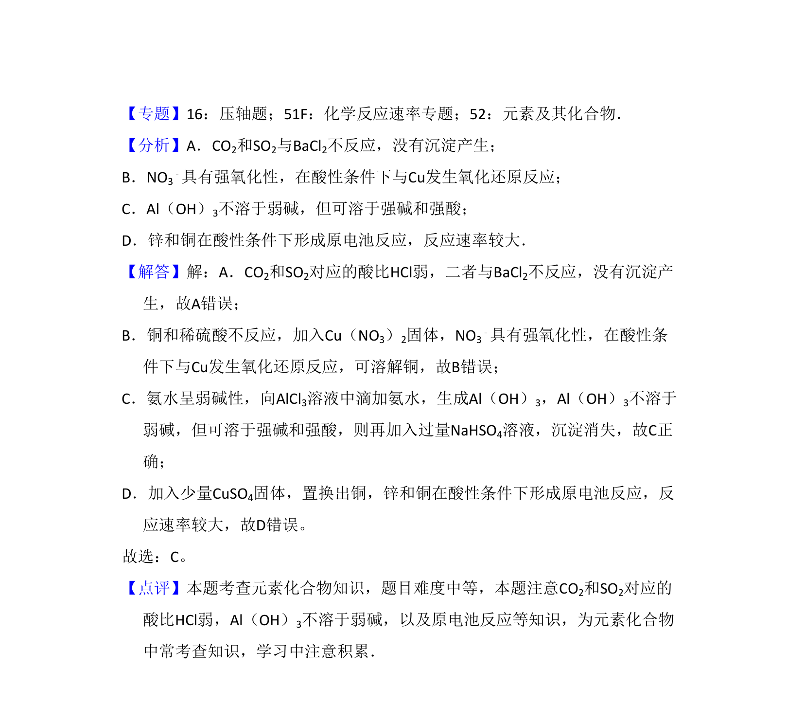

## 题面

## 摘要

考查无机物性质及反应现象判断，涉及二氧化碳、二氧化硫、硝酸、两性氢氧化物等性质。

## 关联考点

- [[969-二氧化硫的化学性质|二氧化硫的化学性质]]
- [[982-硝酸的化学性质|硝酸的化学性质]]
- [[两性氧化物和两性氢氧化物]]
- [[913-化学反应速率的影响因素|化学反应速率的影响因素]]

## 答案与解析

> 📄 原 PDF 第 3 页：`素材/真题/北京/2008-2024·（北京）化学高考真题/2009年高考化学试卷（北京）（解析卷）.pdf`
