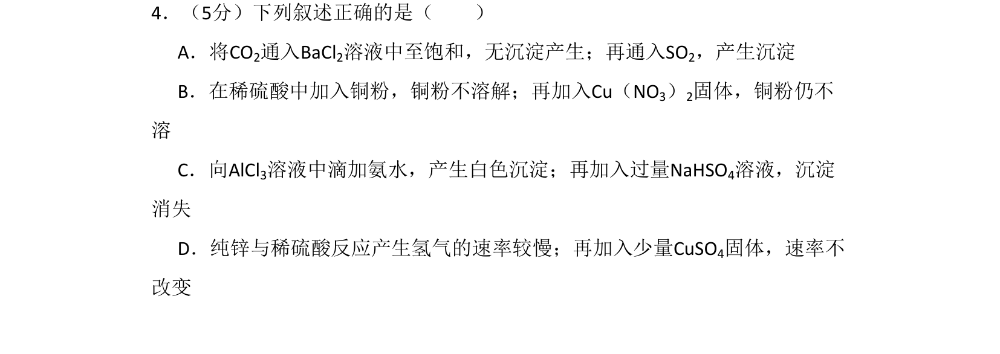
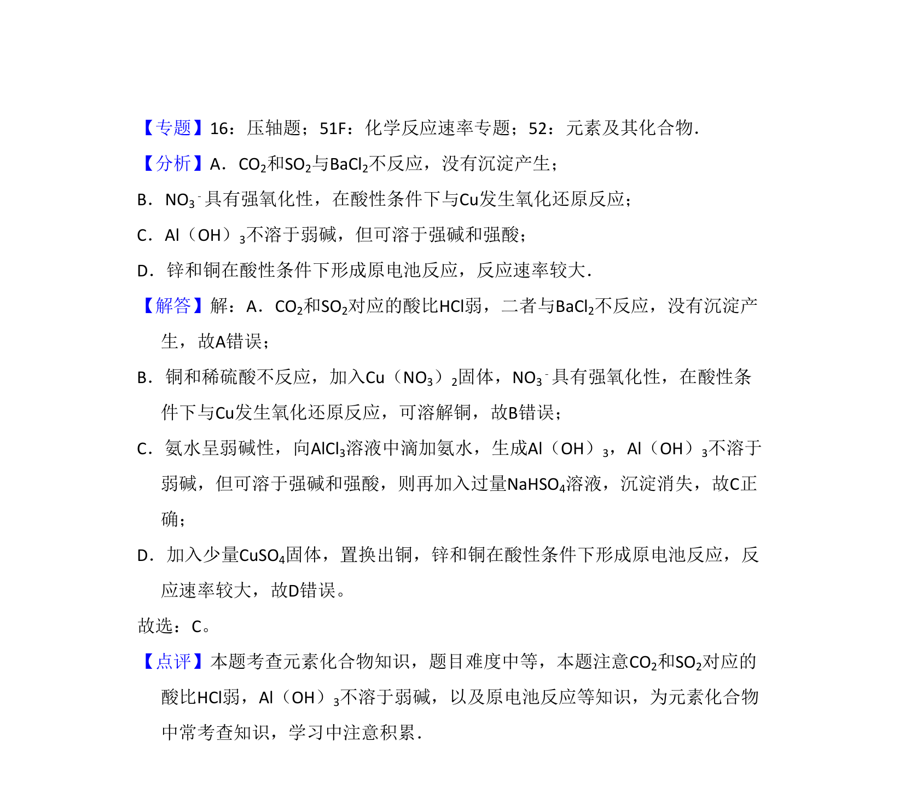

## 题面

## 摘要

考查无机物性质及反应现象判断，涉及二氧化碳、二氧化硫、硝酸、两性氢氧化物等性质。

## 关联考点

- [[969-二氧化硫的化学性质|二氧化硫的化学性质]]
- [[982-硝酸的化学性质|硝酸的化学性质]]
- [[两性氧化物和两性氢氧化物]]
- [[974-化学反应速率影响因素|化学反应速率的影响因素]]

## 答案与解析

> 📄 原 PDF 第 3 页：`素材/真题/北京/2008-2024·（北京）化学高考真题/2009年高考化学试卷（北京）（解析卷）.pdf`

<!-- 题干文本-start -->
## 题干文本
4．（5分）下列叙述正确的是（　　）
A．将CO2通入BaCl2溶液中至饱和，无沉淀产生；再通入SO2，产生沉淀
B．在稀硫酸中加入铜粉，铜粉不溶解；再加入Cu（NO3）2固体，铜粉仍不
溶
C．向AlCl3溶液中滴加氨水，产生白色沉淀；再加入过量NaHSO4溶液，沉淀
消失
D．纯锌与稀硫酸反应产生氢气的速率较慢；再加入少量CuSO4固体，速率不
改变
<!-- 题干文本-end -->

<!-- 解析文本-start -->
## 解析文本
【考点】CA：化学反应速率的影响因素；EG：硝酸的化学性质；F5：二氧化硫
的化学性质；GL：两性氧化物和两性氢氧化物．菁优网版权所有
<!-- 解析文本-end -->
