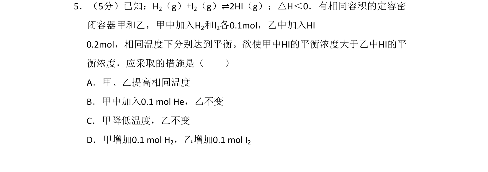
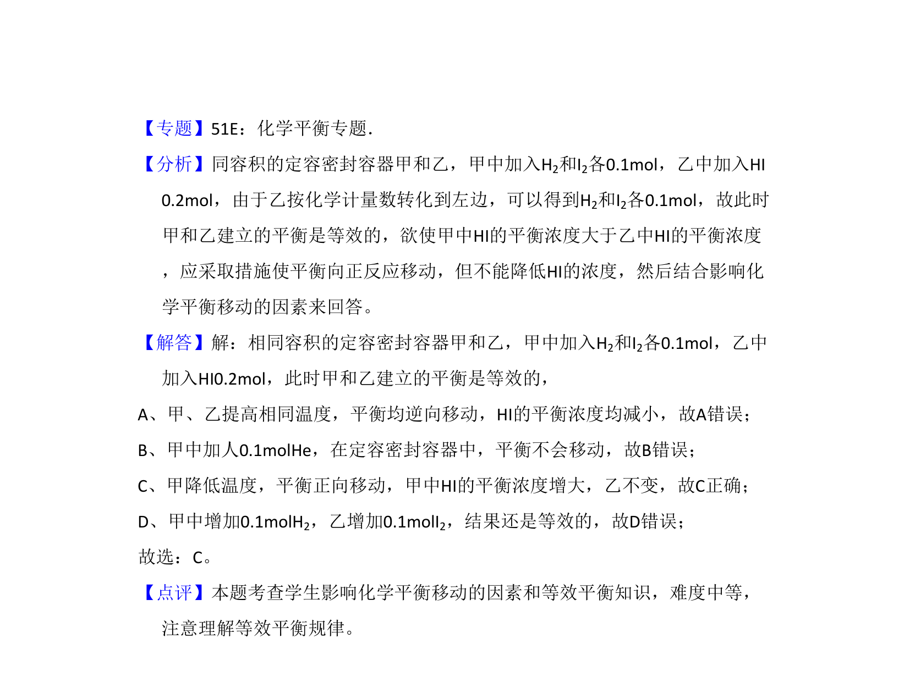

## 题面

## 摘要

本题通过等效平衡原理，考查温度、惰性气体、浓度对化学平衡移动方向及HI浓度的影响。

## 关联考点

- [[878-化学平衡的影响因素|化学平衡的影响因素]]
- [[355-等效平衡|等效平衡]]
- [[282-勒夏特列原理|勒夏特列原理]]

## 答案与解析

> 📄 原 PDF 第 4 页：`素材/真题/北京/2008-2024·（北京）化学高考真题/2009年高考化学试卷（北京）（解析卷）.pdf`
