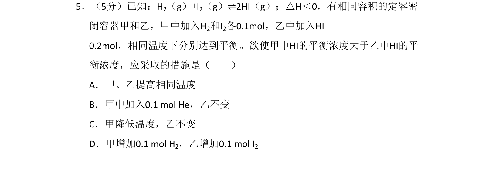
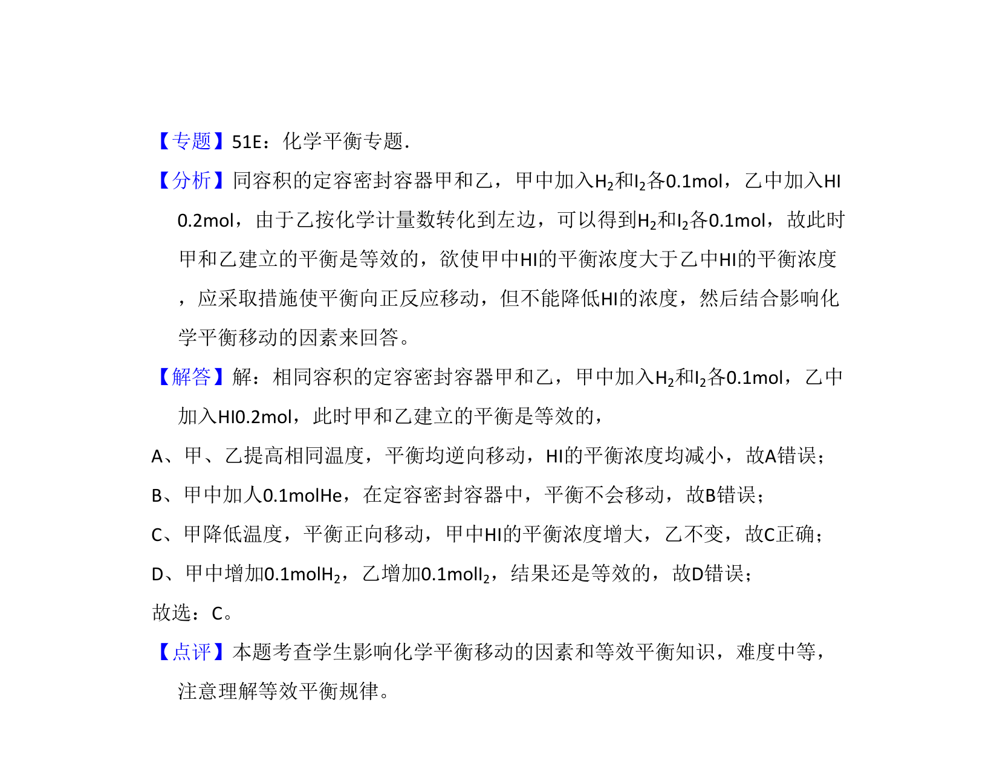

## 题面

## 摘要

本题通过等效平衡原理，考查温度、惰性气体、浓度对化学平衡移动方向及HI浓度的影响。

## 关联考点

- [[619-化学平衡影响因素|化学平衡的影响因素]]
- [[355-等效平衡|等效平衡]]
- [[282-勒夏特列原理|勒夏特列原理]]

## 答案与解析

> 📄 原 PDF 第 4 页：`素材/真题/北京/2008-2024·（北京）化学高考真题/2009年高考化学试卷（北京）（解析卷）.pdf`

<!-- 题干文本-start -->
## 题干文本
5．（5分）已知：H2（g）+I2（g）⇌2HI（g）；△H＜0．有相同容积的定容密
闭容器甲和乙，甲中加入H2和I2各0.1mol，乙中加入HI 
0.2mol，相同温度下分别达到平衡。欲使甲中HI的平衡浓度大于乙中HI的平
衡浓度，应采取的措施是（　　）
A．甲、乙提高相同温度
B．甲中加入0.1 mol He，乙不变
C．甲降低温度，乙不变
D．甲增加0.1 mol H2，乙增加0.1 mol I2
<!-- 题干文本-end -->

<!-- 解析文本-start -->
## 解析文本
【考点】CB：化学平衡的影响因素．菁优网版权所有
<!-- 解析文本-end -->
