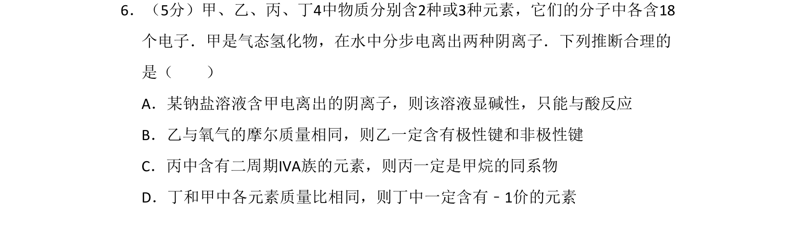
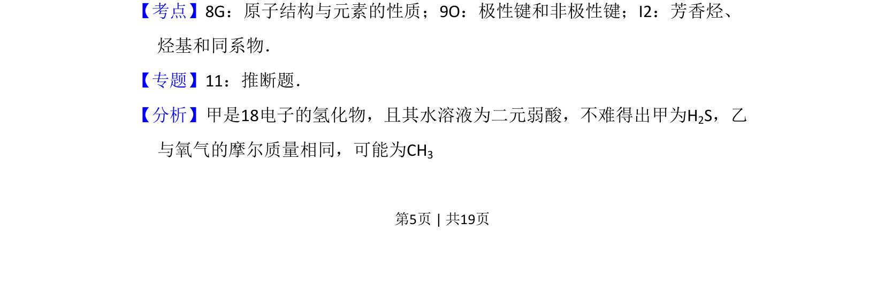
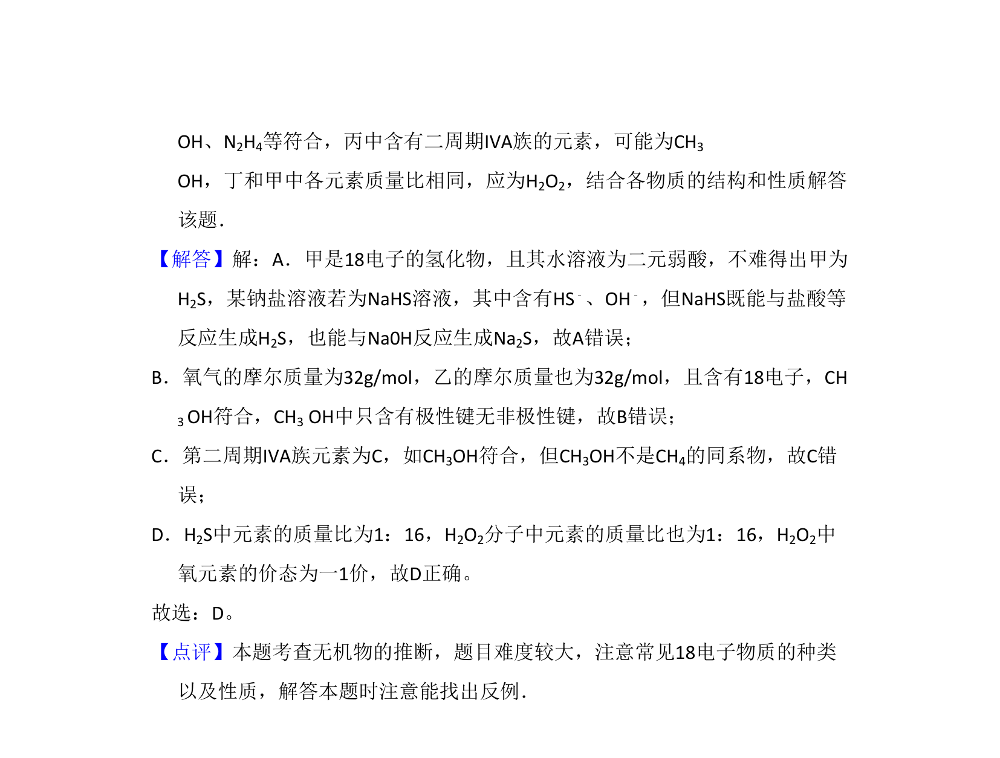

## 题面

## 摘要

推断含18电子物质的结构与性质，结合元素周期律和化学键判断选项正误

## 关联考点

- [[原子结构与元素性质]]
- [[极性键和非极性键]]
- [[658-同系物|同系物]]

## 答案与解析

> 📄 原 PDF 第 5 页：`素材/真题/北京/2008-2024·（北京）化学高考真题/2009年高考化学试卷（北京）（解析卷）.pdf`

<!-- 题干文本-start -->
## 题干文本
6．（5分）甲、乙、丙、丁4中物质分别含2种或3种元素，它们的分子中各含18
个电子．甲是气态氢化物，在水中分步电离出两种阴离子．下列推断合理的
是（　　）
A．某钠盐溶液含甲电离出的阴离子，则该溶液显碱性，只能与酸反应
B．乙与氧气的摩尔质量相同，则乙一定含有极性键和非极性键
C．丙中含有二周期IVA族的元素，则丙一定是甲烷的同系物
D．丁和甲中各元素质量比相同，则丁中一定含有﹣1价的元素
<!-- 题干文本-end -->

<!-- 解析文本-start -->
## 解析文本
【考点】8G：原子结构与元素的性质；9O：极性键和非极性键；I2：芳香烃、
烃基和同系物．菁优网版权所有
【专题】11：推断题．
【分析】甲是18电子的氢化物，且其水溶液为二元弱酸，不难得出甲为H2S，乙
与氧气的摩尔质量相同，可能为CH3
<!-- 解析文本-end -->
