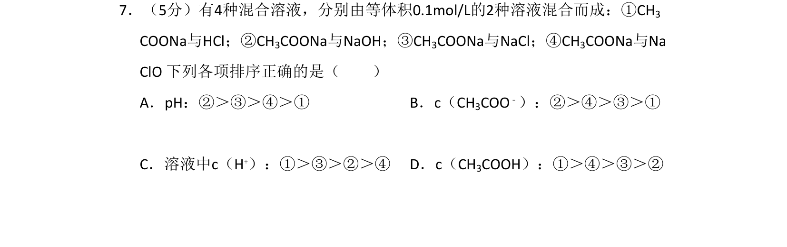
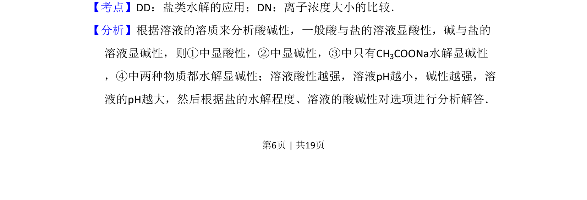
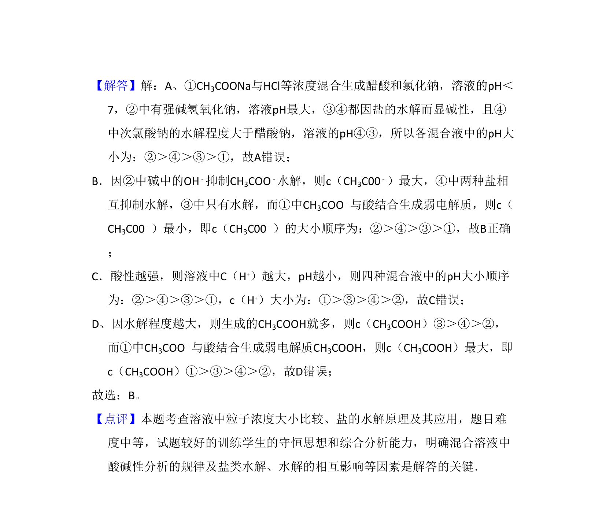

## 题面

## 摘要

混合溶液中盐类水解及离子浓度大小比较。

## 关联考点

- [[盐类水解的应用]]
- [[离子浓度大小的比较]]

## 答案与解析

> 📄 原 PDF 第 6 页：`素材/真题/北京/2008-2024·（北京）化学高考真题/2009年高考化学试卷（北京）（解析卷）.pdf`

<!-- 题干文本-start -->
## 题干文本
7．（5分）有4种混合溶液，分别由等体积0.1mol/L的2种溶液混合而成：①CH3
COONa与HCl；②CH3COONa与NaOH；③CH3COONa与NaCl；④CH3COONa与Na
ClO 下列各项排序正确的是（　　）
A．pH：②＞③＞④＞①B．c（CH 3COO﹣）：②＞④＞③＞①
C．溶液中c（H+）：①＞③＞②＞④D．c（CH 3COOH）：①＞④＞③＞②
<!-- 题干文本-end -->

<!-- 解析文本-start -->
## 解析文本
【考点】DD：盐类水解的应用；DN：离子浓度大小的比较．菁优网版权所有
【分析】根据溶液的溶质来分析酸碱性，一般酸与盐的溶液显酸性，碱与盐的
溶液显碱性，则①中显酸性，②中显碱性，③中只有CH3COONa水解显碱性
，④中两种物质都水解显碱性；溶液酸性越强，溶液pH越小，碱性越强，溶
液的pH越大，然后根据盐的水解程度、溶液的酸碱性对选项进行分析解答．
<!-- 解析文本-end -->
