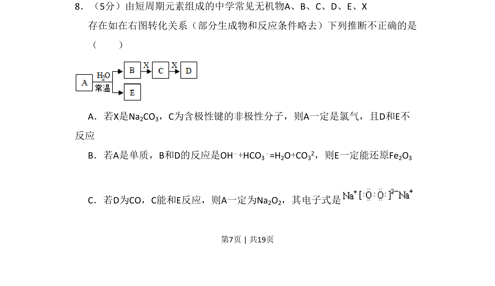
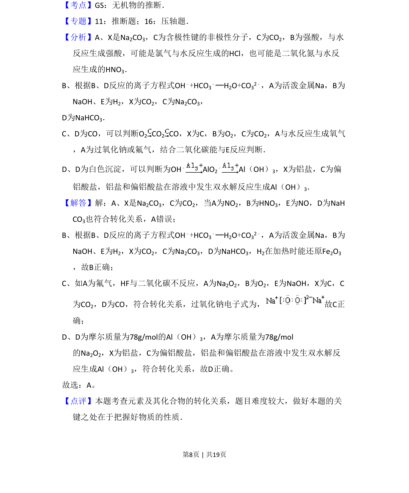

## 题面

## 摘要

短周期元素无机物转化关系推断，涉及Na2CO3、OH⁻与HCO₃⁻反应、Na2O2电子式等。

## 关联考点

- [[元素化合物推断]]
- [[无机转化关系]]
- [[266-电子式|电子式]]
- [[169-离子反应|离子反应]]

## 答案与解析

> 📄 原 PDF 第 7 页：`素材/真题/北京/2008-2024·（北京）化学高考真题/2009年高考化学试卷（北京）（解析卷）.pdf`
