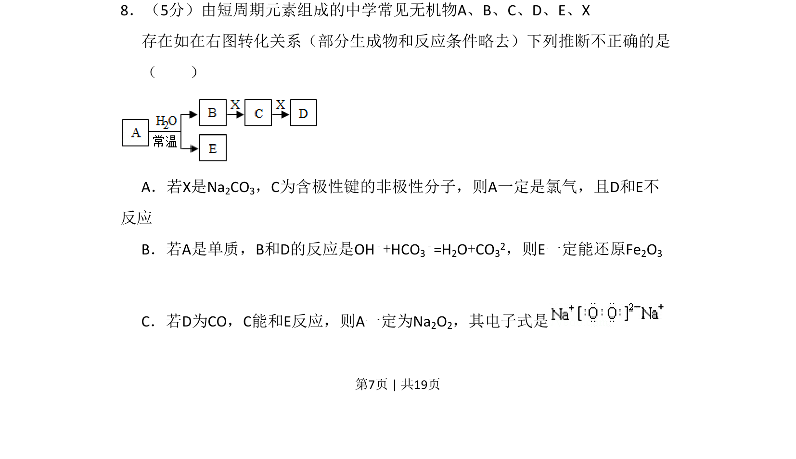
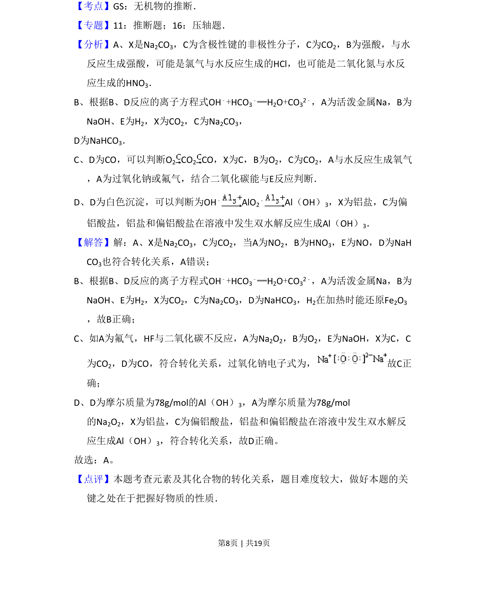

## 题面

## 摘要

短周期元素无机物转化关系推断，涉及Na2CO3、OH⁻与HCO₃⁻反应、Na2O2电子式等。

## 关联考点

- [[元素化合物推断]]
- [[无机转化关系]]
- [[266-电子式|电子式]]
- [[169-离子反应|离子反应]]

## 答案与解析

> 📄 原 PDF 第 7 页：`素材/真题/北京/2008-2024·（北京）化学高考真题/2009年高考化学试卷（北京）（解析卷）.pdf`

<!-- 题干文本-start -->
## 题干文本
8．（5分）由短周期元素组成的中学常见无机物A、B、C、D、E、X 
存在如在右图转化关系（部分生成物和反应条件略去）下列推断不正确的是
（　　）
A．若X是Na2CO3，C为含极性键的非极性分子，则A一定是氯气，且D和E不
反应
B．若A是单质，B和D的反应是OH﹣+HCO3
﹣=H2O+CO32，则E一定能还原Fe2O3
C．若D为CO，C能和E反应，则A一定为Na2O2，其电子式是
<!-- 题干文本-end -->

<!-- 解析文本-start -->
## 解析文本

<!-- 解析文本-end -->
