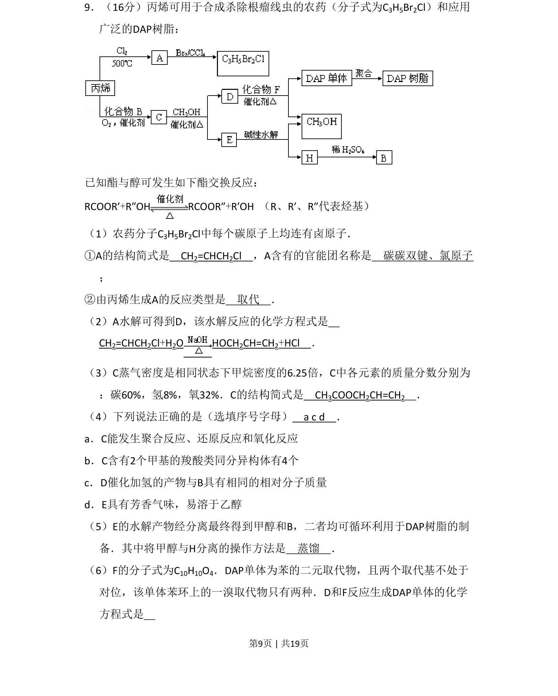
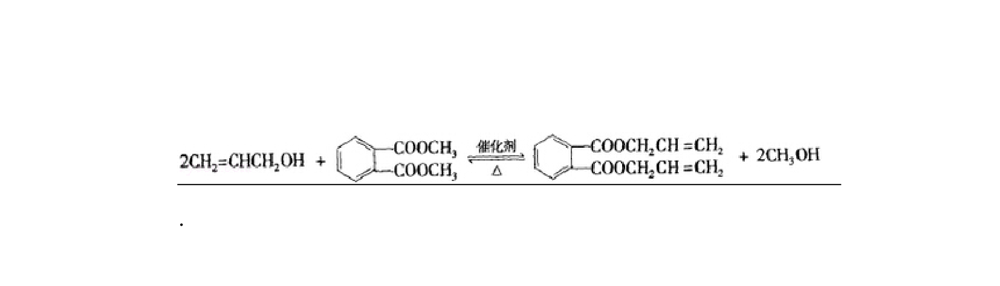
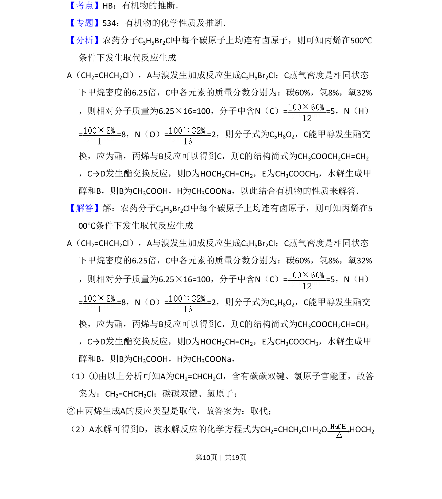
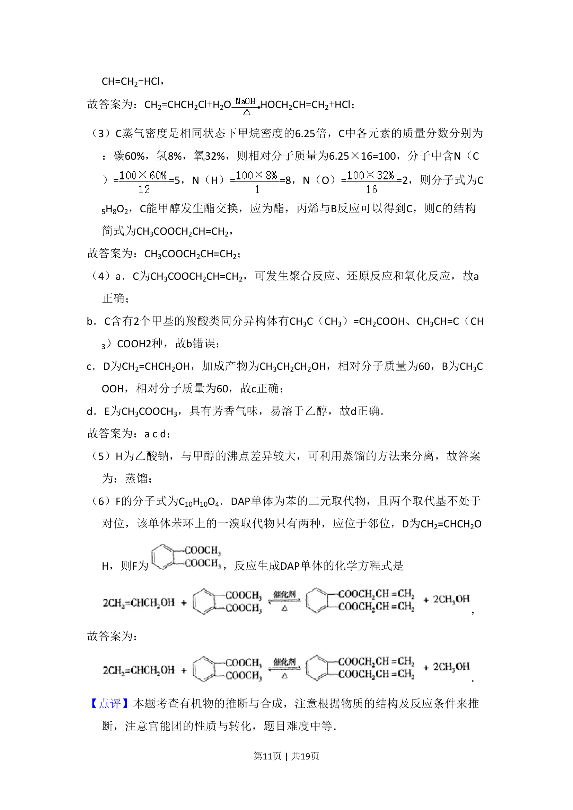

## 题面

## 摘要

该题考查丙烯衍生物的结构推断、反应类型、同分异构体与聚合反应等有机化学综合知识。

## 关联考点

- [[271-化学合成|有机合成]]
- [[448-官能团|官能团]]
- [[646-反应类型|反应类型]]
- [[446-同分异构体|同分异构体]]

## 答案与解析

> 📄 原 PDF 第 9 页：`素材/真题/北京/2008-2024·（北京）化学高考真题/2009年高考化学试卷（北京）（解析卷）.pdf`
