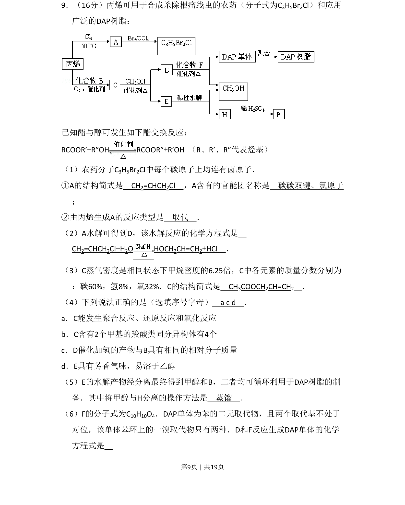
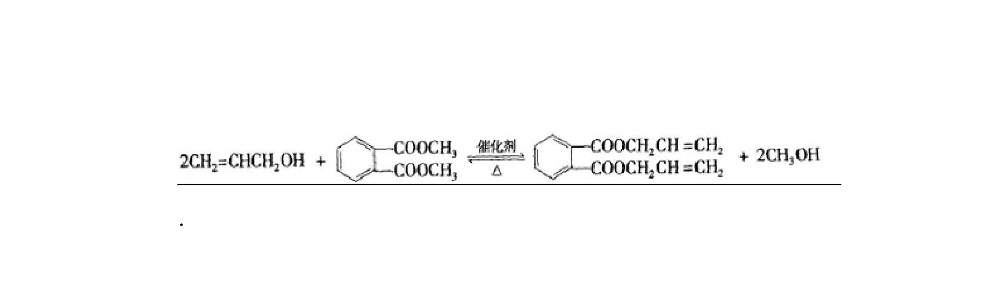
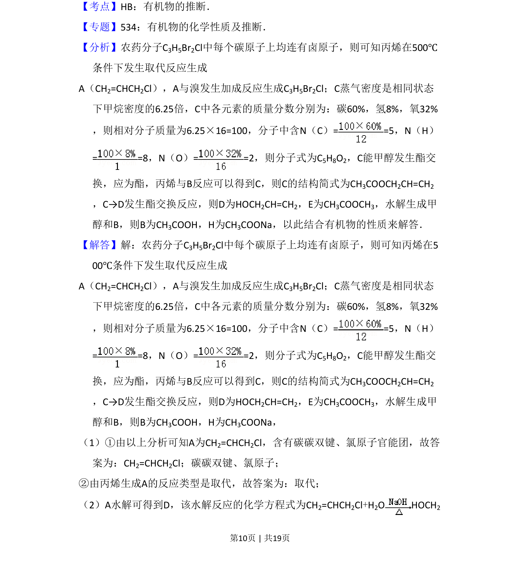
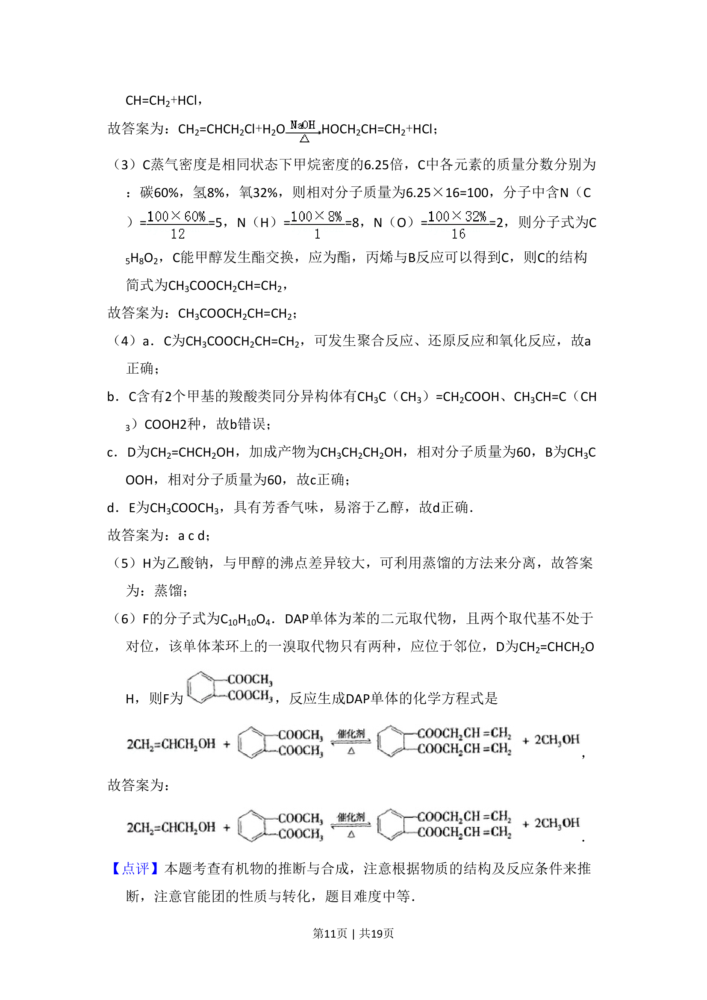

## 题面

## 摘要

该题考查丙烯衍生物的结构推断、反应类型、同分异构体与聚合反应等有机化学综合知识。

## 关联考点

- [[271-化学合成|有机合成]]
- [[448-官能团|官能团]]
- [[646-反应类型|反应类型]]
- [[446-同分异构体|同分异构体]]

## 答案与解析

> 📄 原 PDF 第 9 页：`素材/真题/北京/2008-2024·（北京）化学高考真题/2009年高考化学试卷（北京）（解析卷）.pdf`

<!-- 题干文本-start -->
## 题干文本
9．（16分）丙烯可用于合成杀除根瘤线虫的农药（分子式为C3H5Br2Cl）和应用
广泛的DAP树脂：
已知酯与醇可发生如下酯交换反应：
RCOOR′+R″OH RCOOR″+R′OH  （R、R′、R″代表烃基）
（1）农药分子C3H5Br2Cl中每个碳原子上均连有卤原子．
①A的结构简式是　CH2=CHCH2Cl　，A含有的官能团名称是　碳碳双键、氯原子　
；
②由丙烯生成A的反应类型是　取代　．
（2）A水解可得到D，该水解反应的化学方程式是　
CH2=CHCH2Cl+H2O HOCH2CH=CH2+HCl　．
（3）C蒸气密度是相同状态下甲烷密度的6.25倍，C中各元素的质量分数分别为
：碳60%，氢8%，氧32%．C的结构简式是　CH3COOCH2CH=CH2　．
（4）下列说法正确的是（选填序号字母）　a c d　．
a．C能发生聚合反应、还原反应和氧化反应
b．C含有2个甲基的羧酸类同分异构体有4个
c．D催化加氢的产物与B具有相同的相对分子质量
d．E具有芳香气味，易溶于乙醇
（5）E的水解产物经分离最终得到甲醇和B，二者均可循环利用于DAP树脂的制
备．其中将甲醇与H分离的操作方法是　蒸馏　．
（6）F的分子式为C10H10O4．DAP单体为苯的二元取代物，且两个取代基不处于
对位，该单体苯环上的一溴取代物只有两种．D和F反应生成DAP单体的化学
方程式是
<!-- 题干文本-end -->

<!-- 解析文本-start -->
## 解析文本

<!-- 解析文本-end -->
