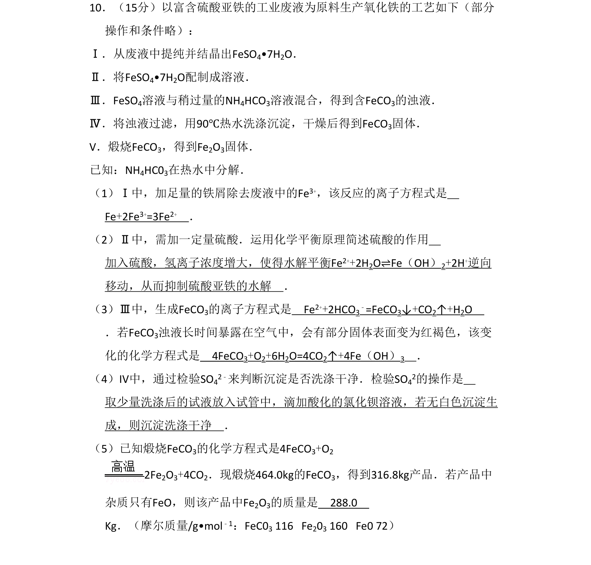
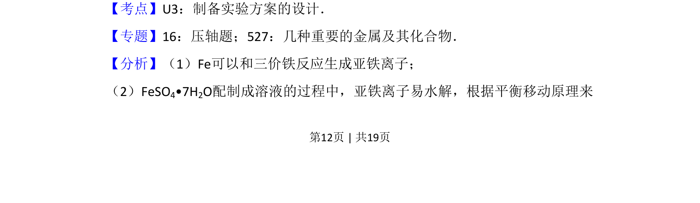
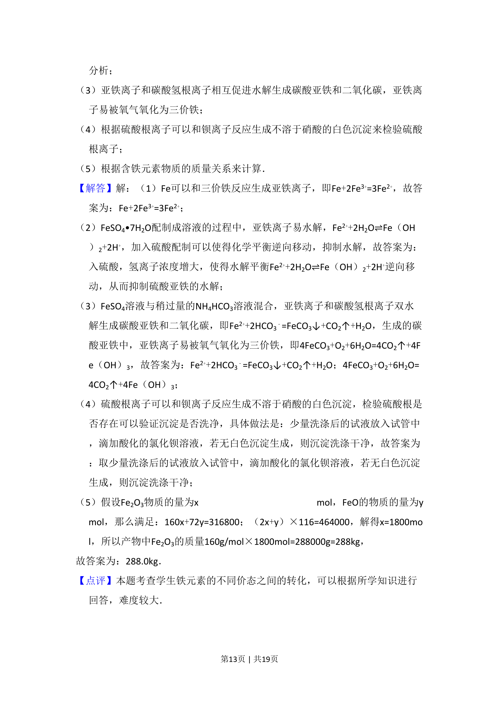

## 题面

## 摘要

以富含硫酸亚铁的工业废液为原料生产氧化铁的工艺流程，涉及提纯、反应、分离及计算。

## 关联考点

- [[制备实验方案的设计]]
- [[964-铁及其化合物|铁及其化合物]]
- [[化学平衡应用]]
- [[物质检验与计算]]

## 答案与解析

> 📄 原 PDF 第 12 页：`素材/真题/北京/2008-2024·（北京）化学高考真题/2009年高考化学试卷（北京）（解析卷）.pdf`
