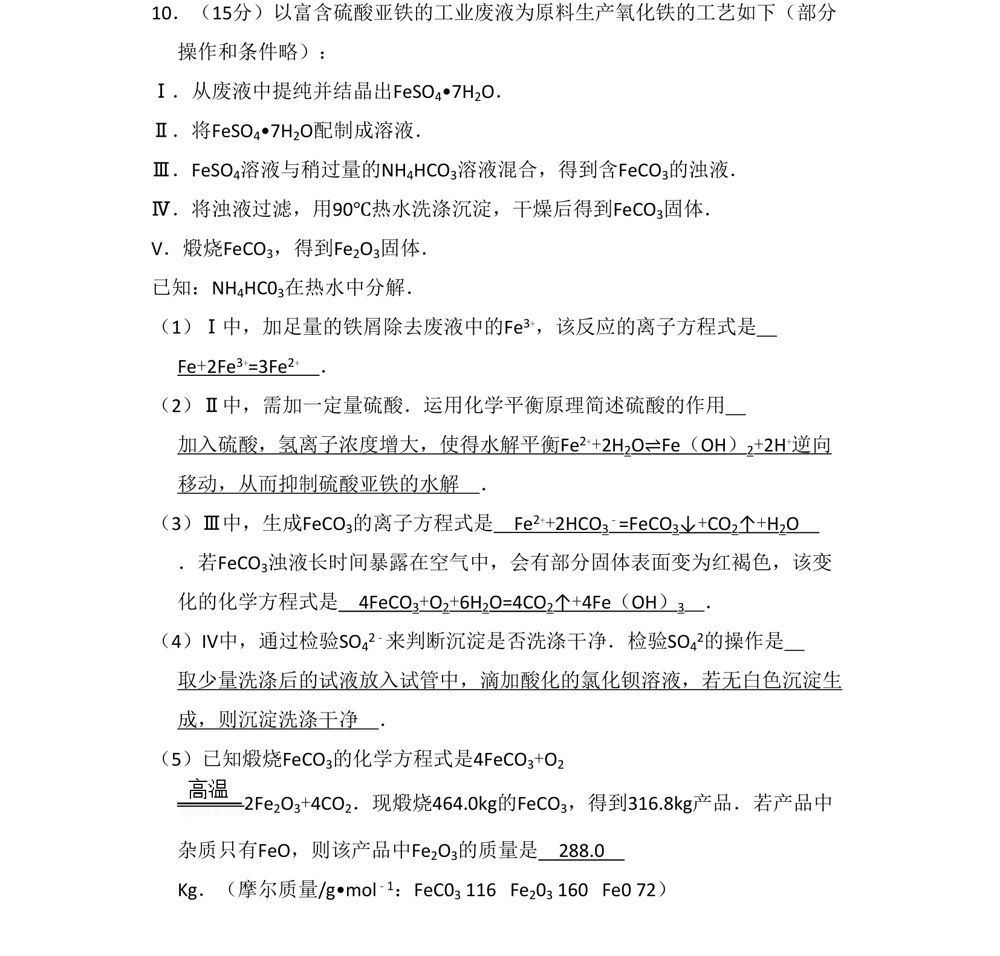
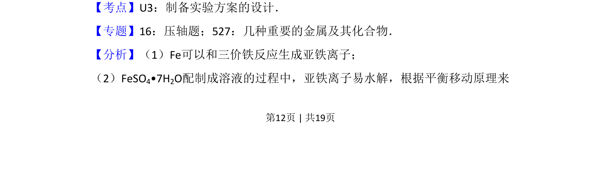
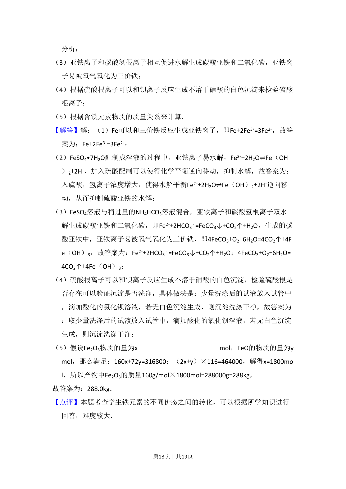

## 题面

## 摘要

以富含硫酸亚铁的工业废液为原料生产氧化铁的工艺流程，涉及提纯、反应、分离及计算。

## 关联考点

- [[制备实验方案的设计]]
- [[964-铁及其化合物|铁及其化合物]]
- [[化学平衡应用]]
- [[物质检验与计算]]

## 答案与解析

> 📄 原 PDF 第 12 页：`素材/真题/北京/2008-2024·（北京）化学高考真题/2009年高考化学试卷（北京）（解析卷）.pdf`

<!-- 题干文本-start -->
## 题干文本
10．（15分）以富含硫酸亚铁的工业废液为原料生产氧化铁的工艺如下（部分
操作和条件略）：
Ⅰ．从废液中提纯并结晶出FeSO4•7H2O．
Ⅱ．将FeSO4•7H2O配制成溶液．
Ⅲ．FeSO4溶液与稍过量的NH4HCO3溶液混合，得到含FeCO3的浊液．
Ⅳ．将浊液过滤，用90℃热水洗涤沉淀，干燥后得到FeCO3固体．
V．煅烧FeCO3，得到Fe2O3固体．
已知：NH4HC03在热水中分解．
（1）Ⅰ中，加足量的铁屑除去废液中的Fe3+，该反应的离子方程式是　
Fe+2Fe3+=3Fe2+　．
（2）Ⅱ中，需加一定量硫酸．运用化学平衡原理简述硫酸的作用　
加入硫酸，氢离子浓度增大，使得水解平衡Fe2++2H2O⇌Fe（OH）2+2H+逆向
移动，从而抑制硫酸亚铁的水解　．
（3）Ⅲ中，生成FeCO3的离子方程式是　Fe2++2HCO3
﹣=FeCO3↓+CO2↑+H2O　
．若FeCO3浊液长时间暴露在空气中，会有部分固体表面变为红褐色，该变
化的化学方程式是　4FeCO3+O2+6H2O=4CO2↑+4Fe（OH）3　．
（4）IV中，通过检验SO42﹣来判断沉淀是否洗涤干净．检验SO42的操作是　
取少量洗涤后的试液放入试管中，滴加酸化的氯化钡溶液，若无白色沉淀生
成，则沉淀洗涤干净　．
（5）已知煅烧FeCO3的化学方程式是4FeCO3+O2 
2Fe2O3+4CO2．现煅烧464.0kg的FeCO3，得到316.8kg产品．若产品中
杂质只有FeO，则该产品中Fe2O3的质量是　288.0　
Kg．（摩尔质量/g•mol﹣1：FeC03 116   Fe203 160   Fe0 72）
<!-- 题干文本-end -->

<!-- 解析文本-start -->
## 解析文本
【考点】U3：制备实验方案的设计．菁优网版权所有
【专题】16：压轴题；527：几种重要的金属及其化合物．
【分析】（1）Fe可以和三价铁反应生成亚铁离子；
（2）FeSO4•7H2O配制成溶液的过程中，亚铁离子易水解，根据平衡移动原理来
<!-- 解析文本-end -->
