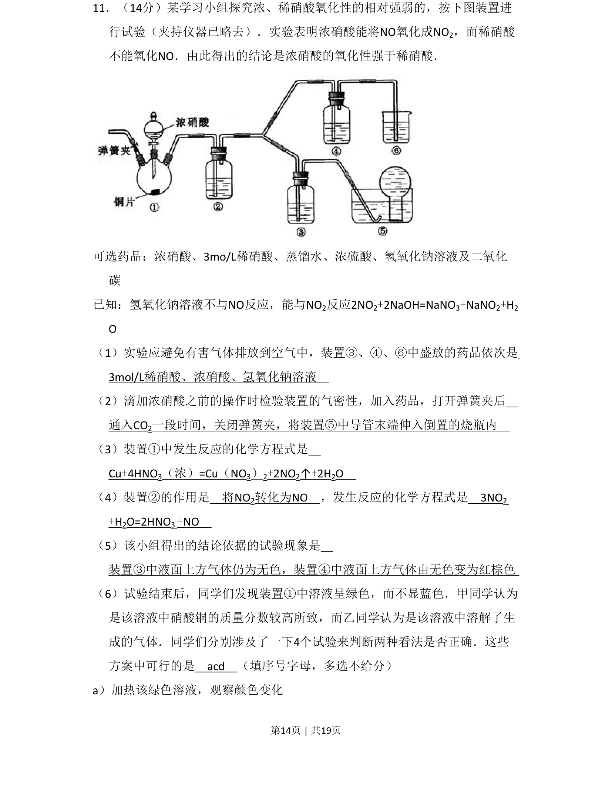
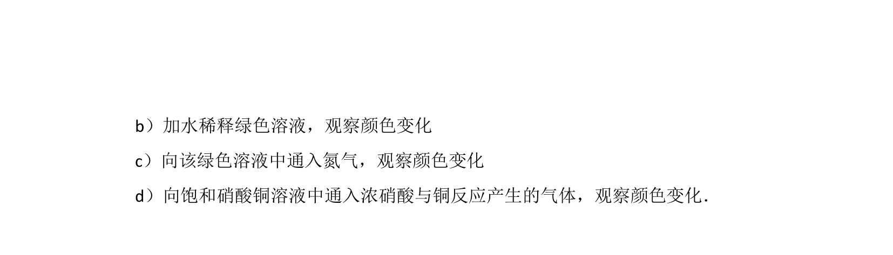
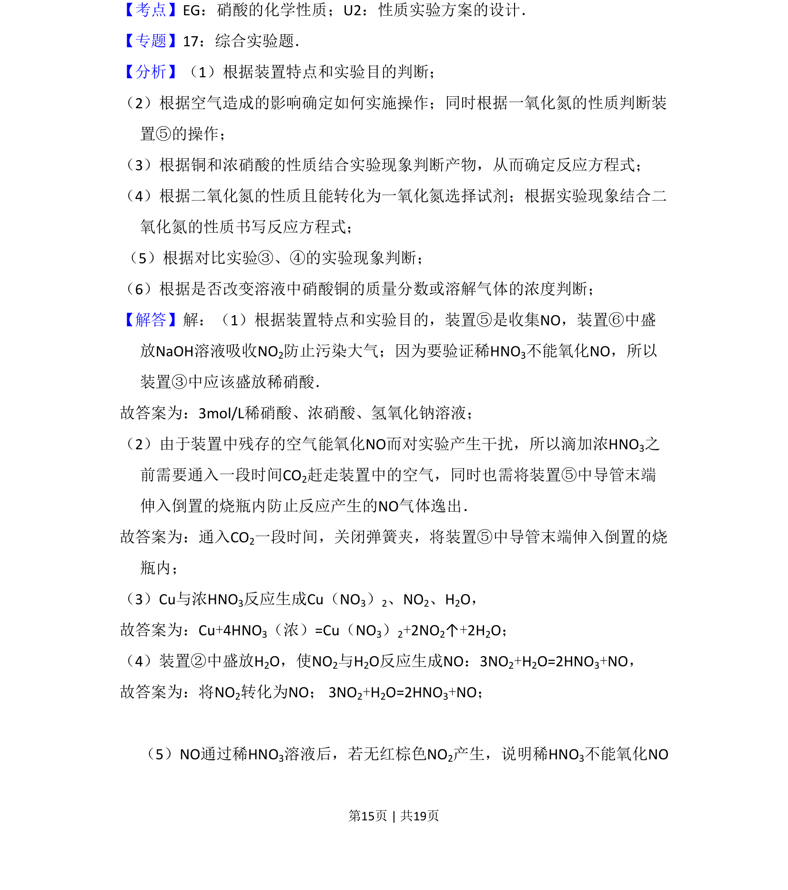
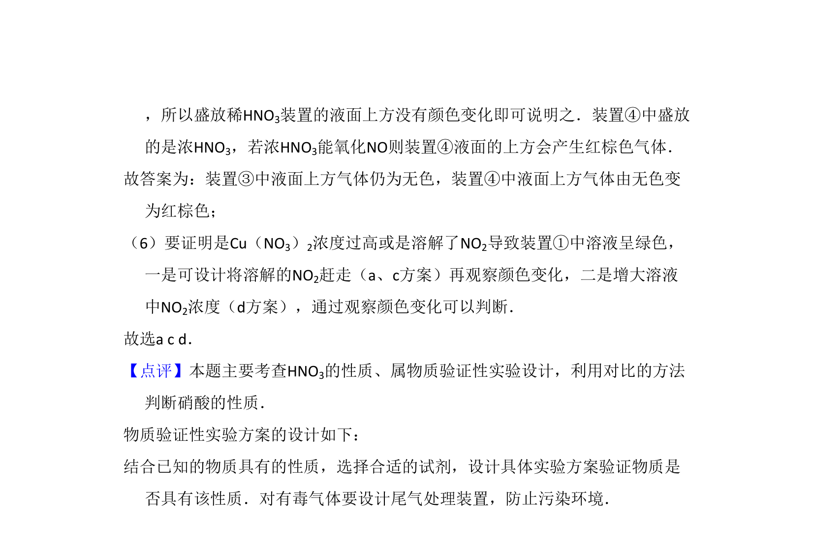

## 题面

## 摘要

探究浓、稀硝酸氧化性强弱，涉及NO与NO2转化、实验设计与尾气处理。

## 关联考点

- [[硝酸的氧化性]]
- [[氮氧化物的性质]]
- [[化学实验操作与设计]]
- [[677-尾气处理|尾气处理]]

## 答案与解析

> 📄 原 PDF 第 14 页：`素材/真题/北京/2008-2024·（北京）化学高考真题/2009年高考化学试卷（北京）（解析卷）.pdf`
