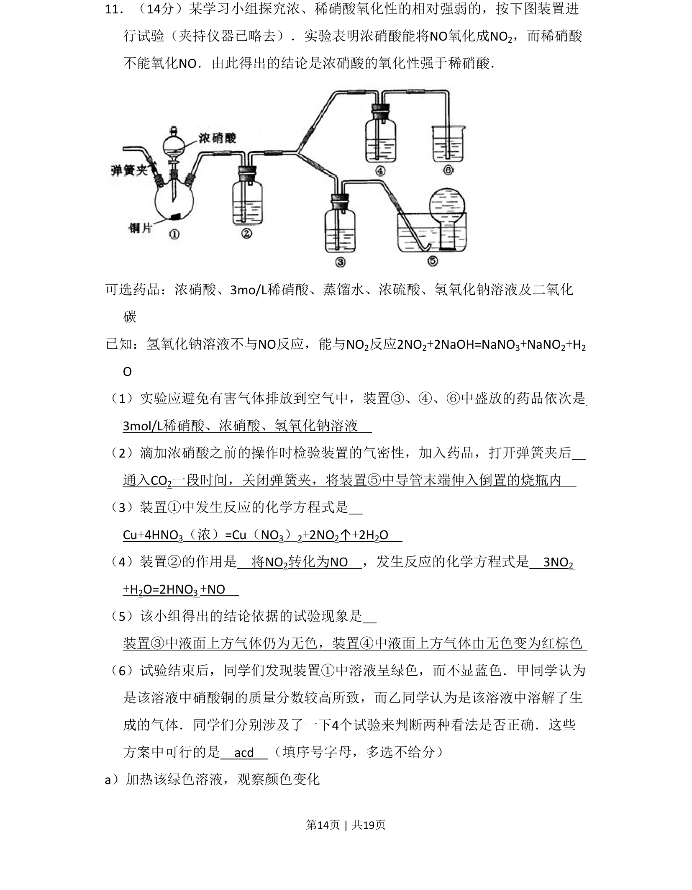
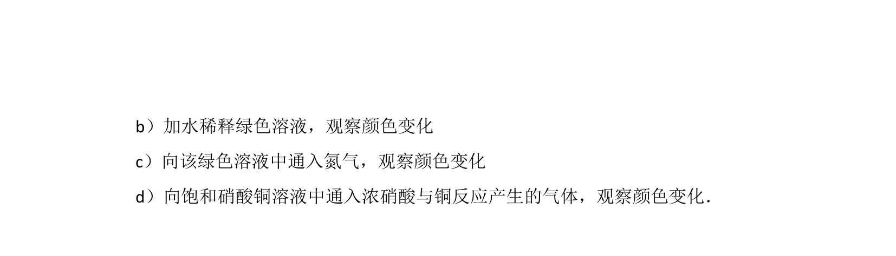
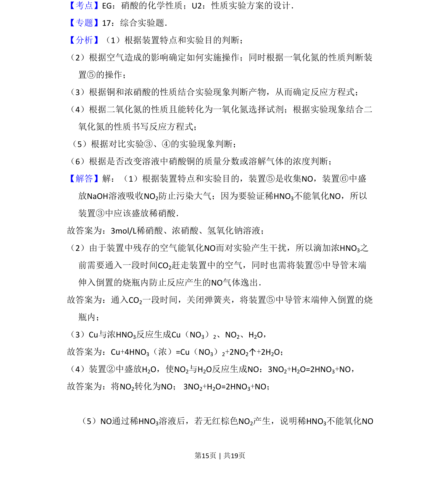
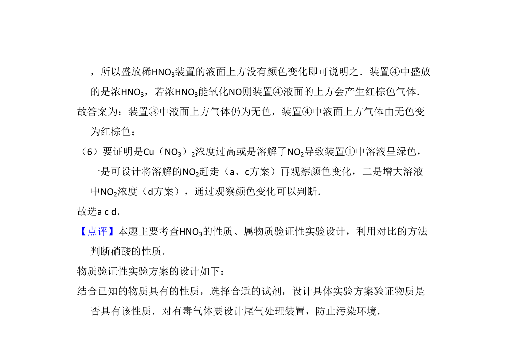

## 题面

## 摘要

探究浓、稀硝酸氧化性强弱，涉及NO与NO2转化、实验设计与尾气处理。

## 关联考点

- [[硝酸的氧化性]]
- [[氮氧化物的性质]]
- [[化学实验操作与设计]]
- [[677-尾气处理|尾气处理]]

## 答案与解析

> 📄 原 PDF 第 14 页：`素材/真题/北京/2008-2024·（北京）化学高考真题/2009年高考化学试卷（北京）（解析卷）.pdf`

<!-- 题干文本-start -->
## 题干文本
11．（14分）某学习小组探究浓、稀硝酸氧化性的相对强弱的，按下图装置进
行试验（夹持仪器已略去）．实验表明浓硝酸能将NO氧化成NO2，而稀硝酸
不能氧化NO．由此得出的结论是浓硝酸的氧化性强于稀硝酸．
可选药品：浓硝酸、3mo/L稀硝酸、蒸馏水、浓硫酸、氢氧化钠溶液及二氧化
碳
已知：氢氧化钠溶液不与NO反应，能与NO2反应2NO2+2NaOH=NaNO3+NaNO2+H2
O
（1）实验应避免有害气体排放到空气中，装置③、④、⑥中盛放的药品依次是　
3mol/L稀硝酸、浓硝酸、氢氧化钠溶液　
（2）滴加浓硝酸之前的操作时检验装置的气密性，加入药品，打开弹簧夹后　
通入CO2一段时间，关闭弹簧夹，将装置⑤中导管末端伸入倒置的烧瓶内　
（3）装置①中发生反应的化学方程式是　
Cu+4HNO3（浓）=Cu（NO3）2+2NO2↑+2H2O　
（4）装置②的作用是　将NO2转化为NO　，发生反应的化学方程式是　3NO2 
+H2O=2HNO3 +NO　
（5）该小组得出的结论依据的试验现象是　
装置③中液面上方气体仍为无色，装置④中液面上方气体由无色变为红棕色　
（6）试验结束后，同学们发现装置①中溶液呈绿色，而不显蓝色．甲同学认为
是该溶液中硝酸铜的质量分数较高所致，而乙同学认为是该溶液中溶解了生
成的气体．同学们分别涉及了一下4个试验来判断两种看法是否正确．这些
方案中可行的是　acd　（填序号字母，多选不给分）
a）加热该绿色溶液，观察颜色变化
<!-- 题干文本-end -->

<!-- 解析文本-start -->
## 解析文本

<!-- 解析文本-end -->
