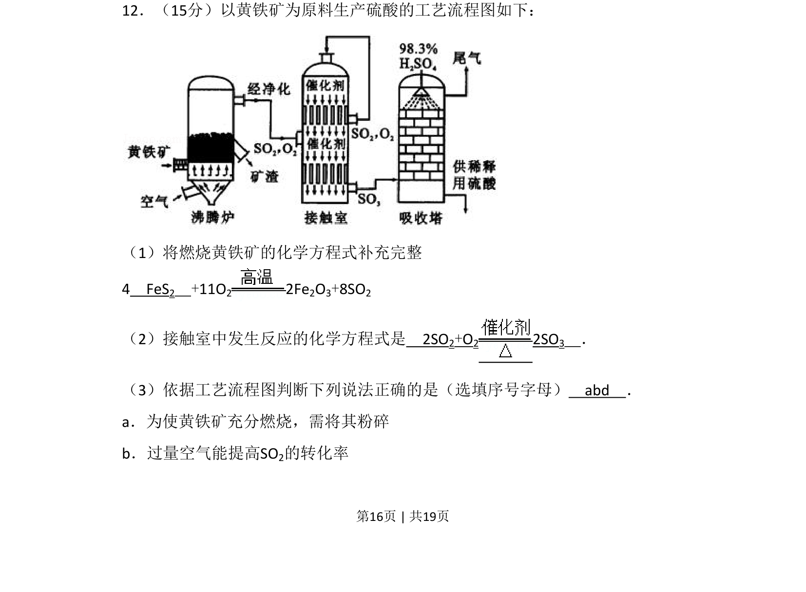
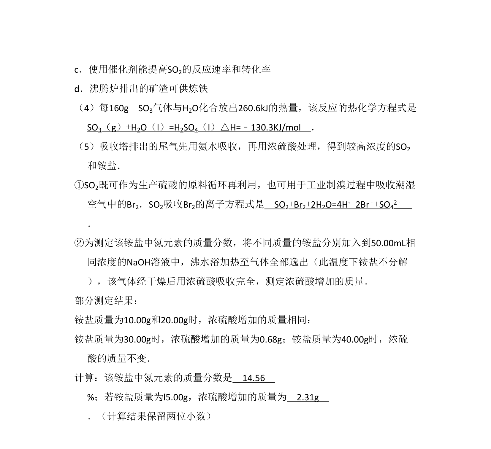
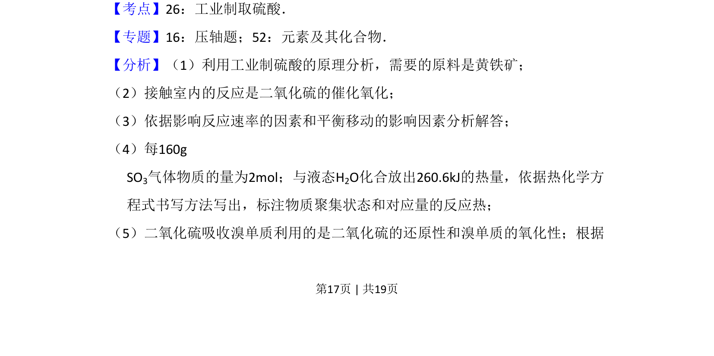
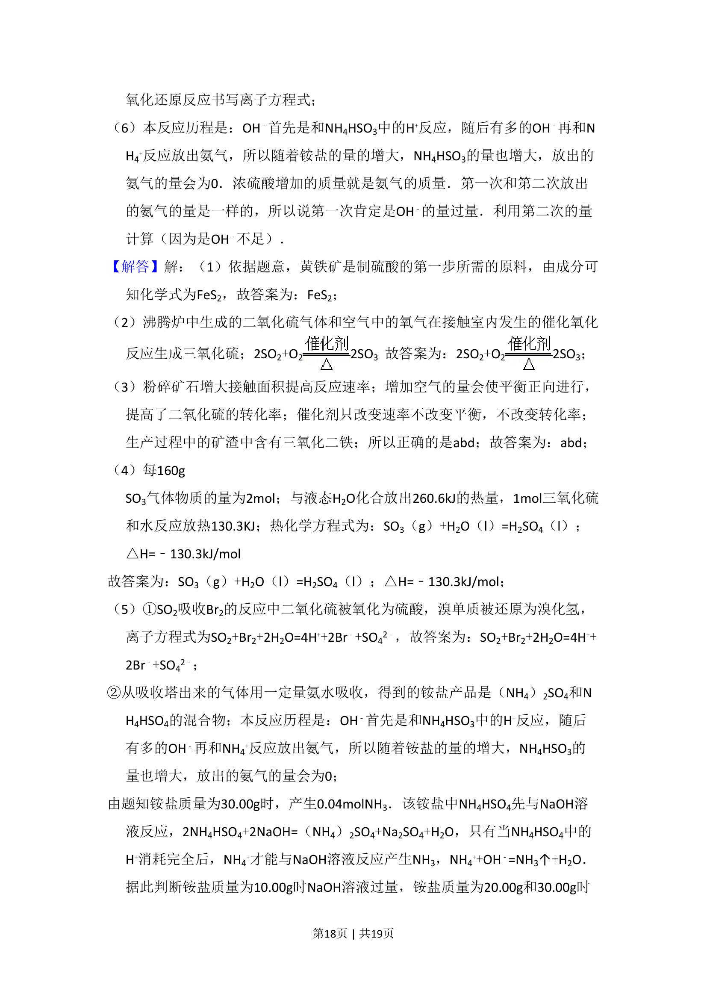
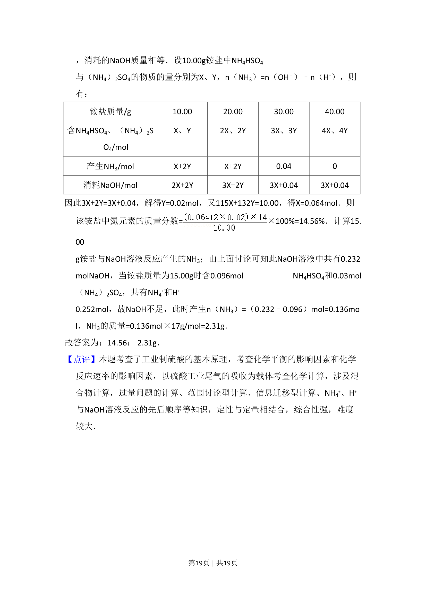

## 题面

## 摘要

以黄铁矿为原料的硫酸工业流程，涉及燃烧和接触室反应方程式书写，并判断操作条件作用

## 关联考点

- [[硫酸工业流程]]
- [[052-化学方程式|化学方程式]]
- [[284-化学平衡|化学平衡]]
- [[875-反应条件控制|反应条件控制]]

## 答案与解析

> 📄 原 PDF 第 16 页：`素材/真题/北京/2008-2024·（北京）化学高考真题/2009年高考化学试卷（北京）（解析卷）.pdf`
