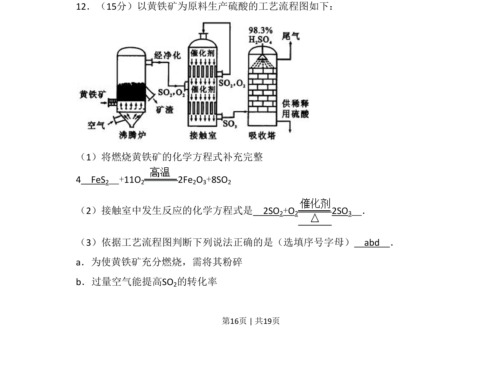
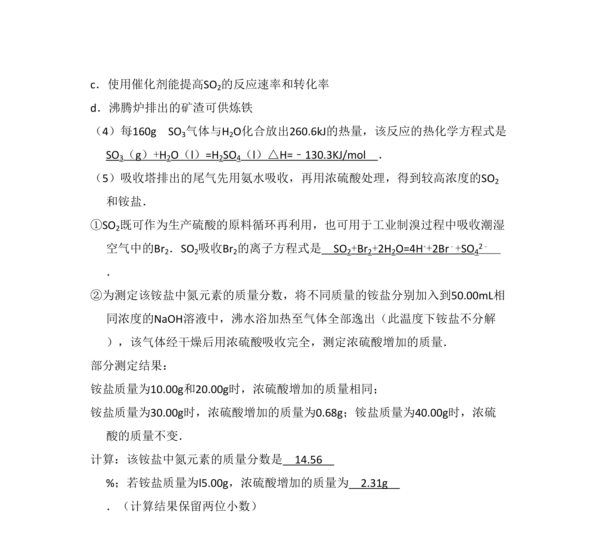
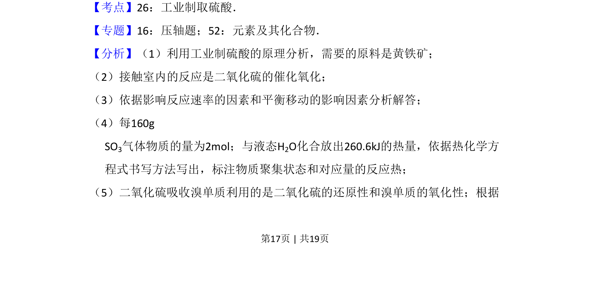
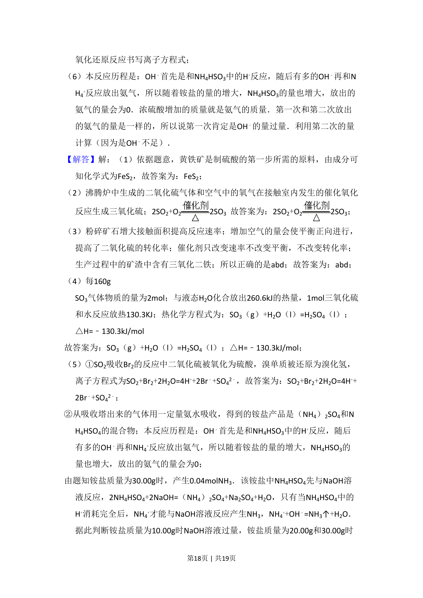
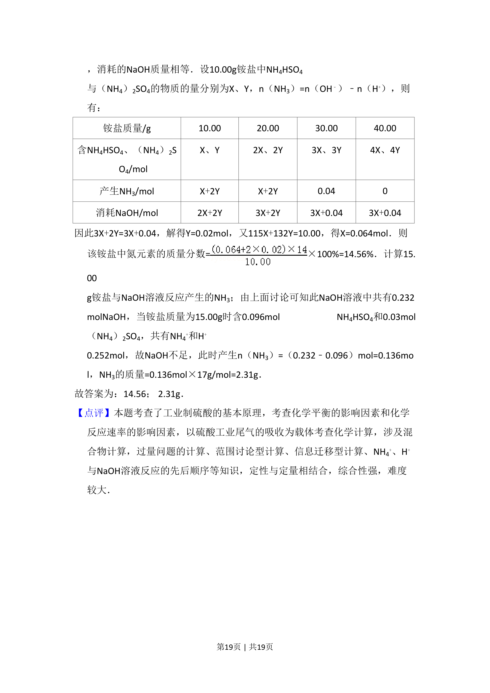

## 题面

## 摘要

以黄铁矿为原料的硫酸工业流程，涉及燃烧和接触室反应方程式书写，并判断操作条件作用

## 关联考点

- [[硫酸工业流程]]
- [[052-化学方程式|化学方程式]]
- [[284-化学平衡|化学平衡]]
- [[875-反应条件控制|反应条件控制]]

## 答案与解析

> 📄 原 PDF 第 16 页：`素材/真题/北京/2008-2024·（北京）化学高考真题/2009年高考化学试卷（北京）（解析卷）.pdf`

<!-- 题干文本-start -->
## 题干文本
12．（15分）以黄铁矿为原料生产硫酸的工艺流程图如下：
（1）将燃烧黄铁矿的化学方程式补充完整
4　FeS2　+11O2 2Fe2O3+8SO2
（2）接触室中发生反应的化学方程式是　2SO2+O2 2SO3　．
（3）依据工艺流程图判断下列说法正确的是（选填序号字母）　abd　．
a．为使黄铁矿充分燃烧，需将其粉碎
b．过量空气能提高SO2的转化率
<!-- 题干文本-end -->

<!-- 解析文本-start -->
## 解析文本

<!-- 解析文本-end -->
