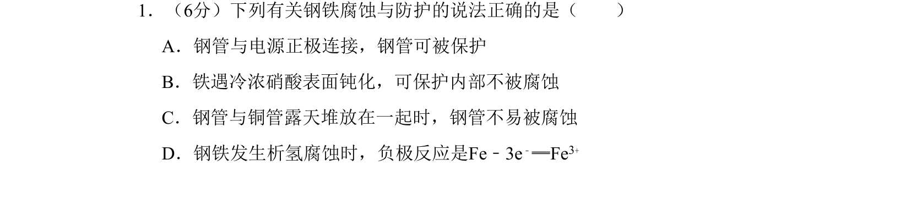
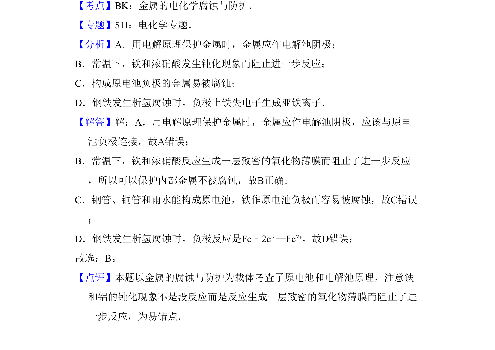

## 题面

## 摘要

考查金属腐蚀的电化学原理，涉及电解保护、钝化及原电池负极判断

## 关联考点

- [[962-金属的电化学腐蚀与防护|金属的电化学腐蚀与防护]]
- [[287-原电池|原电池]]
- [[368-电解池|电解池]]
- [[860-钝化|钝化]]

## 答案与解析

> 📄 原 PDF 第 1 页：`素材/真题/北京/2008-2024·（北京）化学高考真题/2010年高考化学试卷（北京）（解析卷）.pdf`
