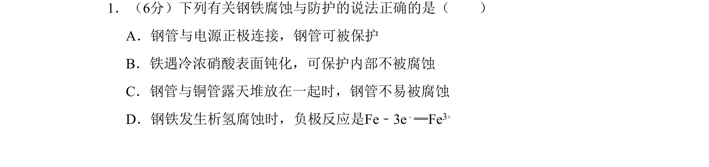
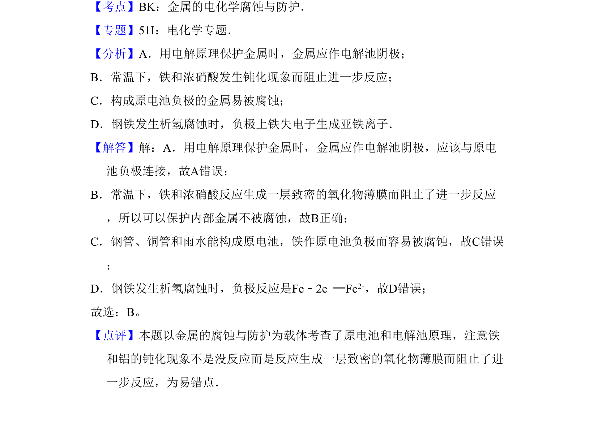

## 题面

## 摘要

考查金属腐蚀的电化学原理，涉及电解保护、钝化及原电池负极判断

## 关联考点

- [[962-金属的电化学腐蚀与防护|金属的电化学腐蚀与防护]]
- [[287-原电池|原电池]]
- [[368-电解池|电解池]]
- [[860-钝化|钝化]]

## 答案与解析

> 📄 原 PDF 第 1 页：`素材/真题/北京/2008-2024·（北京）化学高考真题/2010年高考化学试卷（北京）（解析卷）.pdf`

<!-- 题干文本-start -->
## 题干文本
1．（6分）下列有关钢铁腐蚀与防护的说法正确的是（　　）
A．钢管与电源正极连接，钢管可被保护
B．铁遇冷浓硝酸表面钝化，可保护内部不被腐蚀
C．钢管与铜管露天堆放在一起时，钢管不易被腐蚀
D．钢铁发生析氢腐蚀时，负极反应是Fe﹣3e﹣═Fe3+
<!-- 题干文本-end -->

<!-- 解析文本-start -->
## 解析文本
【考点】BK：金属的电化学腐蚀与防护．菁优网版权所有
【专题】51I：电化学专题．
【分析】A．用电解原理保护金属时，金属应作电解池阴极；
B．常温下，铁和浓硝酸发生钝化现象而阻止进一步反应；
C．构成原电池负极的金属易被腐蚀；
D．钢铁发生析氢腐蚀时，负极上铁失电子生成亚铁离子．
【解答】解：A．用电解原理保护金属时，金属应作电解池阴极，应该与原电
池负极连接，故A错误；
B．常温下，铁和浓硝酸反应生成一层致密的氧化物薄膜而阻止了进一步反应
，所以可以保护内部金属不被腐蚀，故B正确；
C．钢管、铜管和雨水能构成原电池，铁作原电池负极而容易被腐蚀，故C错误
；
D．钢铁发生析氢腐蚀时，负极反应是Fe﹣2e﹣═Fe2+，故D错误；
故选：B。
【点评】本题以金属的腐蚀与防护为载体考查了原电池和电解池原理，注意铁
和铝的钝化现象不是没反应而是反应生成一层致密的氧化物薄膜而阻止了进
一步反应，为易错点．
<!-- 解析文本-end -->
