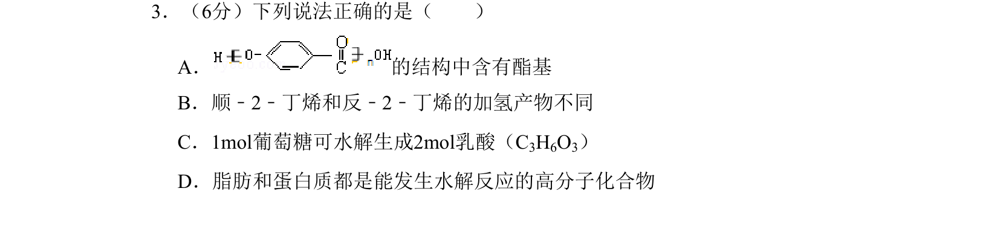
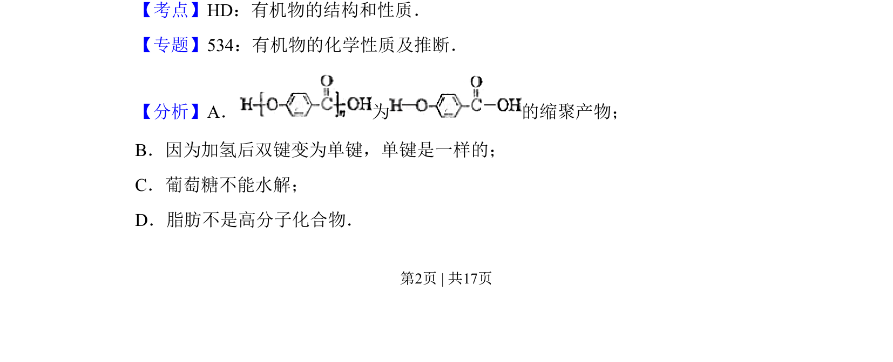
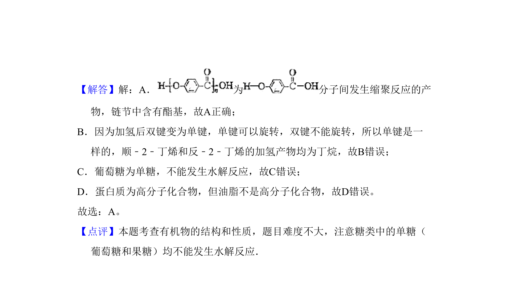

## 题面

## 摘要

该题考查有机物的结构与性质，通过判断关于酯基、烯烃加氢、葡萄糖水解、高分子化合物的说法正误。

## 关联考点

- [[有机物的结构]]
- [[酯基]]
- [[455-顺反异构|顺反异构]]
- [[葡萄糖水解]]
- [[505-高分子化合物|高分子化合物]]

## 答案与解析

> 📄 原 PDF 第 2 页：`素材/真题/北京/2008-2024·（北京）化学高考真题/2010年高考化学试卷（北京）（解析卷）.pdf`
