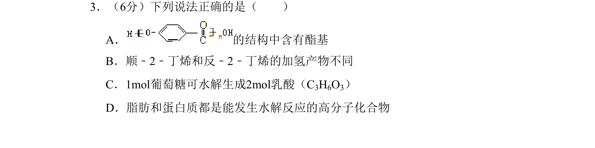
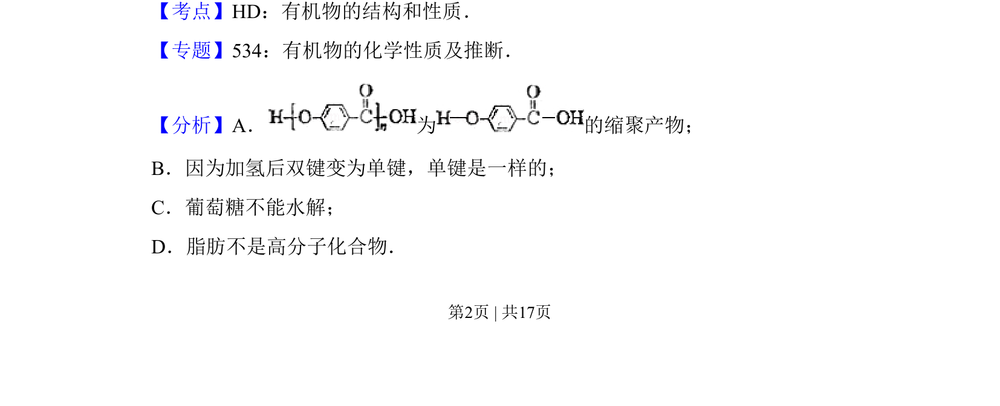
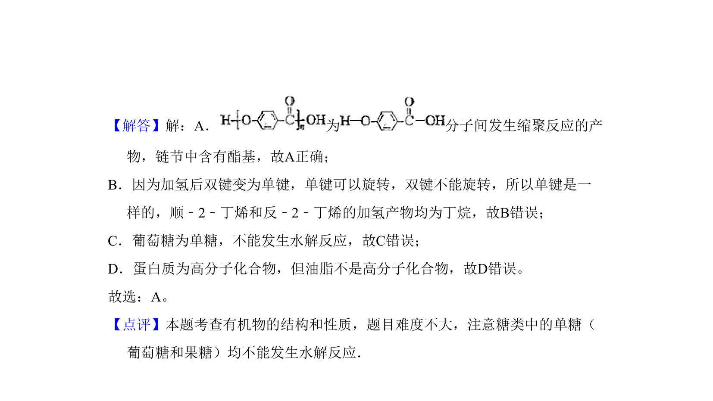

## 题面

## 摘要

该题考查有机物的结构与性质，通过判断关于酯基、烯烃加氢、葡萄糖水解、高分子化合物的说法正误。

## 关联考点

- [[有机物的结构]]
- [[酯基]]
- [[455-顺反异构|顺反异构]]
- [[葡萄糖水解]]
- [[505-高分子化合物|高分子化合物]]

## 答案与解析

> 📄 原 PDF 第 2 页：`素材/真题/北京/2008-2024·（北京）化学高考真题/2010年高考化学试卷（北京）（解析卷）.pdf`

<!-- 题干文本-start -->
## 题干文本
3．（6分）下列说法正确的是（　　）
A． 的结构中含有酯基
B．顺﹣2﹣丁烯和反﹣2﹣丁烯的加氢产物不同
C．1mol葡萄糖可水解生成2mol乳酸（C3H6O3）
D．脂肪和蛋白质都是能发生水解反应的高分子化合物
<!-- 题干文本-end -->

<!-- 解析文本-start -->
## 解析文本
【考点】HD：有机物的结构和性质．菁优网版权所有
【专题】534：有机物的化学性质及推断．
【分析】A． 为 的缩聚产物；
B．因为加氢后双键变为单键，单键是一样的；
C．葡萄糖不能水解；
D．脂肪不是高分子化合物．
<!-- 解析文本-end -->
