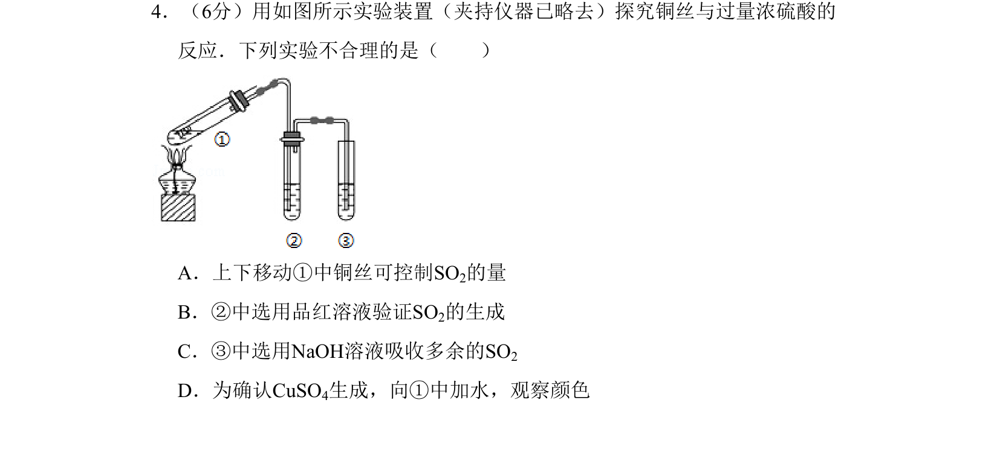
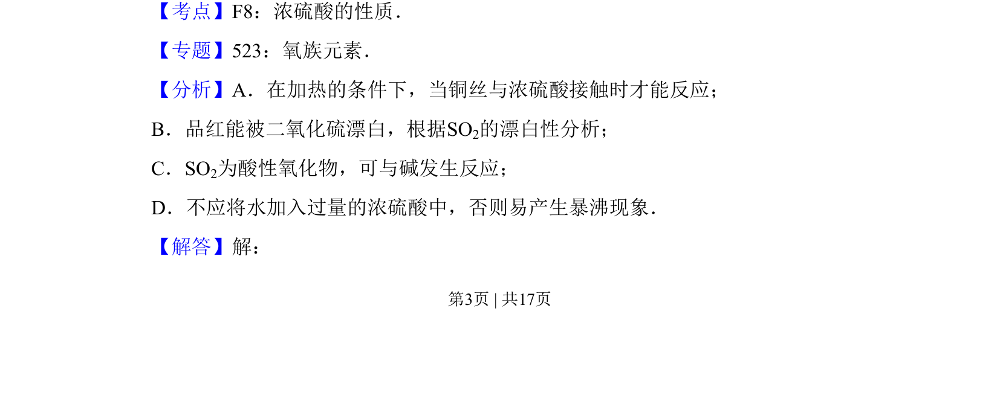
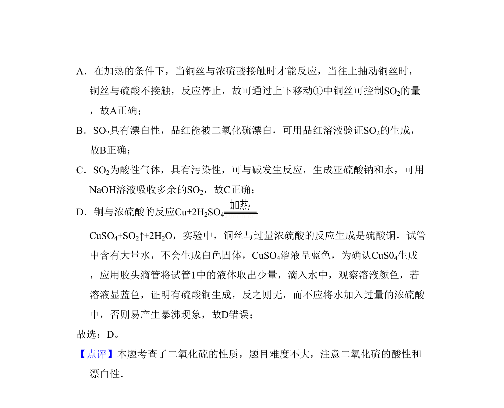

## 题面

## 摘要

探究铜与浓硫酸反应实验中SO₂的控制、验证、尾气处理及产物确认的合理性判断。

## 关联考点

- [[浓硫酸的性质]]
- [[970-二氧化硫的漂白性|二氧化硫的漂白性]]
- [[677-尾气处理|尾气处理]]
- [[实验安全]]

## 答案与解析

> 📄 原 PDF 第 3 页：`素材/真题/北京/2008-2024·（北京）化学高考真题/2010年高考化学试卷（北京）（解析卷）.pdf`
