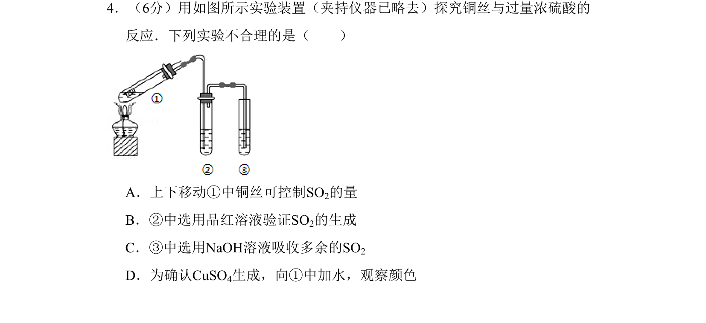
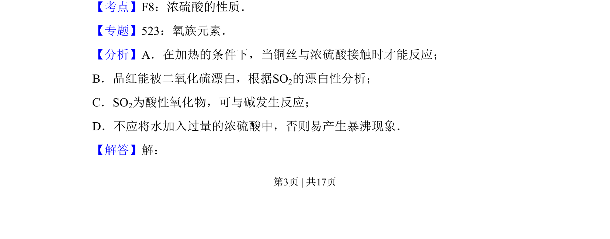
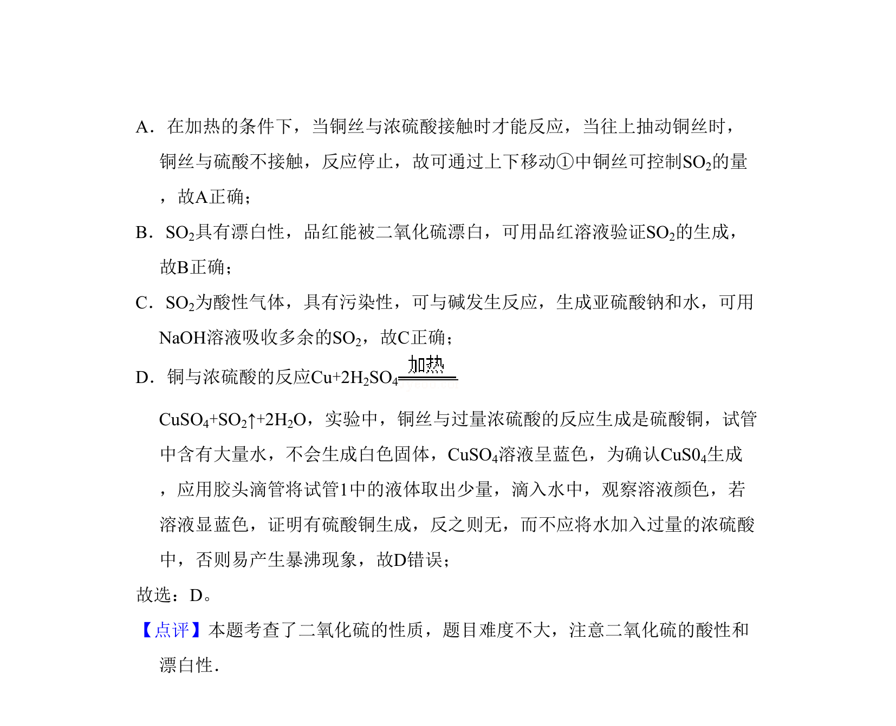

## 题面

## 摘要

探究铜与浓硫酸反应实验中SO₂的控制、验证、尾气处理及产物确认的合理性判断。

## 关联考点

- [[浓硫酸的性质]]
- [[970-二氧化硫的漂白性|二氧化硫的漂白性]]
- [[677-尾气处理|尾气处理]]
- [[实验安全]]

## 答案与解析

> 📄 原 PDF 第 3 页：`素材/真题/北京/2008-2024·（北京）化学高考真题/2010年高考化学试卷（北京）（解析卷）.pdf`

<!-- 题干文本-start -->
## 题干文本
4．（6分）用如图所示实验装置（夹持仪器已略去）探究铜丝与过量浓硫酸的
反应．下列实验不合理的是（　　）
A．上下移动①中铜丝可控制SO2的量
B．②中选用品红溶液验证SO2的生成
C．③中选用NaOH溶液吸收多余的SO2
D．为确认CuSO4生成，向①中加水，观察颜色
<!-- 题干文本-end -->

<!-- 解析文本-start -->
## 解析文本
【考点】F8：浓硫酸的性质．菁优网版权所有
【专题】523：氧族元素．
【分析】A．在加热的条件下，当铜丝与浓硫酸接触时才能反应；
B．品红能被二氧化硫漂白，根据SO2的漂白性分析；
C．SO2为酸性氧化物，可与碱发生反应；
D．不应将水加入过量的浓硫酸中，否则易产生暴沸现象．
【解答】解：
<!-- 解析文本-end -->
