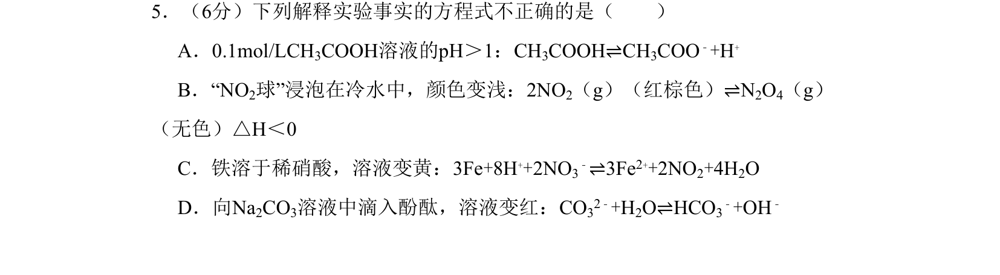
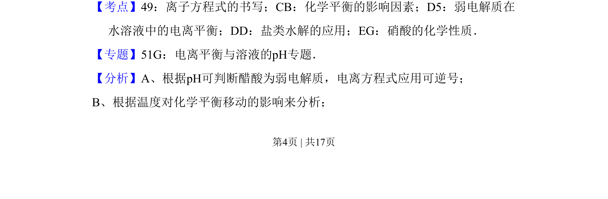
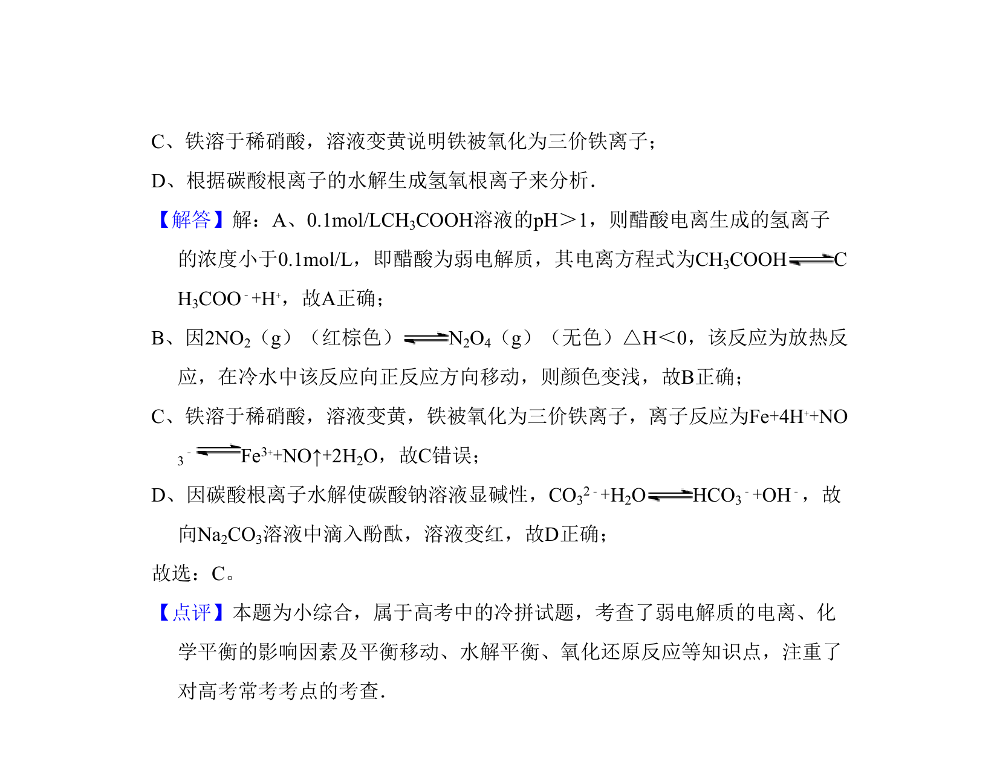

## 题面

## 摘要

考查离子方程式正误判断，涉及弱电解质电离、平衡移动、铁与硝酸反应及水解原理。

## 关联考点

- [[928-弱电解质的电离平衡|弱电解质电离平衡]]
- [[620-化学平衡移动|化学平衡移动]]
- [[807-离子方程式的书写|离子方程式书写]]
- [[336-盐类水解|盐类水解]]

## 答案与解析

> 📄 原 PDF 第 4 页：`素材/真题/北京/2008-2024·（北京）化学高考真题/2010年高考化学试卷（北京）（解析卷）.pdf`

<!-- 题干文本-start -->
## 题干文本
5．（6分）下列解释实验事实的方程式不正确的是（　　）
A．0.1mol/LCH3COOH溶液的pH＞1：CH3COOH⇌CH3COO﹣+H+
B．“NO2球”浸泡在冷水中，颜色变浅：2NO2（g）（红棕色）⇌N2O4（g）
（无色）△H＜0
C．铁溶于稀硝酸，溶液变黄：3Fe+8H++2NO3
﹣⇌3Fe2++2NO2+4H2O
D．向Na2CO3溶液中滴入酚酞，溶液变红：CO32﹣+H2O⇌HCO3
﹣+OH﹣
<!-- 题干文本-end -->

<!-- 解析文本-start -->
## 解析文本
【考点】49：离子方程式的书写；CB：化学平衡的影响因素；D5：弱电解质在
水溶液中的电离平衡；DD：盐类水解的应用；EG：硝酸的化学性质．菁优网版权所有
【专题】51G：电离平衡与溶液的pH专题．
【分析】A、根据pH可判断醋酸为弱电解质，电离方程式应用可逆号；
B、根据温度对化学平衡移动的影响来分析；
<!-- 解析文本-end -->
