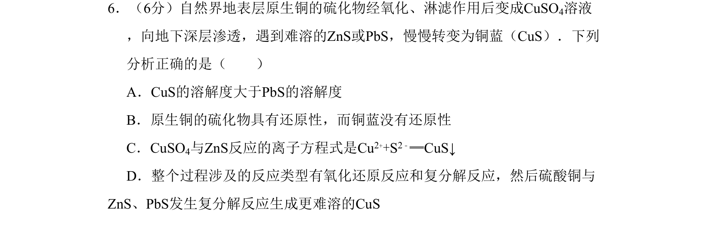
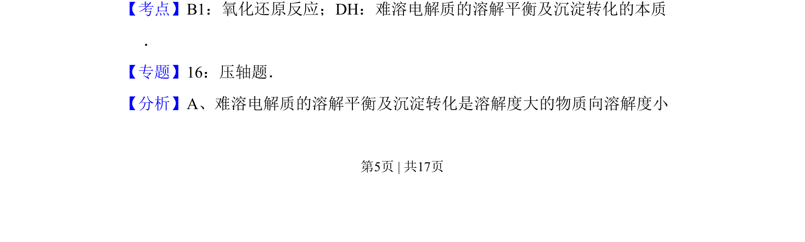
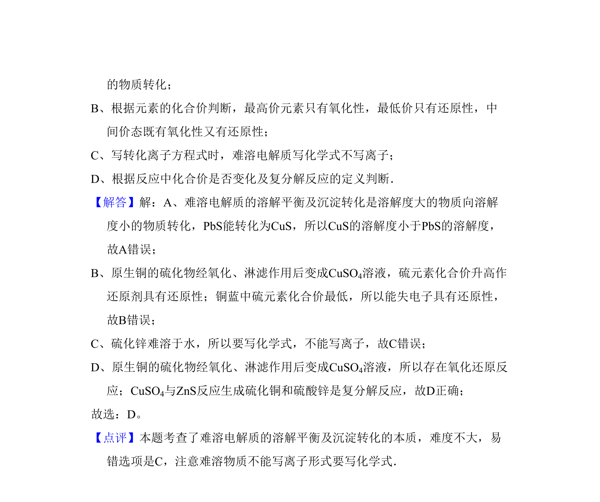

## 题面

## 摘要

通过铜的硫化物转化考查氧化还原与沉淀平衡的综合应用。

## 关联考点

- [[162-氧化还原反应|氧化还原反应]]
- [[难溶电解质的溶解平衡及沉淀转化]]

## 答案与解析

> 📄 原 PDF 第 5 页：`素材/真题/北京/2008-2024·（北京）化学高考真题/2010年高考化学试卷（北京）（解析卷）.pdf`

<!-- 题干文本-start -->
## 题干文本
6．（6分）自然界地表层原生铜的硫化物经氧化、淋滤作用后变成CuSO4溶液
，向地下深层渗透，遇到难溶的ZnS或PbS，慢慢转变为铜蓝（CuS）．下列
分析正确的是（　　）
A．CuS的溶解度大于PbS的溶解度
B．原生铜的硫化物具有还原性，而铜蓝没有还原性
C．CuSO4与ZnS反应的离子方程式是Cu2++S2﹣═CuS↓
D．整个过程涉及的反应类型有氧化还原反应和复分解反应，然后硫酸铜与
ZnS、PbS发生复分解反应生成更难溶的CuS
<!-- 题干文本-end -->

<!-- 解析文本-start -->
## 解析文本
【考点】B1：氧化还原反应；DH：难溶电解质的溶解平衡及沉淀转化的本质
．菁优网版权所有
【专题】16：压轴题．
【分析】A、难溶电解质的溶解平衡及沉淀转化是溶解度大的物质向溶解度小
<!-- 解析文本-end -->
