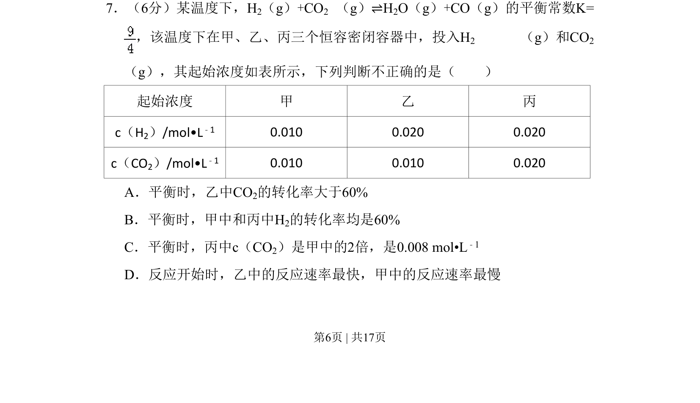
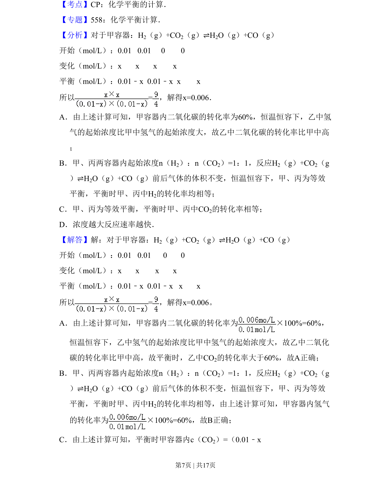
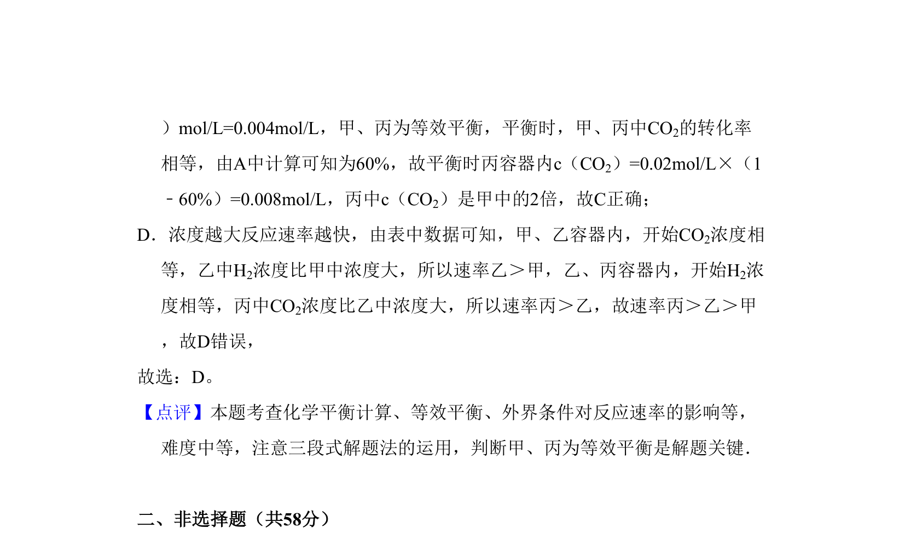

## 题面

## 摘要

化学平衡常数应用与反应速率判断，涉及转化率计算及浓度比较

## 关联考点

- [[342-化学平衡常数|化学平衡常数]]
- [[356-转化率|转化率]]
- [[283-化学反应速率|反应速率]]
- [[浓度计算]]

## 答案与解析

> 📄 原 PDF 第 6 页：`素材/真题/北京/2008-2024·（北京）化学高考真题/2010年高考化学试卷（北京）（解析卷）.pdf`
