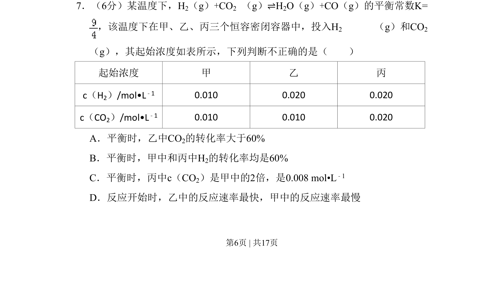
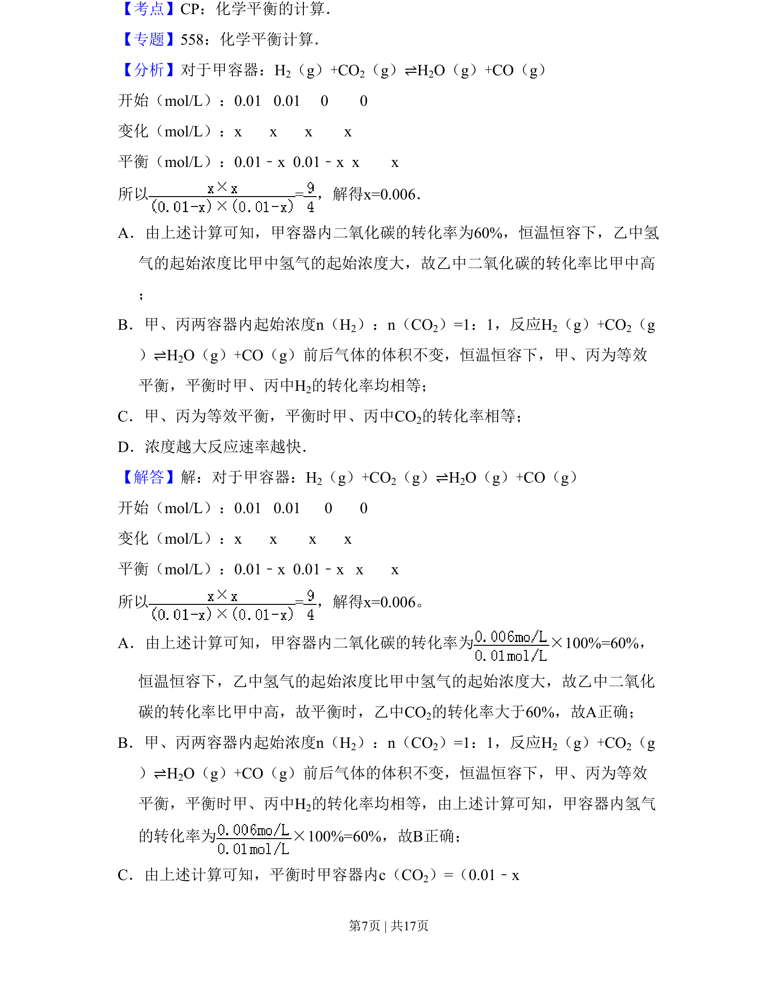
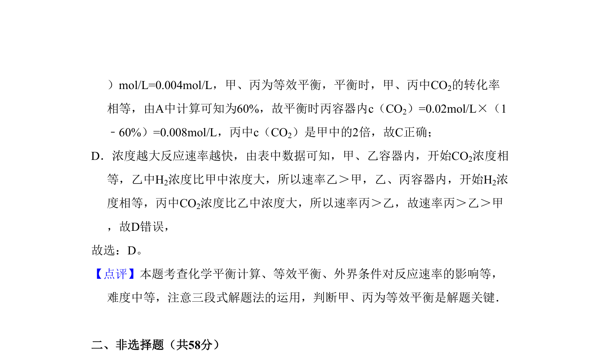

## 题面

## 摘要

化学平衡常数应用与反应速率判断，涉及转化率计算及浓度比较

## 关联考点

- [[342-化学平衡常数|化学平衡常数]]
- [[356-转化率|转化率]]
- [[283-化学反应速率|反应速率]]
- [[浓度计算]]

## 答案与解析

> 📄 原 PDF 第 6 页：`素材/真题/北京/2008-2024·（北京）化学高考真题/2010年高考化学试卷（北京）（解析卷）.pdf`

<!-- 题干文本-start -->
## 题干文本
7．（6分）某温度下，H2（g）+CO2 （g）⇌H 2O（g）+CO（g）的平衡常数K=
，该温度下在甲、乙、丙三个恒容密闭容器中，投入H2 （g）和CO 2 
（g），其起始浓度如表所示，下列判断不正确的是（　　）
起始浓度 甲 乙 丙
c（H2）/mol•L﹣1 0.010 0.020 0.020
c（CO2）/mol•L﹣1 0.010 0.010 0.020
A．平衡时，乙中CO2的转化率大于60%
B．平衡时，甲中和丙中H2的转化率均是60%
C．平衡时，丙中c（CO2）是甲中的2倍，是0.008 mol•L﹣1
D．反应开始时，乙中的反应速率最快，甲中的反应速率最慢
<!-- 题干文本-end -->

<!-- 解析文本-start -->
## 解析文本

<!-- 解析文本-end -->
