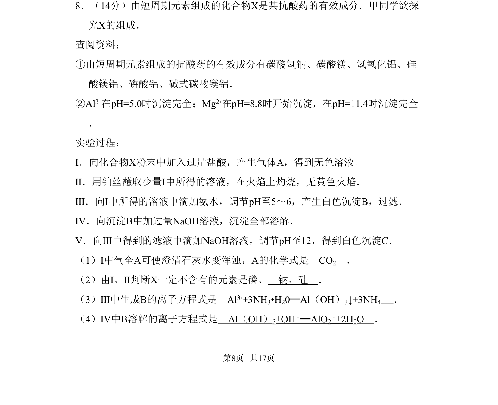
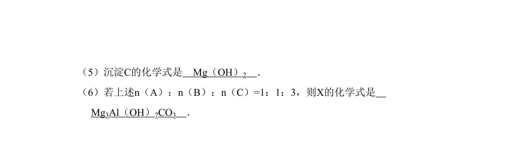
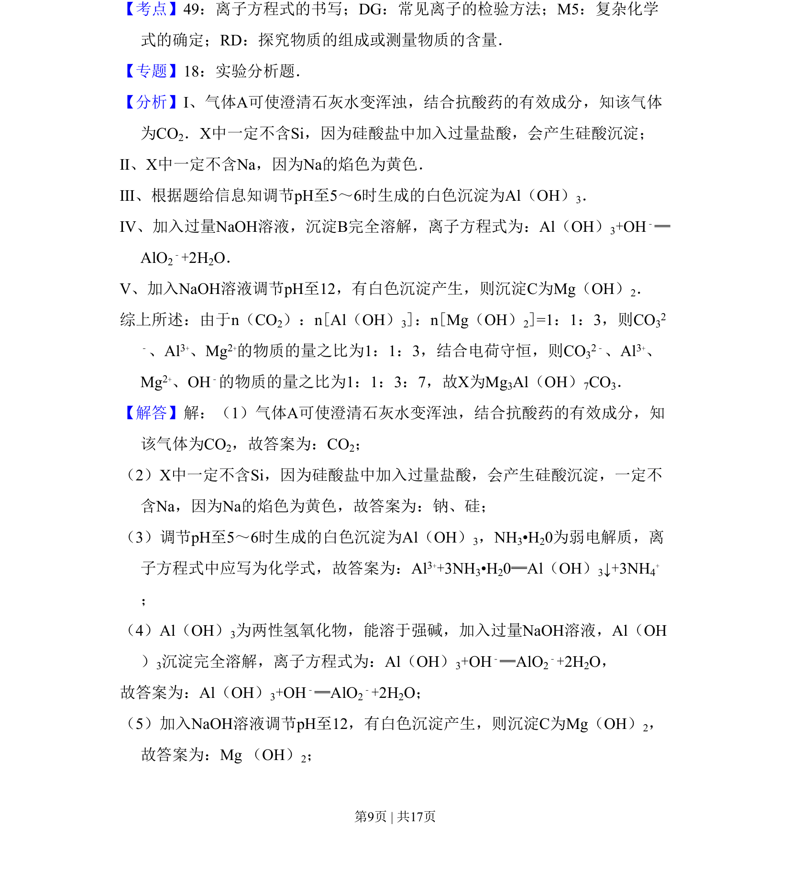
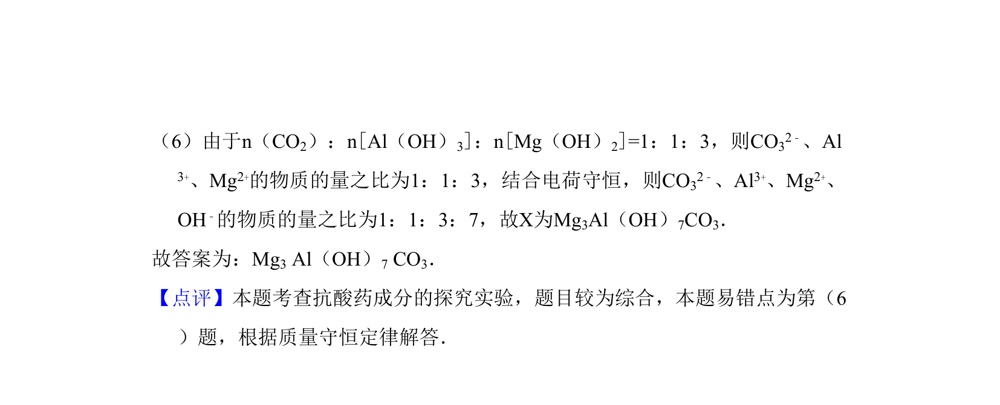

## 题面

## 摘要

探究抗酸药X成分，通过性质实验推断元素组成并书写离子方程式。

## 关联考点

- [[597-元素推断|元素推断]]
- [[169-离子反应|离子反应]]
- [[205-焰色反应|焰色反应]]
- [[179-两性氢氧化物|两性氢氧化物]]

## 答案与解析

> 📄 原 PDF 第 8 页：`素材/真题/北京/2008-2024·（北京）化学高考真题/2010年高考化学试卷（北京）（解析卷）.pdf`
